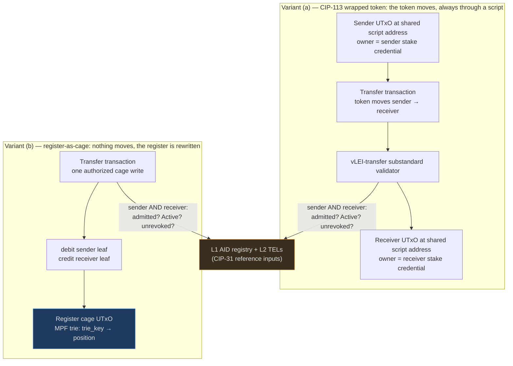

# Case C — KYC-Gated Security Tokens

Transfers only between identified holders: the tokenized-securities case,
where transfer restriction is a legal requirement of the asset class, not a
policy preference.

!!! info "What is a security, and why can't it just be a token?"
    A [security](../../finance-primer.md#security) is a tradable claim — a
    share, a bond, a slice of a fund. Unlike ordinary goods, the law
    regulates *who may hold it and how it may change hands*: a security sold
    under a [private placement](../../finance-primer.md#private-placement)
    exemption, for example, typically may only be resold to other eligible
    investors. So "put the security on-chain" is never just minting a token:
    the transfer rules are part of the asset. An unrestricted token *is not a
    lawful representation* of such a security — which is why this case exists.

## 1. Actors & credential level

- **Issuer** — the legal entity issuing the security (or its tokenization
  platform). Must itself be vLEI-identified (LE credential); its AID signs
  issuance and holds the freeze/seize authority. Maps to an L1 leaf + its own
  L2 TEL if it issues holder credentials.
- **Transfer agent / registrar** — in traditional securities law the register
  keeper. On-chain this role partially dissolves into the validator, but *not
  entirely*: court-ordered seizures and error correction legally require an
  override power (see §4). Holds an OOR credential from the issuer's LE, or is
  the issuer itself.
- **Holders** — the honest gap in this case. vLEI identifies **legal
  entities**; natural persons appear only as *role* credentials (OOR/ECR) tied
  to an entity. Institutional holders (funds, corporates) fit cleanly as LE
  credentials. **Retail individuals do not** — an unaffiliated person has no
  place in the GLEIF hierarchy. Options: (a) scope v1 to
  institutional/professional holders only; (b) treat brokers as entities
  holding omnibus positions (off-chain sub-ledger — weakens the whole pitch);
  (c) wait for eIDAS 2.0 personal wallets and design a second credential root
  next to GLEIF. Only (a) is defensible today.
- **QVIs / GLEIF** — as in every case: credential issuance roots.

!!! info "Who is a transfer agent?"
    For traditional securities, ownership is not proven by holding a paper —
    it is whatever the official register says. The
    [transfer agent / registrar](../../finance-primer.md#transfer-agent-registrar)
    is the company legally responsible for that register: it records
    transfers, freezes positions, executes
    [court orders](../../finance-primer.md#court-ordered-seizure-freeze-forced-transfer),
    and corrects errors. On-chain, the *recording* part becomes the
    validator's job — but the *override* part (freeze, seizure) is a legal
    duty that cannot be dissolved, which is why it reappears below as a
    deliberate design feature.

!!! info "Omnibus positions — the traditional retail workaround"
    An [omnibus position](../../finance-primer.md#omnibus-position) is one
    account in a broker's name that commingles many end clients; who owns
    what appears only in the broker's private books. It is how retail
    investors traditionally reach markets they cannot enter directly — and if
    used here, the on-chain register would only ever show "Broker X holds
    1,000,000 units," giving up exactly the holder-level transparency this
    design promises. That is why option (b) above weakens the pitch.

## 2. Gated action & enforcement point

Cardano native assets have **no transfer hook** — a bearer token in a wallet
moves with a key signature and no script runs. Transfer restriction therefore
requires the token to *never be a plain bearer asset*. Two mechanisms:

!!! info "Register vs bearer — the key distinction of this whole page"
    Two opposite ways to prove you own something
    ([primer](../../finance-primer.md#register-vs-bearer-instrument)):

    - **Bearer**: whoever holds it, owns it. Cash works this way — and so
      does a plain Cardano native token sitting in a wallet.
    - **Register**: whoever the official ledger *says* owns it, owns it.
      Land works this way — possession of the house keys means nothing; the
      land registry entry is the truth. Modern securities are almost all
      register-based.

    A plain token is a bearer instrument, and bearer instruments cannot
    carry transfer restrictions — nothing runs when they move. So the two
    designs below are the two possible escapes: **(a)** make the token
    stop being a plain bearer asset (wrap it in a script that always runs),
    or **(b)** stop pretending there is a bearer instrument at all and put
    the *register itself* on-chain, exactly as securities law already
    models it.

**CIP-113 programmable tokens**: all programmable tokens sit at a **shared
script address**; ownership is expressed by the **stake credential** of the
holding UTxO; every transfer/mint/burn runs a global coordinator which invokes
per-token **substandard** validators (withdraw-trigger pattern). Status: **not
final** — under active development (CIPs PR #444, superseding CIP-143), with
the reference implementation explicitly R&D. Crucially, the platform
implementation already ships `kyc`, `kyc-extended`, and `freeze-and-seize`
substandards — and the existing KYC substandard is exactly the pattern
cardano-keri exists to replace: a **trusted-entity attestation** (an
Ed25519-signed `user_pkh‖role‖valid_until` payload, signed by a key from an
admin-maintained trusted-entities list in a global-state datum). That is the
allowlist-operator model with a signature instead of a database row — a
precise, standards-track product wedge for cardano-keri.

**Fallback if CIP-113 stalls**: the token never leaves a bespoke script; every
spend is the gate. The degenerate form of the same idea — which leads to
variant (b) below.

## 3. Design sketch

Common base: L1 AID registry, L2 TELs, L3 verifier, L4 proof builder;
admission cache `trie_key → {credential_saids, expiry}`.

**Variant (a) — CIP-113 substandard "vLEI-transfer".** cardano-keri ships a
substandard replacing trusted-entity signatures with registry proofs: the
transfer validator takes L1/L2 as CIP-31 reference inputs and requires, for
**both** the spending stake credentials and every receiving stake credential,
an admitted + `Active` + unrevoked `trie_key` (admission mapping
`stake_credential ↔ trie_key` established once, on-chain). Freeze-and-seize
composes as a second substandard under the issuer's AID. Pros: rides an
emerging standard; the wallet/DEX integration story is CIP-113's problem, not
ours; distribution channel into every CIP-113 deployment. Cons: standard not
final; the shared-address model imports its ecosystem-integration frictions;
per-transfer ex-units for receiver+sender checks × multiple UTxOs.

**Variant (b) — the register IS a cage (MPFS-ledger).** No token moves at all:
the security register is an MPFS trie `trie_key → position`; a transfer is one
cage write mutating two leaves (debit/credit), authorized by the sender's AID
key and gated on both parties' admission. This mirrors legal reality — for
registered securities **the register is authoritative, not the bearer
instrument** — and it is the most cardano-keri-native design: transfer
authorization is exactly the value-write path of
[Value Authorization](../../architecture/value-auth.md). Pros: no CIP-113
dependency; restriction enforcement is trivially total (there is nothing to
move outside the gate); issuer override = an oracle-signed corrective write
(explicit, auditable). Cons: zero composability with wallets/DEXes (positions
are not assets); a single register UTxO serializes all transfers; the oracle
liveness dependency sits on the critical path of every trade.

The variants are not exclusive: (b) as pilot register, (a) as the
standards-track product.

## 4. Pressure on the open decisions

- **Admission vs per-tx**: decisive here — the **receiver** must be checked,
  and a receiver cannot assemble a 3-hop proof for someone else's incoming
  transfer at spend time. The admission cache is effectively mandatory; per-tx
  reduces to `Active` + TEL non-revocation for both parties.
- **KeyState parity**: institutional holders ⇒ weighted multisig KeyState is
  required from day one; strengthens the list-shaped-derivation argument.
- **Revocation/override**: regulators expect a revoked/sanctioned holder to be
  **frozen** and positions to be **force-transferable** under court order.
  Pure "oracle cannot touch leaves" is legally wrong for this asset class —
  the design must *deliberately reintroduce* a scoped issuer power
  (freeze/seize under the issuer AID, on-chain, auditable): the ownership
  model needs a per-cage override policy knob. Cascade semantics must come
  from GLEIF governance docs, not invention.
- **Throughput**: retail-scale transfer volume is the hardest case of the
  four; variant (b)'s single-UTxO register makes the known bottleneck a
  blocker at scale; variant (a) shards naturally across UTxOs.
- **Privacy**: a public register mapping LEI → holdings is likely unacceptable
  (position confidentiality is standard market practice). MPF roots hide leaf
  values, but every transfer's proofs reveal the touched leaves. Mitigations
  (salted/blinded leaf values, per-holder subaccounts, or accepting disclosure
  for private placements only) are unresolved design work — a first-class
  limitation.

!!! info "Why must the issuer be able to seize an asset it sold?"
    Because courts can order it
    ([primer](../../finance-primer.md#court-ordered-seizure-freeze-forced-transfer)):
    in fraud, insolvency, inheritance, or sanctions proceedings, a judge can
    rule that a holder's position be frozen or handed to someone else — and
    the register keeper is legally obliged to execute the ruling. A "nobody
    can ever touch your position" register is not censorship-resistant
    finance; it is a register no regulated issuer may lawfully use. The
    design's answer is to make the power *scoped and auditable*: the issuer
    can freeze or move positions, visibly, under its own signed AID — but can
    never fabricate an identity or forge a holder's consent.

!!! info "Why is a public list of holders a problem?"
    Position confidentiality is standard market practice for good commercial
    reasons: a fund's holdings reveal its strategy (competitors can copy or
    trade against it), a company quietly building a stake in another would be
    front-run, and counterparties gain negotiating leverage from knowing your
    book. Public markets *do* have disclosure rules (large shareholdings must
    be declared) — but those are thresholds and deadlines, not a live public
    feed of everyone's balance. An on-chain register that broadcasts
    LEI → holdings in real time discloses far more than any regulation asks.

## 5. Demand side

The most commercially concrete case: tokenized private credit/funds/bonds is a
live market, and **every** issuance needs transfer restriction to be lawful.
Buyers: tokenization platforms and issuer-side agents (they pay for rails that
reduce their per-venue [KYC](../../finance-primer.md#kyc-know-your-customer)
cost), not end holders. Regulatory basis: transfer
restrictions derive from securities exemptions (private-placement resale
restrictions) and AML obligations of the *issuer/intermediaries* — the EU
basis (MiFID II financial-instrument qualification of tokenized securities,
the DLT Pilot Regime, prospectus exemptions) **needs article-level citation
before any regulatory claim enters these docs**. Smallest pilot: one private
placement, one issuer, N institutional holders, variant (b) register +
freeze/seize — no CIP-113 dependency, no retail, no DEX.

!!! info "Decoding the demand paragraph"
    - **Tokenized private credit / funds / bonds** — on-chain versions of
      loans to companies, investment-fund shares, and tradable debt
      ([primer](../../finance-primer.md#bond-fund-money-market-fund)); the
      live corner of the [RWA](../../finance-primer.md#rwa-real-world-assets)
      market, where tokenized money-market funds already exist on other
      chains — every one of them transfer-restricted.
    - **[Private placement](../../finance-primer.md#private-placement)** — a
      sale to a small circle of professional investors, allowed with light
      paperwork precisely *because* resale is restricted. The restriction is
      the price of the exemption — remove it and the exemption collapses.
      That is why the pilot is lawful only with the gate working.
    - **The EU frameworks** — whether a given token legally *is* a security
      ([MiFID II](../../finance-primer.md#mifid-ii-basel-iii-eidas-20-mica)
      financial-instrument qualification), which disclosure exemptions apply
      (prospectus rules), and under what sandbox on-chain settlement may
      operate (the
      [DLT Pilot Regime](../../finance-primer.md#dlt-pilot-regime)) — are
      exactly the claims that need article-level citation before entering
      these docs as assertions.

## 6. Case-specific risks & limitations

- **Retail is out of scope** until a personal-identity credential root exists
  — "KYC-gated security tokens" over-promises otherwise.
- **CIP-113 finalization risk** — variant (a)'s timeline is not ours to
  control.
- **Issuer override is a feature here and a contradiction of the epic's
  headline** ("oracle cannot forge by contract") — needs careful spec
  language: *forging* stays impossible, *freezing/seizing* becomes an
  explicit, scoped, issuer-AID-signed power.
- **Privacy of positions** unresolved (see §4).
- **Securities-law perimeter**: running the register/validator could itself be
  a regulated activity (transfer-agent/CSD-like) in some jurisdictions — legal
  review needed before any mainnet pilot.

!!! info "The 'perimeter' risk, in plain words"
    Financial regulation defines a *perimeter*: cross it, and you need a
    license. Keeping the authoritative record of who owns a security is
    inside that perimeter in most jurisdictions — it is what
    [transfer agents](../../finance-primer.md#transfer-agent-registrar) and
    [CSDs](../../finance-primer.md#csd-central-securities-depository)
    (the institutions holding master registers for entire markets, like
    Euroclear) are licensed to do. If the cardano-keri register *is* the
    authoritative record, whoever operates it may be doing licensed activity
    without a license. This is a question about the *operator's* legal
    status, not about the code — hence "legal review before mainnet."
