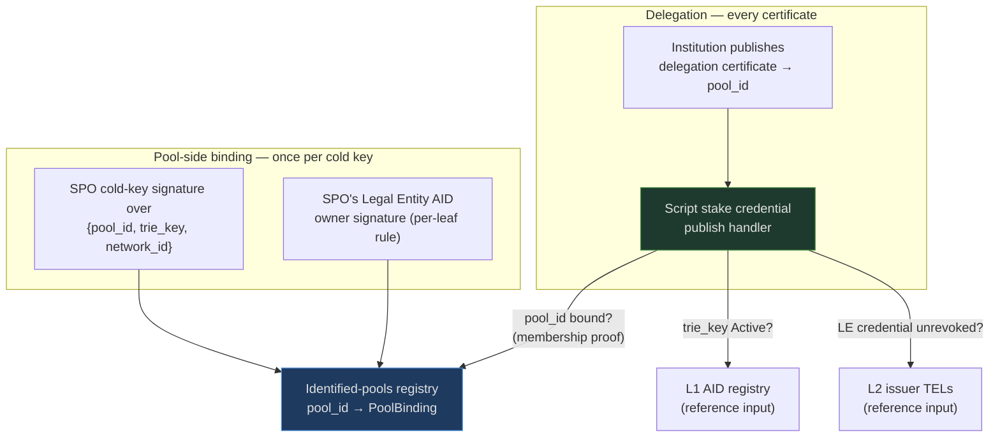

# Case B — Identified SPO Delegation

"Only delegate to legally identified pools" — an institution's stake may only
ever back operators with a valid Legal Entity vLEI.

## 1. Actors & credential level

- **The SPO** is a legal entity holding a
  [vLEI Legal Entity credential](../vlei.md) (QVI-issued). Its identity anchor
  is its **pool cold key**: the binding
  object is `{pool_id, trie_key}` where `pool_id = blake2b_224(cold_vkey)` —
  the same hash the ledger uses in delegation and registration certificates
  (Aiken stdlib: `StakePoolId = Hash<Blake2b_224, VerificationKey>`). Binding
  to `pool_id` rather than to a wallet key matters: it survives relay changes,
  reward-address changes, and pledge moves; it dies only with cold-key
  rotation (a pool re-registration event, which is the correct time to
  re-attest).
- **The delegator** is the buyer: an institution
  ([fund, treasury](../../finance-primer.md#fund-desk-treasury), exchange
  under compliance constraints) that must demonstrate its stake only ever
  backs identified operators.
- **The verifier** is the delegator's own *stake credential script* — not the
  pool, not an oracle. cardano-aid supplies the registries and the verifier
  library it imports.

!!! info "What is an 'institution under compliance constraints'?"
    A [fund, desk, or treasury](../../finance-primer.md#fund-desk-treasury)
    manages money under written rules — set by a board, by client mandate, or
    by regulation — and must be able to show an auditor that every action
    followed those rules. "Compliant staking yield" simply means earning
    staking rewards *without stepping outside those rules*: e.g. a treasury
    policy saying company funds may only back service providers whose legal
    identity is [verified](../../finance-primer.md#kyc-know-your-customer).
    An exchange is "under compliance constraints" because it is itself a
    regulated business with
    [AML duties](../../finance-primer.md#aml-and-sanctions-screening) — it
    cannot route customer assets to anonymous operators. Today such policies
    live in documents and are checked by hand after the fact; this design
    turns one into a rule the chain itself enforces at the moment of
    delegation.

## 2. Gated action & enforcement point

Verified against the Aiken validator and certificate documentation:

- A stake credential can be a Plutus script. Publishing a delegation
  certificate for a script credential invokes the script's **`publish`
  handler**, whose target is the full `Certificate` value.
- The handler **sees**:
  `DelegateCredential { credential, delegate: DelegateBlockProduction { stake_pool } }`
  — i.e. the exact target `pool_id` — plus the whole transaction (so CIP-31
  reference inputs to the L1/L2 registries are visible). Same for
  `DelegateVote`/`DelegateBoth` (DRep analog) and
  `RegisterAndDelegateCredential`.
- The handler **cannot see**: the *current* delegation of the credential
  (certificates carry no prior state), epoch boundaries, or anything after the
  certificate lands. Enforcement exists only at certificate-publication time.

So the design is: **the institution's stake credential is a script that
witnesses a delegation certificate only if the redeemer proves `stake_pool` is
bound to an Active, unrevoked vLEI entity.** The script checks: membership
proof of `pool_id → PoolBinding` in the identified-pools registry,
`PoolBinding.trie_key` Active in the L1 AID registry, TEL non-revocation (L2),
all against reference-input roots.

**Pool-side registration** is mutual attestation: the SPO submits
`PoolBinding { pool_id, cold_vkey, trie_key }` with (a) an Ed25519 signature
by `cold_vkey` over a domain-separated `{pool_id, trie_key, network_id}`
message, verified on-chain (`blake2b_224(cold_vkey) == pool_id` — blake2b_224
is a PlutusV3 builtin), and (b) the LE's `cur_key` signature per the per-leaf
owner-sig rule. Neither party can bind the other unilaterally.

The two flows side by side — binding happens once per cold key; the gate fires
at every delegation certificate:

## 3. Design sketch

New components on top of L1–L4:

- **Identified-pools registry**: an MPF cage `pool_id → PoolBinding`,
  owner-signed leaves (the LE owns its binding), oracle co-signed. Not leaves
  inside the AID registry — different key space, different lifecycle (cold-key
  rotation ≠ AID rotation).
- **Delegator stake script** (`publish` + `withdraw` handlers), parameterized
  by the registries it trusts and the owner's authorization rule (institution
  multisig).
- **Delegation-state UTxO (optional but load-bearing)**: because the script is
  stateless, an "evict on revocation" path needs a companion UTxO recording
  the current `pool_id`. With it, a permissionless keeper can publish a
  re-delegation to a fallback identified pool by proving the *recorded* pool's
  credential is now revoked. Without it, revocation response is purely an
  off-chain operational duty of the institution.
- **DRep analog** falls out for free: the same handler pattern on
  `DelegateVote` against an identified-DReps registry.

!!! warning "Honest limit — delegation is sticky"
    The ledger re-invokes no script at epoch boundaries. If the pool's vLEI is
    revoked *after* delegation, stake keeps flowing to it until someone
    publishes a new certificate. In everyday terms: a delegation certificate
    is like a standing order at a bank — it keeps acting until you replace it,
    and nobody re-checks it each period. The gate guarantees "was identified
    at delegation time," and only with the keeper/eviction extension
    "re-delegated promptly after revocation." It can never guarantee "never
    staked to a revoked pool."

## 4. Pressure on the open decisions

- **Admission vs per-tx**: delegation certificates are *rare* (per
  institution: a few per year). Full per-certificate verification is
  affordable — this case exerts **no pressure toward the admission cache**;
  it is the natural home for full per-transaction verification.
- **KeyState parity**: SPO legal entities and institutional delegators are
  both organizations — **thresholds needed on both sides** (LE AID multisig;
  the institution's owner-rule is native script/multisig). Reinforces
  list-shaped KeyState.
- **Revocation freshness**: strong at the gate, **structurally weak after it**
  (stickiness). Cascade depth matters at certificate time (revoked QVI ⇒ pool
  not delegatable).
- **Throughput**: negligible. The single-UTxO registry ceiling is irrelevant
  here.
- **Privacy**: pool identity is *meant* to be public (differentiation); the
  delegator's identity need not be on-chain at all — only its policy is.
  Mildest privacy profile of the four cases.

## 5. Demand side

Buyers: (i) institutions that want compliant staking yield — the
certificate-time guarantee maps directly to an auditable policy; (ii) SPOs
buying differentiation ("legally identified pool") to attract that stake;
(iii) the Veridian/Amaru channel: identified SPOs are the same population
pitched as **KERI witness hosts** (witnesses are the always-on servers that
receipt KERI key events — see the [KERI primer](../../keri-primer.md)) — one
vLEI onboarding sells both ("witness hosting under a verifiable legal
identity"), and Amaru bundling is the distribution vector. **Smallest pilot**:
one [QVI](../vlei.md)-credentialed SPO + one institutional delegator + the
pools registry on preprod; no DeFi protocol needed, no per-trade throughput,
exercises L1+L2+L3 end-to-end.

!!! info "Why 'auditable policy' is the selling point"
    Today, "we only stake with reputable operators" is a sentence in a policy
    document, checked by hand after the fact. With the stake script, the
    policy is enforced by the chain at the moment of delegation, and every
    past delegation carries on-chain proof that the check ran. An auditor can
    verify years of policy compliance from public data, without trusting
    anyone's spreadsheet — that verifiability, not the yield itself, is what
    the institution is buying.

## 6. Case-specific risks/limitations

- **Gates the delegator, not the pool**: an unidentified world continues
  delegating to anyone; value exists only if identified stake is commercially
  meaningful to SPOs.
- **Address migration**: the institution must move funds to base addresses
  with the script stake credential — operational cost, custody-integration
  friction.

    !!! info "Custody-integration friction, in plain terms"
        Institutions usually do not hold keys themselves — a
        [custodian](../../finance-primer.md#custody) does, under contract and
        regulation. Moving funds to addresses whose staking rights are
        controlled by a script means the custodian's systems must know how to
        build and sign transactions for that script. If the custodian does not
        support it, the institution cannot adopt the design at all — a
        sales-and-integration hurdle, not a cryptographic one.
- **Rewards custody**: rewards accrue to the script's reward account; the
  `withdraw` handler must gate withdrawals (owner multisig) — more scope, and
  a bug here strands rewards.
- **Cold-key rotation** invalidates the binding; needs a re-attestation flow
  tied to pool re-registration.
- **Stickiness** (above) is the headline caveat for any compliance claim
  stronger than certificate-time.
