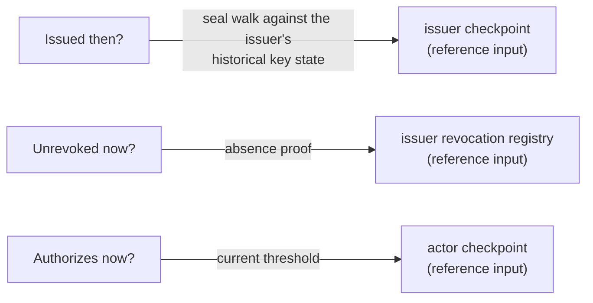
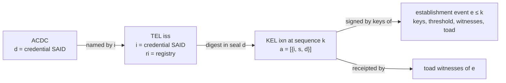
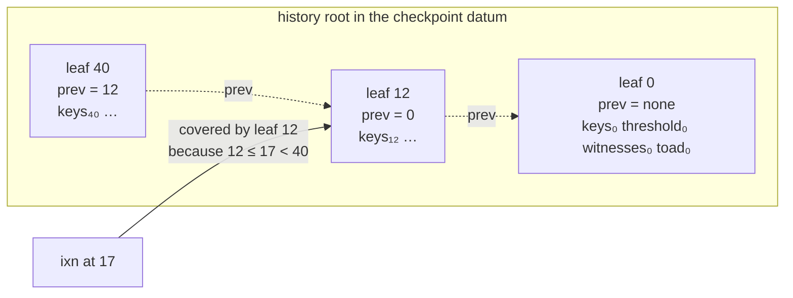
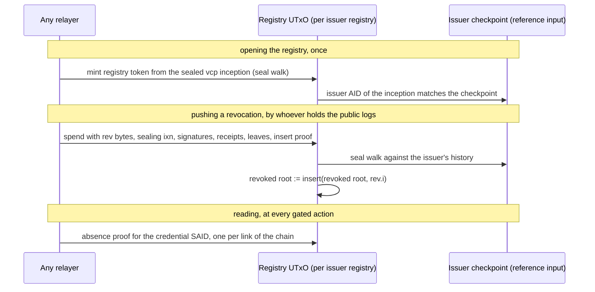
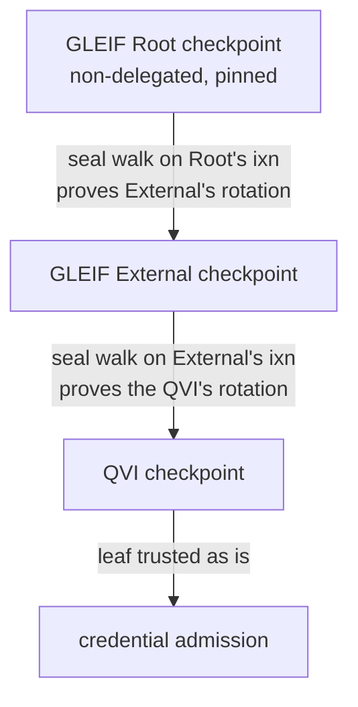
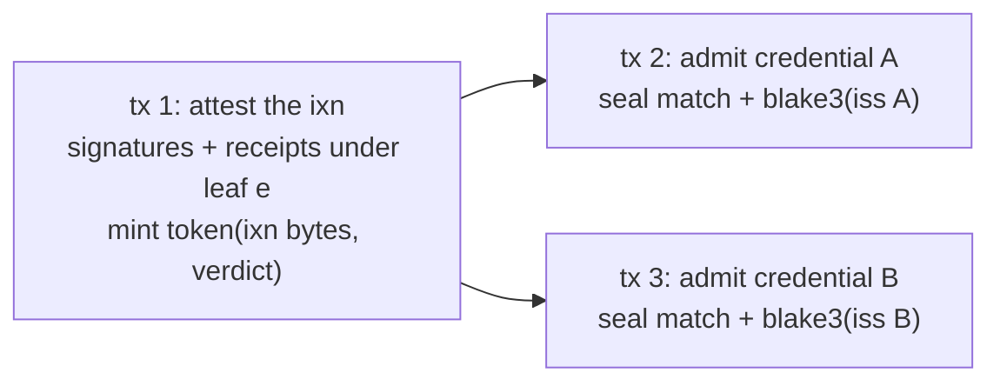

# Verifying credentials against the checkpoint

A company, Acme, holds a vLEI credential issued three years ago by a qualified
issuer, a QVI. The QVI has rotated its keys twice since. Acme wants to use the
credential to unlock a gated action on Cardano today. The validator must
convince itself of three things: the QVI really issued this credential under
keys it validly held at the time, nobody has revoked it since, and the account
acting now is really Acme. It must do so without any server, without any
whitelist, and without replaying the QVI's log, which by now holds thousands of
events.

This page is the design that makes that possible. The identity checkpoint
described in the [Trust Model](trust-model.md) and
[Compromise of the Current Keys](key-compromise.md) already projects each
identity's establishment events, its inceptions and rotations, onto Cardano. The
design here adds three things to it and nothing else: a memory of past key
states, a way to prove that an issuer's interaction event was genuine, and a
per-issuer set of revocations that anyone may fill. Interaction events, the
bulk of any issuer's log, are never ingested. Work per credential is bounded by
the issuer's key and witness counts, never by the length of any log.

The tracker holds the tickets:
[key-state history](https://github.com/lambdasistemi/cardano-keri/issues/391),
[the revocation mirror](https://github.com/lambdasistemi/cardano-keri/issues/392)
and its children, and the delegation tickets under
[how Cardano learns that a parent approved a child](https://github.com/lambdasistemi/cardano-keri/issues/292).

## Three questions, three answers



The three questions are answered by three different reference inputs, and the
answers are never mixed. The current keys in a checkpoint say nothing about
history. A historical seal says nothing about revocation. A revocation registry
says nothing about who is acting.

## What the credential carries, and what it does not

An ACDC carries no public key. The issuer's commitment reaches the verifier as
a seal: a digest placed in the `a` field of one of the issuer's KEL events,
almost always an interaction event. keripy builds it as
`SealEvent(iss.i, iss.s, iss.d)`, so the seal names the credential's SAID, the
TEL sequence number and the SAID of the TEL `iss` event. The `iss` event in
turn names the credential and its registry. TEL events carry no signatures of
their own. Their authority is the signatures on the KEL event that seals them,
under the keys in force at that sequence number.



When a QVI grants a credential over IPEX, the grant embeds the credential, the
`iss` event and the anchoring KEL event with its signatures. The holder's wallet
already has every byte the verifier needs, except the witness receipts, which
are public in the issuer's witness logs, and the key-state proof, which is on
Cardano.

## The checkpoint remembers its past key states

The checkpoint datum holds the current keys, threshold, witnesses and toad of
the latest accepted establishment event. Once it advances, the previous state
is in a spent output, which no validator can read. The design adds one field: a
Merkle Patricia Forestry root over every establishment state the checkpoint
has accepted, keyed by the event's sequence number.



Each leaf also records the sequence number of the previous establishment
event. That back-pointer is known when the leaf is inserted, so the trie is
insert-only: registration inserts the inception state, every advance inserts
the new state. The trie cannot answer "the greatest establishment at or below
17", because its keys are hashed and unordered. The back-pointer turns that
range question into two exact lookups and two integer comparisons: the leaf at
12 supplies the keys, the leaf at 40 proves through its back-pointer that
nothing rotated in between. When the covering leaf is the latest one, the datum's
own current sequence number closes the range instead, and the admission is
provisional, for the reason given under superseding below.

For delegated identities the latest leaf may have to be replaced rather than
appended, because KERI lets a delegated rotation supersede the latest-seen
delegated rotation at the same sequence number when the parent approves it
later. That is the one case that uses a trie update.

## The seal walk

Every use of an issuer's log reduces to one check: was this TEL event sealed
by the issuer, under keys the issuer validly held, and seen by the issuer's
witnesses. The validator parses nothing. The proof builder supplies raw bytes
and byte offsets, and the script slices at each offset and compares against
values it computes itself.

```mermaid
sequenceDiagram
    participant H as Holder wallet
    participant PB as Proof builder
    participant V as Verifier script
    participant CK as Issuer checkpoint (reference input)
    H->>PB: credential, iss, anchoring ixn with signatures (from the IPEX grant)
    PB->>PB: fetch witness receipts, fetch history leaves and trie proofs
    PB->>V: redeemer: bytes, offsets, signatures, receipts, leaf e, successor leaf
    V->>CK: token and AID match the credential's issuer?
    V->>V: leaf e and successor verify against the history root; e ≤ k < e'
    V->>V: seal d = blake3(iss), seal i = credential SAID, iss.ri = registry
    V->>V: controller signatures over ixn bytes meet threshold of leaf e
    V->>V: witness receipts over ixn bytes meet toad of leaf e
    V-->>PB: issued then: final, or provisional when e is the latest leaf
```

The blake3 over the `iss` bytes is the one hash, and it takes the hash-proof
token pattern already shipped for registration: a pre-minted token binds the
bytes to their digest in one transaction and the verifying transaction burns
it.

### Witness receipts are the branch binding

Nothing above proves the interaction event sits on the accepted branch of the
issuer's KEL by chaining digests, and the checkpoint stores no event SAIDs to
chain to. Doing so would mean one hash per event between the covering
establishment event and the seal, unbounded for an active issuer. KERI's own
branch discipline is not the hash chain but first-seen witnessing: a witness
receipts the first event it sees at a sequence number and never another,
except a superseding rotation. A KEL is contiguous, so every sequence number
between two rotations is taken by a real event, and a forged interaction event
signed with genuinely valid but stolen keys has no free position to occupy
without the witnesses' collusion. That is the same assumption the checkpoint
already makes when it advances.

### Superseding recovery

A rotation may supersede an interaction event at the same sequence number when
no rotation sits after it. The events shunted to the disputed branch are the
superseded interaction and whatever followed it under the old keys. The range
check excludes all of them, because they sit at or after the sequence number
of the superseding rotation's leaf. An interaction event before a later
rotation can no longer be superseded, so its admission is final. An
interaction event after the latest rotation is receipted but provisional. The
cage that caches an admission records that distinction and evicts a provisional
admission when the issuer's checkpoint later inserts a leaf at or below that
sequence number.

## The revocation mirror

Issuances are never stored: whoever presents a credential proves its `iss`. Only
revocations are stored, as a set per registry. Order of insertion is
irrelevant to a set, which is why the mirror does not need the completeness
guarantee that killed the earlier record-cursor projection.



Pushing is permissionless because the issuer's own cryptography is the
permission. Pushing twice fails on the insert and is harmless. A revocation
pushed at the issuer's tip and later superseded over-revokes, which fails
closed. The gate checks one absence proof per link of the credential chain,
four for the longest vLEI chain, each against its own registry read as a
reference input. A revoked QVI credential fails every chain below it with no
extra logic.

Absence in the mirror is not absence in the KEL. A revocation the issuer has
anchored but nobody has pushed is invisible. Freshness is the push latency and
no on-chain rule bounds it without an oracle. The issuer and GLEIF have the
strongest reason to push, since a revocation nobody sees is not a revocation;
who pushes under which incentive is
[an open ticket](https://github.com/lambdasistemi/cardano-keri/issues/398).
The volume is small: the vLEI ecosystem revokes on the order of tens of
credentials a day worldwide, each one an admission-sized transaction.

## Delegation: recursion becomes induction

GLEIF's issuer chain is delegated: the Root approves every key event of GLEIF
External, and External approves every key event of each QVI. An approval is a
seal in the parent's KEL naming the child, the child's sequence number and the
SAID of the child's exact event. GLEIF External has published every one of its
approvals inside interaction events and has never rotated.



Proving an approval is the seal walk again, run against the parent's
checkpoint, with one addition: the seal names the digest of the child's event,
so the child's `dip` or `drt` bytes need their own SAID proof, where the plain
advance path never hashes the rotation it accepts. With the parent's key-state
history the approval is provable forever; without it, only until the parent
rotates.

The recursion is paid once per rotation, by whoever advances the child, never
per credential. A QVI's leaf exists only because the QVI's advance proved
External's approval, and External's leaf exists only because its advance
proved Root's. At admission the verifier reads the QVI's leaf and trusts it.
A consumer that wants "descended from the root I trust" walks the parent
fields across checkpoints, one reference input per generation, with no
signature checks. Recording each approval once as its own certificate token,
minted against the parent's checkpoint as a reference input and consumed by the
child's advance, removes contention on the parent and moves the expensive step
out of the advance transaction.

## Transaction layout: attestations, not single transactions

Fitting one transaction is not a goal. Any step may be split across
transactions, each minting an attestation token of its result that the next
step consumes or reads. The token name commits to the exact bytes verified,
the minting policy is the only authentication, and a provisional verdict
travels in the token so the cage can evict it.



The natural cut is per anchoring event. One QVI interaction event may seal
many issuances; attesting it once lets every credential sealed in it be admitted
afterwards with a seal match and one hash. Measurements pick where to cut, not
whether a cut is needed.

## Decisions

| Decision | Chosen | Rejected | Why |
|---|---|---|---|
| Where historical key state lives | trie root in the checkpoint datum, leaf per establishment event with a back-pointer | running hash over past states; per-rotation UTxOs | proofs stay constant size in the number of rotations; no extra UTxOs to fund or find |
| How the range "establishment at or below k" is proven | successor leaf with back-pointer, or the datum's current sequence number | ordered index; forward pointer written on the next rotation | the trie has no order; a forward pointer costs an update on every advance |
| How an interaction event is bound to the accepted branch | toad witness receipts over the event bytes at the historical witness set | hash chain from the covering establishment event | no event SAIDs exist on-chain to chain to; the chain would be unbounded |
| What the mirror stores | revoked SAIDs only, one set per registry | issued and revoked states; issuer-only writes under current keys | issuance is proven by the presenter; a set converges in any order; current keys cannot vouch for past events |
| Who may push a revocation | anyone, with the issuer's own seal, signatures and receipts | the issuer, authorized by its checkpoint | the issuer's cryptography is the permission; ownership gates add nothing and create a deadline |
| How delegation is verified | once per rotation, by the child's advance against the parent's checkpoint; consumers walk parent fields | replay of every ancestor's log at admission | recursion becomes induction; admission reads one leaf |
| Transaction layout | attestation tokens per step, cut where measurement says | fit every check in one transaction | bounded is the requirement; single-transaction fit is not |

## What the design does not claim

The mirror's freshness is the push latency, stated and not enforced. An issuer
without witnesses has no branch binding, and the verifier applies a toad floor.
A QVI that registers its checkpoint after earlier rotations has no leaves for
the states before registration unless registration replays them, one rotation
each. Blinded TEL state, which the ACDC specification allows, is out of scope;
the vLEI ecosystem publishes issuance and revocation unblinded. The costs of
one seal walk on a QVI-shaped and a GLEIF-shaped issuer are unmeasured, and
the measurement decides where the attestation cuts fall.

---

*Next: [The Regulated DeFi Gate](defi-gate.md) | [vLEI Bridge](vlei.md) | [ACDC Primer](../acdc-primer.md)*
