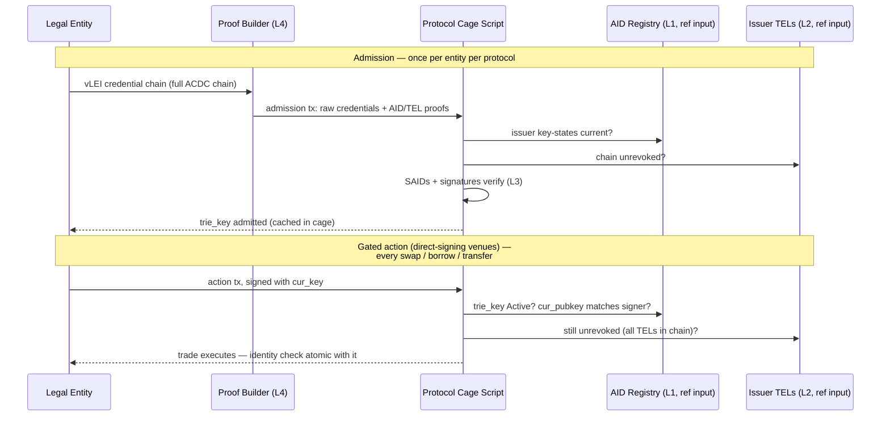

# The Regulated DeFi Gate

A primer on the flagship use case: what a compliance gate is, why the current
industry pattern is weak, and precisely which part of the problem cardano-aid
solves. Companion to the [vLEI Bridge](vlei.md) use-case analysis.

!!! tip "No finance background needed"
    Every financial and institutional concept used here (securities, KYC/AML,
    custody, allowlists, batchers, MEV…) is explained from zero in the
    [Finance Primer](../finance-primer.md); identity concepts (AID, KEL,
    ACDC) are in the [KERI Primer](../keri-primer.md).

## The problem the gate solves

DeFi protocols are permissionless: any address can supply liquidity, borrow,
or trade. That is precisely why regulated institutions —
[banks, funds, corporate treasuries](../finance-primer.md#fund-desk-treasury)
— largely cannot use them. Their obligations
([KYC](../finance-primer.md#kyc-know-your-customer)/[AML](../finance-primer.md#aml-and-sanctions-screening),
counterparty risk rules, transaction reporting) attach to *them*, not to the
pool: an institution that trades against anonymous counterparties cannot
demonstrate to its supervisor who it transacted with. For
[tokenized securities](../finance-primer.md#security) the constraint is harder
still — securities law imposes transfer restrictions, so the *asset itself*
must refuse to move to a non-eligible holder.

A **gate** is the mechanical answer: a check, enforced at execution time, that
every counterparty in a transaction is an identified, currently-valid legal
entity. "Regulated DeFi" is the same AMM/lending/settlement machinery, with
every state transition passing the gate.

## The incumbent pattern and its three weaknesses

The existing pattern is the **permissioned pool with an operator-run
[allowlist](../finance-primer.md#allowlist)**: a company verifies documents
off-chain and writes approved addresses to a list the contract checks. Aave
Arc — a whitelisted pool with Fireblocks as the permissioning agent — is the
canonical precedent; it saw little uptake.

1. **The allowlist operator is a new trusted intermediary** — exactly what the
   chain was supposed to remove. It can censor, err, or disappear.
2. **Identity is not portable.** KYC done for pool A means nothing to pool B;
   every venue re-verifies the same entity.
3. **Revocation is operational, not cryptographic.** When an entity loses its
   standing, someone must remember to update every list it appears on.

## vLEI: identity as a credential chain, not a database row

The [GLEIF vLEI ecosystem](vlei.md) replaces the operator's database with a
chain of signed credentials:

```
GLEIF (root of trust, self-signed)
  → QVI      (Qualified vLEI Issuer — accredited, audited by GLEIF)
    → Legal Entity credential   (bound to the entity's LEI and its KERI AID)
      → OOR / ECR               (named officers, role-in-context)
```

(The last level is simplified: OOR credentials are issued by the QVI under an
LE-signed authorization credential, so a full role chain is four ACDCs — see
the [factored core](business-cases/index.md).)

Each link is an [ACDC](https://github.com/WebOfTrust/ietf-acdc) — a signed,
content-addressed (SAID) credential naming its issuer's AID and its subject's
AID. A verifier can check the whole chain *offline*: hash the content, verify
the issuer's signature, confirm the issuer's key was current, confirm nothing
in the chain is revoked. The [LEI](../finance-primer.md#lei-and-gleif) is the
identifier regulators already accept
for entity identification. The crucial import: **the trust root is not
cardano-aid and not the DeFi protocol — it is the existing regulatory
identification infrastructure, made cryptographic.**

What is missing from that picture: a blockchain cannot run it. Verification
requires walking KERI KELs (are the issuer keys current?) and TELs (is the
credential revoked?) — live, off-chain data structures. Today, "verify a vLEI"
is something a *server* does. Any smart contract that gates on it is back to
trusting whoever runs that server. That is the hole cardano-aid fills.

## What cardano-aid contributes: the chain runs the gate itself

The four layers of the
[on-chain architecture](https://github.com/lambdasistemi/cardano-aid/issues/21)
put the two moving parts of vLEI verification — current key-state and
revocation status — on-chain, as MPF-rooted registries a Plutus script
consumes via CIP-31 reference inputs, and provide the Aiken verifier that
walks the chain:

| vLEI verification step | Off-chain world | With cardano-aid |
|---|---|---|
| Issuer key is current | KERI KEL replay via witnesses | **Layer 1** AID registry proof |
| Credential not revoked | Query issuer's TEL | **Layer 2** TEL registry proof |
| Content/signature integrity | CESR tooling | **Layer 3** Aiken verifier: `blake2b_256` + `verify_ed25519_signature` |
| Assemble the evidence | verifier server | **Layer 4** proof builder (WASM SDK in the holder's flow) |

### Gate flow

The flow below shows the **direct-signing** case — the entity itself signs the
gated action. On batcher-based DEXes the gated-action leg differs; see the
correction box after the diagram.



An entity is **admitted** by one transaction carrying its full
credential chain plus proofs — verified entirely by the script,
permissionless, with no admission committee. Every subsequent gated action
checks three cheap things atomically with the trade: the entity's signature
against its *current* registered key, its AID status `Active`, and
non-revocation across the chain's TELs.

!!! danger "Correction from the case analysis"
    The flow above shows the entity signing the gated action directly. On most
    Cardano DEXes it does not — an off-chain **batcher** signs the executing
    transaction (the batch), so the gate must instead verify a **detached
    signature carried in the order datum**, checked when the batcher spends
    the order. See the deeper
    [Regulated DeFi case analysis](business-cases/regulated-defi.md) for the
    corrected enforcement points (order validator, withdraw-zero pattern,
    LP-token minting policy).

!!! note "Open design decisions"
    Two parameters of this flow are proposed, not settled:

    1. **Admission-cached vs full per-transaction verification.** The flow
       above is the hybrid: pay the full chain walk once at admission, check
       only key-state + revocation per action. The alternative — re-running
       all three hops inside every gated spend — is purer but ex-unit-heavy
       and exposes every trade to proof invalidation whenever any issuer in
       the chain rotates.
    2. **Revocation cascade depth.** If GLEIF revokes a QVI, do entities
       credentialed by that QVI lose access? Checking all three TELs per
       action (three MPF proofs) makes revocation bite anywhere in the chain
       within one root update. The cascade semantics should be cited from the
       GLEIF ecosystem governance framework, not invented here.

### Properties the allowlist pattern cannot offer

- **Atomicity.** The identity check and the trade are one transaction. There
  is no window where a revoked entity's trade is in flight against a stale
  list.
- **No allowlist operator.** Admission is script-verified. The residual
  trusted parties are GLEIF/QVIs — already the regulator-accepted roots — and,
  for liveness only, the registry oracle, who cannot forge an identity, only
  fail to update one (see [Trust Model](trust-model.md)).
- **Portable admission.** The same credentials admit the entity to any
  protocol that imports the Layer-3 verifier. KYC once, at the QVI, not per
  venue.
- **Rotation-proof references.** The protocol authorizes the `trie_key`, which
  is stable across key rotations — the entity rotates keys without
  re-onboarding anywhere.
- **Cryptographic revocation.** The QVI flips one TEL entry; every gate on the
  chain sees it at the next root update, with no per-protocol operational
  step.

## cardano-aid's role, precisely bounded

cardano-aid is **the verification rails, not any of the actors**:

| Responsibility | Owner |
|---|---|
| KYC / entity vetting | QVIs, under GLEIF accreditation |
| Credential issuance and revocation | Issuers, in their TELs |
| Operating the DeFi protocol | The protocol — imports Layer 3 as a library |
| Holder key custody and wallets | Veridian / any KERI wallet |
| Registry + TEL validators, Aiken verifier, proof-builder SDK | **cardano-aid** |

The one thing cardano-aid needs from others and cannot build: Veridian issuing
**F-prefix (Blake2b-256)** SAIDs for Cardano-targeted credentials — see
[Blake2b-256 Requirement](blake2b256-requirement.md). This is the single
external gate on the on-chain stack.

## What the gate is not

!!! warning "Honest limits"
    - **A gate is not a compliance program.** It proves *who* transacted, not
      that the activity was monitored, reported, or sanctions-screened.
      Protocols and institutions still own their AML processes; the gate
      shrinks the identity problem, not the whole obligation.
    - **"Regulation requires DeFi gating" is not a claim this project makes.**
      [MiFID II, Basel III, and eIDAS 2.0](../finance-primer.md#mifid-ii-basel-iii-eidas-20-mica)
      — surveyed in [vLEI Bridge](vlei.md) —
      establish machine-verifiable *entity identification*. The demand for
      gates comes from institutions' own obligations and from
      tokenized-securities transfer restrictions — not from a rule that says
      "DeFi must gate." The MiCA treatment of DeFi specifically has not been
      cited here at article level and must be before this document makes any
      regulatory-obligation claim.
    - **Privacy is structural.** Gating binds a legal entity's entire activity
      in a gated venue to its public LEI. For legal entities — unlike
      individuals — this may be acceptable; it is a property to state, not
      hide.
    - **Demand is unvalidated.** The sharpest open question remains: who is
      the first user, and which transaction are they trying to gate? The
      precedent (Aave Arc) failed on demand, not mechanism. A better mechanism
      is an argument, not evidence.
    - **Freshness has a floor.** Revocation bites at the next TEL root update,
      and Cardano settlement bounds how fast any status change reaches the
      gate (see [Trust Model — synchronization lag](trust-model.md#synchronization-lag)).

## One-line summary

cardano-aid makes "verify a vLEI" something a Plutus validator can do, so
identity gating inherits the trust profile of the chain plus GLEIF — instead
of the trust profile of whoever runs the allowlist.
