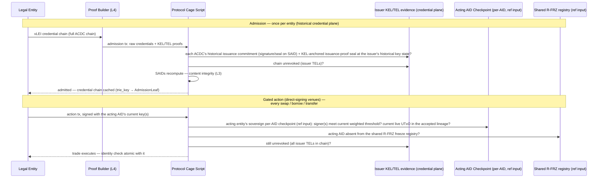

# The Regulated DeFi Gate

A primer on the flagship use case: what a compliance gate is, why the current
industry pattern is weak, and precisely which part of the problem cardano-keri
solves. Companion to the [vLEI Bridge](vlei.md) use-case analysis.

!!! tip "No finance background needed"
    Every financial and institutional concept used here (securities, KYC/AML,
    custody, allowlists, batchers, MEV…) is explained from zero in the
    [Finance Primer](../finance-primer.md); identity concepts (AID, KEL,
    ACDC) are in the [KERI Primer](../keri-primer.md).

## The problem the gate solves

DeFi protocols are permissionless: any address can supply liquidity, borrow,
or trade. That is precisely why regulated institutions —
[banks, funds, corporate treasuries](../finance-primer.md#fund-desk-treasury)
— largely cannot use them. Their obligations
([KYC](../finance-primer.md#kyc-know-your-customer)/[AML](../finance-primer.md#aml-and-sanctions-screening),
counterparty risk rules, transaction reporting) attach to *them*, not to the
pool: an institution that trades against anonymous counterparties cannot
demonstrate to its supervisor who it transacted with. For
[tokenized securities](../finance-primer.md#security) the constraint is harder
still — securities law imposes transfer restrictions, so the *asset itself*
must refuse to move to a non-eligible holder.

A **gate** is the mechanical answer: a check, enforced at execution time, that
every counterparty in a transaction is an identified, currently-valid legal
entity. "Regulated DeFi" is the same AMM/lending/settlement machinery, with
every state transition passing the gate.

## The incumbent pattern and its three weaknesses

The existing pattern is the **permissioned pool with an operator-run
[allowlist](../finance-primer.md#allowlist)**: a company verifies documents
off-chain and writes approved addresses to a list the contract checks. Aave
Arc — a whitelisted pool with Fireblocks as the permissioning agent — is the
canonical precedent; it saw little uptake.

1. **The allowlist operator is a new trusted intermediary** — exactly what the
   chain was supposed to remove. It can censor, err, or disappear.
2. **Identity is not portable.** KYC done for pool A means nothing to pool B;
   every venue re-verifies the same entity.
3. **Revocation is operational, not cryptographic.** When an entity loses its
   standing, someone must remember to update every list it appears on.

## vLEI: identity as a credential chain, not a database row

The [GLEIF vLEI ecosystem](vlei.md) replaces the operator's database with a
chain of signed credentials:

```
GLEIF (root of trust, self-signed)
  → QVI      (Qualified vLEI Issuer — accredited, audited by GLEIF)
    → Legal Entity credential   (bound to the entity's LEI and its KERI AID)
      → OOR / ECR               (named officers, role-in-context)
```

(The last level is simplified: OOR credentials are issued by the QVI under an
LE-signed authorization credential, so a full role chain is four ACDCs — see
the [factored core](business-cases/index.md).)

Each link is an [ACDC](https://github.com/WebOfTrust/ietf-acdc) — a
content-addressed (SAID) credential naming its issuer's AID and its subject's
AID, whose issuer commitment is a **signature or a seal on the SAID** (issuance
is anchored — sealed — into the issuer's KEL at the issuer's key-state *at the
time of issuance*). A verifier can check the whole chain *offline*: hash the
content (SAID), verify the issuer's commitment against the issuer's **historical
key-state at issuance** (not the issuer's current key — the binding survives
later rotations), confirm nothing in the chain is revoked. The
[LEI](../finance-primer.md#lei-and-gleif) is the
identifier regulators already accept
for entity identification. The crucial import: **the trust root is not
cardano-keri and not the DeFi protocol — it is the existing regulatory
identification infrastructure, made cryptographic.**

What is missing from that picture: a blockchain cannot run it. Verification
requires walking KERI KELs (to establish each issuer's **historical key state**
and its **issuance commitment at issuance**) and TELs (is the credential
**currently revoked?**) — live, off-chain data structures. Today, "verify a vLEI"
is something a *server* does. Any smart contract that gates on it is back to
trusting whoever runs that server. That is the hole cardano-keri fills.

## What cardano-keri contributes: the chain runs the gate itself

The layers of the
[on-chain architecture](../architecture/overview.md)
(tracked in [#21](https://github.com/lambdasistemi/cardano-keri/issues/21),
internal) put the moving parts of vLEI verification on-chain — the acting
entity's **current authority** as its sovereign per-AID checkpoint (read via a
CIP-31 reference input), and the credential chain's **issuance evidence and
revocation status** as KEL-anchored seals and MPF-rooted TEL registries — and
provide the Aiken verifier that walks the chain. The steps span two planes:

| vLEI verification step | Off-chain world | With cardano-keri |
|---|---|---|
| Historical issuance authority (*issued then*) | KERI KEL replay via witnesses | Issuer's **signature or seal on the SAID** (MUST on the most-compact form; SHOULD on other variants) + a **KEL-anchored issuance-proof seal at the issuer's historical key state** — **rotation does not invalidate it** |
| Current non-revocation (*unrevoked now*) | Query issuer's TEL | **Layer 2** TEL registry proof |
| Current dApp actor authorization (*authorizes now*) | — | The **acting entity's sovereign per-AID checkpoint** — current weighted keys/threshold read via CIP-31 reference input (#92) |
| Content / signature integrity | CESR tooling | **Layer 3** Aiken verifier: `blake2b_256` recompute proves **content integrity** (SAID) only; a **direct signature** is verified with the SAID as the signed message, a **seal** is followed to its KEL event (or via TEL state to its KEL anchoring seal) and the KEL signatures verified **at the historical key state** |
| Assemble the evidence | verifier server | **Layer 4** proof builder (WASM SDK in the holder's flow) |

!!! warning "Two planes: historical credential admission vs current-actor authority (#92)"
    Per `specs/92-checkpoint-contention/DECISION.md` the rows above span **two distinct
    planes**, and the sovereign per-AID checkpoint answers **only** the current-actor one:

    - **Admission / credential plane (historical, per ACDC).** Each credential is verified by
      the issuer's **historical issuance commitment** (signature or seal on the SAID) + its
      **KEL-anchored issuance-proof seal at the issuer's historical key state** + the issuer's
      **TEL** non-revocation. This uses **KEL / TEL evidence** — the admission-cache credential
      plane — and does **not** consult each issuer's current checkpoint. **Rotation does not
      invalidate prior issuance.** The GLEIF → QVI → Legal Entity hierarchy is the trust root,
      preserved unchanged.
    - **Current-actor plane (the acting entity, now).** The entity submitting the new action is
      authorized by **its own sovereign, per-AID, quantity-one uniquely-tokenized checkpoint
      UTxO** — asset id `(checkpoint_policy_id, aid_asset_name)`, current weighted keys/threshold
      in the inline `CheckpointDatum`, read as a CIP-31 reference input and discovered by a
      generic `(policy_id, asset_name)` asset lookup (candidate outref for liveness only,
      revalidated by the consuming tx).

    **Lifecycle / freeze are not datum fields.** The `CheckpointDatum` carries only the
    AID/sequence binding + current weighted key state. Close / lifecycle is enforced by the
    checkpoint's **asset mint/spend lineage** (the referenced checkpoint must be the current
    live UTxO, not closed/tombstoned/migrated); freeze is the **separate shared R-FRZ** rule
    (attacker-contendable residual). The mechanical re-cut is downstream #24.

### Gate flow

The flow below shows the **direct-signing** case — the entity itself signs the
gated action. On batcher-based DEXes the gated-action leg differs; see the
correction box after the diagram.



An entity is **admitted** by one transaction carrying its full
credential chain plus proofs — verified entirely by the script against the
**historical** credential plane (issuance commitments + KEL-anchored issuance
proofs at each issuer's historical key state + TEL status), permissionless, with
no admission committee, and **without consulting any issuer's current
checkpoint**. Every subsequent gated action then checks, atomically with the
trade: the **acting entity's** signature(s) meeting the weighted threshold of the
current keys in its **sovereign per-AID checkpoint** (read as a CIP-31 reference
input); that the referenced checkpoint is the **current live UTxO in the accepted
lineage** (not closed/tombstoned); **absence from the separate shared R-FRZ
freeze registry**; and non-revocation across the credential chain's issuer TELs.
Lifecycle and freeze are **validation rules**, not `CheckpointDatum` fields.

!!! danger "Correction from the case analysis"
    The flow above shows the entity signing the gated action directly. On most
    Cardano DEXes it does not — an off-chain **batcher** signs the executing
    transaction (the batch), so the gate must instead verify a **detached
    signature carried in the order datum**, checked when the batcher spends
    the order. See the deeper
    [Regulated DeFi case analysis](business-cases/regulated-defi.md) for the
    corrected enforcement points (order validator, withdraw-zero pattern,
    LP-token minting policy).

!!! note "Open design decisions"
    Two parameters of this flow are proposed, not settled:

    1. **Admission-cached vs full per-transaction verification.** The flow
       above is the hybrid: pay the full credential-chain walk once at
       admission, then per action check only the acting entity's current
       checkpoint + revocation. The alternative — re-running all the
       credential-chain hops inside every gated spend — is purer but
       ex-unit-heavy: each trade must re-walk the full chain against the
       latest TEL / revocation-root evidence. (This is **not** about issuer
       key rotation — the historical issuance proof is anchored at the
       issuer's historical key state and **survives** later issuer rotations;
       only revocation status changes over time.)
    2. **Revocation cascade depth.** If GLEIF revokes a QVI, do entities
       credentialed by that QVI lose access? Checking all three TELs per
       action (three MPF proofs) makes revocation bite anywhere in the chain
       within one root update. The cascade semantics should be cited from the
       GLEIF ecosystem governance framework, not invented here.

### Properties the allowlist pattern cannot offer

- **Atomicity.** The identity check and the trade are one transaction. There
  is no window where a revoked entity's trade is in flight against a stale
  list.
- **No allowlist operator.** Admission is script-verified. The residual
  trusted parties are GLEIF/QVIs — already the regulator-accepted roots — and,
  for liveness only, the MPFS oracles of the L2 TEL registries and the
  admission cage (the issuers and the venue), who cannot forge an identity,
  only fail to update one (see [Trust Model](trust-model.md)).
- **Portable admission.** The same credentials admit the entity to any
  protocol that imports the Layer-3 verifier. KYC once, at the QVI, not per
  venue.
- **Rotation-proof references, with universal re-authorization.** The protocol
  references the AID's stable identity — its **sovereign per-AID checkpoint**
  `(checkpoint_policy_id, aid_asset_name)` — so the entity rotates keys without
  re-onboarding. But rotation is **not** transparent to pending actions: a
  `delta = 0` rotation (`seq + 1`) **consumes** the referenced checkpoint UTxO,
  so the spent checkpoint is **no longer available as a CIP-31 reference input**
  and any in-flight authorization made under the prior key state is **stale by
  construction** — changing the reference input alone cannot revive an old
  signature. The action **must be re-signed** by the AID's current weighted keys
  at the new sequence over a fully bound action. Long-lived protocol state
  follows the cross-protocol lifecycle (**Execute / Refresh-Re-sign /
  Cancel-Reclaim by the current keys / Expire-Cleanup**); value-bearing stale
  UTxOs need a **current-AID reclaim path**. This does **not** touch historical
  credential evidence — ACDC issuance / TEL seals remain historical evidence
  through issuer rotation until revoked, and are not pending dApp actions.
- **Cryptographic revocation.** The QVI flips one TEL entry; every gate on the
  chain sees it at the next root update, with no per-protocol operational
  step.

## cardano-keri's role, precisely bounded

cardano-keri is **the verification rails, not any of the actors**:

| Responsibility | Owner |
|---|---|
| KYC / entity vetting | QVIs, under GLEIF accreditation |
| Credential issuance and revocation | Issuers, in their TELs |
| Operating the DeFi protocol | The protocol — imports Layer 3 as a library |
| Holder key custody and wallets | Veridian / any KERI wallet |
| Registry + TEL validators, Aiken verifier, proof-builder SDK | **cardano-keri** |

The former single external gate — Veridian issuing **F-prefix (Blake2b-256)**
SAIDs — is dissolved by the E-native contract (2026-07-16): standard Blake3
identities and SAIDs are consumed as-is, so nothing on the on-chain stack
waits on a wallet vendor. See
[Blake2b-256 Requirement](blake2b256-requirement.md) for the archived
rationale.

## What the gate is not

!!! warning "Honest limits"
    - **A gate is not a compliance program.** It proves *who* transacted, not
      that the activity was monitored, reported, or sanctions-screened.
      Protocols and institutions still own their AML processes; the gate
      shrinks the identity problem, not the whole obligation.
    - **"Regulation requires DeFi gating" is not a claim this project makes.**
      [MiFID II, Basel III, and eIDAS 2.0](../finance-primer.md#mifid-ii-basel-iii-eidas-20-mica)
      — surveyed in [vLEI Bridge](vlei.md) —
      establish machine-verifiable *entity identification*. The demand for
      gates comes from institutions' own obligations and from
      tokenized-securities transfer restrictions — not from a rule that says
      "DeFi must gate." The MiCA treatment of DeFi specifically has not been
      cited here at article level and must be before this document makes any
      regulatory-obligation claim.
    - **Privacy is structural.** Gating binds a legal entity's entire activity
      in a gated venue to its public LEI. For legal entities — unlike
      individuals — this may be acceptable; it is a property to state, not
      hide.
    - **Demand is unvalidated.** The sharpest open question remains: who is
      the first user, and which transaction are they trying to gate? The
      precedent (Aave Arc) failed on demand, not mechanism. A better mechanism
      is an argument, not evidence.
    - **Freshness has a floor.** Revocation bites at the next TEL root update,
      and Cardano settlement bounds how fast any status change reaches the
      gate (see [Trust Model — synchronization lag](trust-model.md#synchronization-lag)).

## One-line summary

cardano-keri makes "verify a vLEI" something a Plutus validator can do, so
identity gating inherits the trust profile of the chain plus GLEIF — instead
of the trust profile of whoever runs the allowlist.
