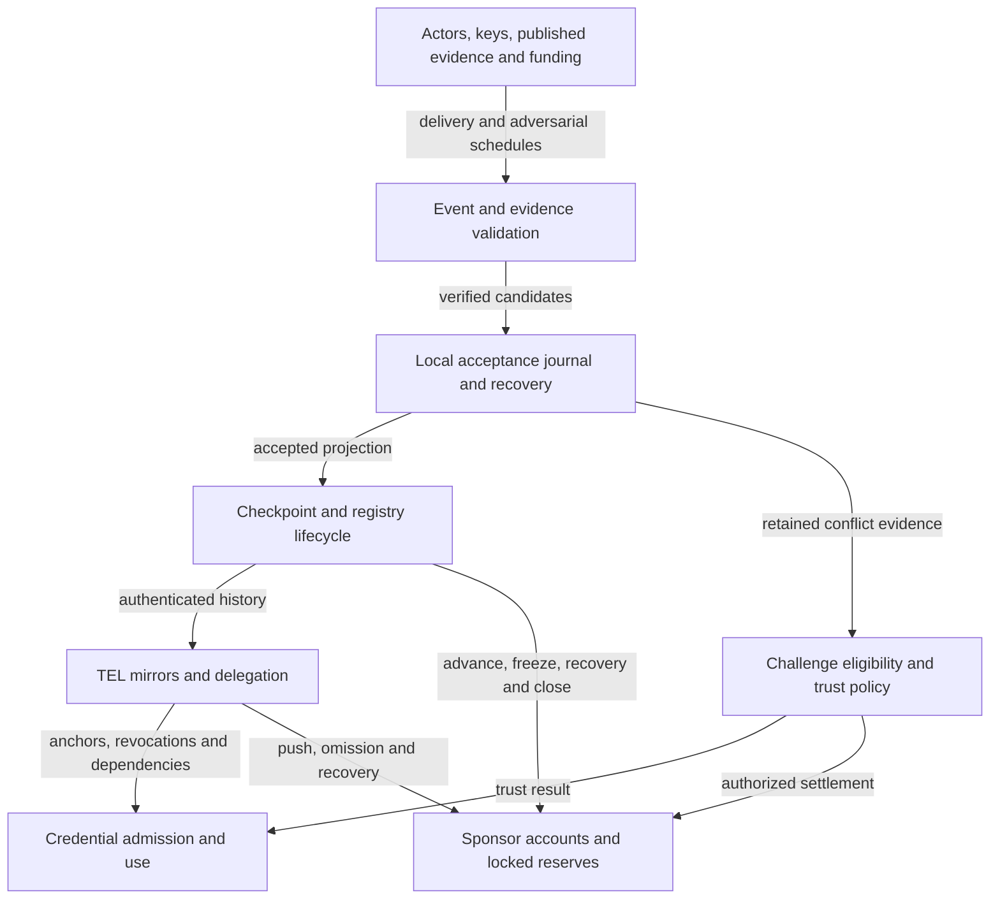
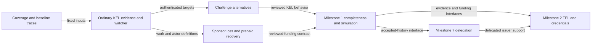

# Plan: bring the watcher and incentive design into Lean

## The stories this plan must cover

An identity owner needs to see what happens when current or next keys are
stolen, including when the thief rotates again before anyone responds. A
sponsor needs to know which funds can be spent, seized, recovered or returned
when the issuer is passive or hostile. A consumer needs to distinguish an
accepted KERI history from incomplete observation, and a mirror's absence
proof from evidence that a credential has never been revoked.

**Plan, 11 September 2026:** model all these behaviors in executable Lean,
state their invariants and limitations, and exercise reachable attacks before
doing new proof work. Include all ten stories in the [conviction proposal][stories].
The proposal is an input to design, not an already accepted replacement for
the checkpoint rules.

**Milestone boundary:** all KEL work discussed here belongs to **Milestone 1**,
excluding delegation. TEL and ACDC work belongs to **Milestone 2**. Delegation
remains in its existing **Milestone 7** lane; it is neither an identity-core
acceptance requirement nor a reason to postpone the ordinary KEL model.

“Everything goes into Lean” means every discussed guarantee, refusal,
assumption and counterexample has a named declaration and an executable
scenario where applicable. It does not mean asserting every claim in the
discussion as a theorem. Contradictory claims become competing profiles or
counterexamples; unavailable evidence remains unavailable in the model.

The deliverable of this phase is a reviewed executable design and its coverage
record. New theorem proofs remain deferred. Existing proof guarantees and the
retired-lifecycle boundary remain intact until an explicit integration change.

## Authority and starting point

| Input | Identity and treatment |
|---|---|
| Current repository | `811843b313d9005923ba205e86d7a3afa6fb3d0d`. Inspect Aiken, the checkpoint model and the statement library separately; their capabilities are not identical. |
| This conversation | First-seen applies to our watcher; focus on invariants; model unwilling issuers; sponsorship must cover freeze and prepaid recovery; examine reward farming and issuer capture of sponsor funds. |
| Existing checkpoint rulings | The terminal-conviction and convictor-payout rulings are recorded in [identity operations](../architecture/identity-ops.md#convict-new-shape-in-the-m1-return), and implemented in the Lean checkpoint. Preserve them as the baseline. Changes to eligibility, terminality, payout or dormant revival require an explicit amendment, not relabeling an existing ruling as undecided. |
| Existing statement decisions | [Statement ledger](https://github.com/lambdasistemi/cardano-keri/blob/811843b313d9005923ba205e86d7a3afa6fb3d0d/lean/STATEMENTS-ATOMS.md), including permanent retained revocations, provisional anchors, cache-then-evict, consumed certificates, and the excluded recursive delegation profile. Existing exclusions must become explicit model boundaries or be implemented in their assigned milestone. |
| Prior review | [Watcher conformance review](watcher-conformance.md), with pinned specifications and executable baseline evidence. Carry forward every boundary, scenario and correction, including its unresolved status. |
| Updated gist | Revision `6878815c5204acd0c82c046b2ccb09d65abcae32`: [conviction stories][stories] and [incentive analysis][incentives]. Both files read in full, including the analysis's response to the review. |
| Specification profile | KERI 1.1, source `fbdd4a6155e48248873cccd5cf6f79b6b631a021`. Keep the whitepaper and expired Internet Draft as separately versioned sources; do not combine their definitions silently. |
| Claude artifact | The commentable page was moved back into the gist on 11 September; revision `6878815c` carries everything the page held, including the glossary and the witness-set correction from its comment threads. No separate input remains. |

The previous review already executed eight checkpoint payoff/dormancy checks,
twelve rapid-rotation checks and a finite quorum calculation. Those are useful
baseline regressions, with their recorded abstract evidence assumptions. They
are not a signed same-block Cardano attack or a complete watcher implementation.
The current statement ledger describes 71 proved statements and 39 probes;
neither count establishes coverage of this expanded design.

## Milestone ownership

| Milestone | Work owned here | Boundary |
|---|---|---|
| Identity core, Milestone 1 | Non-delegated KEL validation and history; watcher first acceptance and ordinary recovery; conflict retention and exposure; all ten conviction stories; challenge time, dormant policy and checkpoint consumer readiness; KEL sponsorship, fund ownership, rewards, freeze, prepaid unfreezing, close and revival. | Completeness review and simulator coverage close on these behaviors. Unsupported delegated events are explicitly refused; implementing their approvals or recovery is excluded. |
| Verification, Milestone 2 | TEL seal-walk integration, per-registry mirror economics, retained revocations, local absence, ACDC chain admission, cache/eviction/expiry and credential use. | Reuse the reviewed KEL evidence, sponsorship and lifecycle contracts. These consumers do not own or postpone fixes to their KEL prerequisites. |
| Delegated identities, Milestone 7 | Parent approval identity, certificates, delegated establishment and supersession, recursive ancestor precedence, and their composition with KEL/TEL/credential consumers. | Existing [delegation ticket](https://github.com/lambdasistemi/cardano-keri/issues/292) is assigned here. Keep all delegated scenarios in the coverage register with this owner; do not silently omit them from the overall plan. |

The earlier economic tickets were all filed under verification. The ticket
alignment required by the operator's new boundary is:

| Existing work | Planned alignment |
|---|---|
| [Checkpoint history #391](https://github.com/lambdasistemi/cardano-keri/issues/391) | Ordinary KEL history and its authenticated interface move to identity core; TEL/ACDC consumers stay in verification; delegated supersession stays with delegated identities. Split acceptance criteria at those boundaries. |
| [Shared sponsorship #404](https://github.com/lambdasistemi/cardano-keri/issues/404) | KEL sponsorship, passive-issuer operation and the shared funding contract move to identity core. Keep TEL funding as a verification adaptation and delegated GLEIF operation as a later consumer. |
| [Prepaid unfreezing #405](https://github.com/lambdasistemi/cardano-keri/issues/405) | Move the checkpoint recovery design to identity core. TEL recovery remains an application of its shared contract. |
| [Sponsor protection #406](https://github.com/lambdasistemi/cardano-keri/issues/406) | KEL ownership, close/refund protection and the shared adversarial funding model move to identity core. Distinct-revocation farming and TEL retirement remain verification acceptance criteria. |
| [TEL economics #398](https://github.com/lambdasistemi/cardano-keri/issues/398) | Remains in verification; depends on the identity-core funding contract. |

These are the assignments for the planned work; this document does not claim
the GitHub issue milestones have already been changed. Separate milestone
completion receipts prevent a later TEL or delegation decision from hiding
an unfinished ordinary KEL invariant.

## Model architecture and boundaries



Use these conceptual modules; final file boundaries should follow shared
definitions rather than duplicate state machines:

| Lean surface | Planned responsibility |
|---|---|
| New `Evidence.lean` | Typed events, historical authority, thresholds, receipts, authenticated commitments, actor capabilities and evidence availability. |
| New `Watcher.lean` | Validated first acceptance, local acceptance ordinals, retained branches, recovery and conflict records, replay and evidence retrieval. |
| New `Challenge.lean` | Candidate challenge policies, authenticated targets, clocks, consumer effects and settlement eligibility. Detection is independent of payout. |
| New `Sponsorship.lean` | Contributions, ownership, authorized spending, freeze bond, locked recovery reserve, premium pool, refunds and cumulative exposure. |
| Existing `Checkpoint.lean` and `Registry.lean` | Remain the lifecycle authorities. Refine their evidence and funding interfaces; make close, dormant conviction, revival and registry folds obey the selected design. |
| Existing `Statements/History.lean` and `Delegation.lean` | Ordinary accepted-history integration belongs to identity core. Approval ordering, delegated supersession and their consequences belong to the delegated-identity extension. |
| Existing `Statements/Mirror.lean` and `Credential.lean` | Add TEL economics and observation status; compose anchors, absence, funding status and credential use. |
| New composition surface, tentatively `Bridge.lean` | One executable product transition and replay across these interfaces; no independent lifecycle that can bypass checkpoint rules. |
| Corresponding goals, probes and trace drivers | Named propositions, executable predicates, reachable controls, adversarial traces and exported outcomes. |

Cryptographic verification can remain a declared primitive with explicit
soundness assumptions. However, `duplicityAt : Epoch → Seq → Bool` cannot be
the entire definition of the conflict we are investigating. Model the event,
authority, threshold, witness and recovery conditions that make the primitive
results meaningful. Distinguish public keys from private signing capability,
and creating a signature from relaying an already available signed event.

A history leaf must expose or authenticate the verification context it is
used to establish. A digest commitment plus a checked opening may suffice;
this plan does not require every full event or key list to live in the datum.
State on-chain commitments, off-chain retention and retrieval obligations
separately. The general MPFS cage remains a transport mechanism; KERI rules
belong in its application model.

## Complete invariant scope

Each row below expands into named declarations and controls in the first
implementation slice. A coverage register will bind the conversation item,
source or ticket, declaration, policy status, reachable trace, falsifying
mutation and evidence receipt. Unresolved rows stay visible.

### Evidence, observation and recovery

| Required invariant or explicit limitation | Required executable controls |
|---|---|
| Validate before acceptance: AID, event type, native sequence, content digest, prior linkage, historical control authority, current and prior-next thresholds, applicable receipts and delegation approval. | Good event accepted; change each binding independently and observe the corresponding refusal. An invalid packet arriving first must not reserve acceptance priority. |
| Prior-next satisfaction supports partial and augmented rotations, key order changes and the supported threshold forms. | Same keys and disjoint satisfiable subsets; reordered indices; current threshold passes but prior-next fails, and the converse. Weighted thresholds cannot be reduced to a cardinality rule. |
| Derive each rotation's resulting witness set from its authenticated predecessor and valid cuts/adds; bind distinct receipts to that event and to the witness's applicable signing authority. | Witness replacement, duplicate receipts, signatures on another event, invalid deltas, old witness keys and witnessless operation. Compare tip-set, rival-set and any joint-set financial policies explicitly. |
| First accepted is local to the observer; an ordinary conflicting rotation cannot replace it. Local acceptance ordinal and native sequence are different. | Reverse two valid arrival orders at two observers; retain each observer's accepted copy. Replay, duplicate delivery and restart preserve its order. |
| Retain accepted and superseded events and their relationship; full event differences cannot disappear into an equal projected key state. | Equal key state with differing seals/content; retained interaction branch after recovery; replay from persisted evidence and missing-archive failure. |
| Ordinary recovery may replace eligible interactions, never an accepted ordinary rotation or an event protected by a later establishment. | Permitted interaction recovery, forbidden rotation replacement, forbidden interaction supersession and recovery behind a later rotation. |
| Delegated recovery uses authenticated parent approval order, including exact event identity for two seals in the same event and actual parent supersession. | Later parent sequence; later seal in the same event; same sequence on different parent branches; parent rotation replacing an interaction. Show where the non-forked-parent assumption is established rather than granting it to arbitrary inputs. |
| Recursive ancestor precedence and termination are represented, or an explicit restricted profile refuses them. | Grandparent recovery, root with no superior approval, depth exhaustion, cycles and incomparable approvals. A declared unsupported recovery is a compatibility limit, not evidence of full conformance. |
| Observation, conflict classification, accepted history, future trust and financial punishment are distinct results. | Verified conflict retained with no replacement; reconciled conflict; unverified allegation; admissible alert with no bounty. Terminal financial policy must not accidentally block permitted delegated recovery. |
| No observed conflict does not establish global absence; a quiet or permissionless publication path does not establish completeness or delivery. | Withholding, peer partition, eclipse at bootstrap, witnesses who do not gossip, no relayer, no funds and ledger censorship. Expose observation basis and unknown coverage. |
| Receipt intersection and liveness depend on named assumptions. | For a fixed common set, exercise `max(0, 2*M-N)`, `2*M > N+F`, and `M ≤ N-F`; violate the fault bound. Different branch witness sets require a separate analysis. Waiting is not watcher diversity. |
| Evidence exposure has a storage and retrieval contract. | A mismatch cue alone cannot produce a conviction; retrieve and validate both variants. A deadline may end a financial remedy without deleting a late conflict or preventing its reporting. |

### Challenge time and checkpoint lifecycle

| Required invariant or explicit limitation | Required executable controls |
|---|---|
| An admissible challenge target and its protected liability cannot be erased before the promised deadline by another lifecycle action. | Second rotation, close, freeze, poison, top-up, revival, migration and registry batching; exercise chained transactions without an intervening victim turn. |
| A minimum rotation spacing and an evidence expiry are independent rules. | Keep the tip stationary past `C`; test whether conviction remains possible. Test just before, at and just after each deadline, including `C = 0` if allowed. Never infer expiry from a rotation guard. |
| Challenge time is derived from authenticated ledger-visible bounds and is not freely chosen by the submitter. | Backdated or missing bounds, excessively wide validity intervals, non-monotone time and boundary inclusion. Model a conservative validity-range construction before treating an abstract `now` as an exact inclusion slot. |
| Retained challenge targets authenticate all context required by their chosen predicate. | Wrong AID/incarnation, sequence, event digest, prior establishment, key commitments, thresholds, witness set or acceptance-time commitment. Arbitrary supplied openings fail. |
| Non-moving operations neither shorten protection nor indefinitely renew it without the chosen authorization. | Repeated top-ups/poison/freeze reset attacks; equal-sequence delegated replacement and batched catch-up carrying several rotations. Specify which intermediate establishment states remain challengeable. |
| A victim's opportunity is conditional on remaining keys, evidence, notice and inclusion; it is symmetric between race participants. | Owner wins and thief wins; copied keys versus keys lost outright; no remaining satisfiable subset; withheld receipts; delayed ceremony; relayer front-running. A third party can submit public evidence without holding next keys. |
| Consumer maturity after registration/revival and readiness after a new contested rotation are separate policies. | Mature checkpoint rotates while a treasury immediately consumes it; compare consumer refusal or explicitly accepted exposure during the challenge interval. Existing `bornAt` alone does not reset on rotation. |
| Registration, dormant state and revival cannot bypass challenge, ownership or old-key policy. | Inception plus first rotation; bootstrap at a later established state; close during a contest; late evidence against a stationary dormant leaf; reopen with stale keys; attempted resurrection after conviction. |
| Funded intervention does not restore ordinary KERI priority. | Reserve-key rival can be admissible evidence under a selected policy while remaining forbidden as a replacement of our first accepted ordinary rotation. Delegated recovery is evaluated separately. |
| Existing checkpoint controls survive the refinement: quorum-authorized poison, valid-rotation clearing, signed intent where required, consumer signature thresholds and one registry incarnation per identity. | A single compromised member below threshold cannot poison; invalid rotation cannot clear poison; reused or redirected intent fails its binding; duplicated registration and stale registry generation cannot bypass the lifecycle. Passive ordinary advance still needs no invented issuer Cardano intent. |

### Sponsorship, freeze and reward economics

| Required invariant or explicit limitation | Required executable controls |
|---|---|
| The conviction bond, freeze bond, locked recovery reserve, premium pool and ledger minimum-value costs have distinct purposes and authorized flows. | Exact conservation by asset and account; insufficient funds; no premium drawn from a protected bond; no reserve double use. Money units in fixtures are explicit. |
| Sponsor spending rights are separate from KERI identity authority. Distinguish donations from recoverable contributions at funding time. | Issuer changes refund address, rotates or closes; sponsor exits or is replaced; several sponsors contribute. Neither side gains the other's signing, censorship or financial authority implicitly. |
| Covered unfreezing restores the freeze bond from locked funds with no fresh external bond contribution and no extra Cardano-specific issuer signature. | Passive issuer publishes an ordinary valid event; freeze and recovery use it. Exercise both enough and exhausted reserve. Specify transaction fees and premium funding separately from the no-extra-unfreeze-bond promise. |
| Freeze proves a particular omitted valid progress event and applicable funding failure, not inactivity. | Idle issuer, unavailable event, invalid event, sufficient pool, stale state proof and already seized bond. Cooldown-ineligible progress must not automatically qualify as culpably omitted progress. |
| Intervening unpaid progress cannot consume the sole recovery evidence and strand a frozen checkpoint. Top-up alone proves no catch-up. | Freeze then another relayer advances/pushes unpaid, then recover from the recorded omission; top-up without progress; multiple omissions; one resolved omission does not certify completeness. |
| Rewards require newly credited work, bind their destination, and cannot be paid twice. | Replay, duplicate transaction, old-root proof, same evidence under another payee, copied signed close with rewritten payee and competing insert/freeze/recovery transactions. |
| Valid fresh work can also be manufactured for profit; replay protection and conservation are insufficient. | Issuer = hunter = relayer = beneficiary, colluding sponsors, distinct fresh rotations/revocations, repeated freeze/recovery, new addresses and reopen loops. Track external fees and event-production costs as explicit inputs. |
| Recoverable sponsor exposure is bounded by authorized cumulative loss and renewal rules, across identities/addresses/incarnations where the funding contract applies. | Drain, close, refund redirect, re-register and automatically replenish; stop at the authorized budget. New capital requires the funding authority's consent. A finite reserve caps loss but does not establish deterrence. |
| Payout analysis compares the same actor capabilities and ownership across alternatives. | Close-capable winner, rival-only loser, evidence-only relayer and sponsor-funded owner self-conviction. Record the fate of every held balance, including the reserve; a larger close payout does not make a rival-only bounty worthless. |
| Finite funding cannot buy unbounded paid work or unconditional freshness. | Long valid-event streams, no sponsor renewal, adversarial fee levels, refusal of reward but permitted unpaid progress, exhausted reserve and consumer outcomes. Economic safety and availability tradeoffs stay visible. |
| Shared GLEIF/QVI infrastructure has explicit providers for every operation. | Opening, history supply, advance, revocation push, freeze, recovery, close/retirement and sponsor exit with an unwilling root issuer. No assumed GLEIF/QVI payer, new event, custom intent or responsive witness. Model committed donations, recoverable sponsorship and consumer self-relay separately. |

### TEL, credentials and composition

| Required invariant or explicit limitation | Required executable controls |
|---|---|
| A pushed revocation is issuer/registry/credential bound and its TEL event is authenticated through the proper KEL seal and historical authority before insertion. | Wrong registry, issuer, SAID, TEL sequence, seal index/digest, KEL authority, receipts, inception anchor or provisional range. Current keys cannot substitute for historical authority. |
| Mirror absence is absence from a specific committed mirror state; stronger freshness claims require an observation contract. | Genuine sealed revocation withheld off chain; disclosed but unpushed; already inserted; unavailable archive. An old-root absence proof cannot authorize a current omission reward or current validity claim. |
| Revocation facts and their verification provenance survive funding/lifecycle changes under the selected retention policy. | Sponsor exit, retirement, reactivation, issuer recovery and superseded provisional seal. Preserve the existing conservative retention policy unless amended; quantify its possible over-revocation. Decide full evidence archive versus authenticated commitment and retrieval, separately from the on-chain revoked-SAID set. |
| The TEL mirror has its own specified freeze bond, premium and recovery funding lifecycle, sharing the sponsorship contract where applicable. | Funded/unpaid/duplicate push; evidence-backed omission freeze; reserve recovery after someone else inserted the revocation; pool and reserve exhaustion. This is per mirror, not a bond attached to each TEL event. |
| Credential validity preserves actor binding, issuer-to-issuee links, schema/root/depth policy, anchors and time bounds. | Wrong actor, broken chain link, revoked ancestor, untrusted root/schema, depth exhaustion, expired admission and premature renewal. Retain the existing repaired probes. |
| Recovery consequences reach credential use and delegated installation. | Provisional anchor changes between admission and use, before eviction and after expiry; consumed certificate re-minted; stale unconsumed certificate; child installed before parent recovery. Preserve stated installed-child policy unless amended. |
| The composed model cannot bypass lifecycle or evidence rules through a simpler submodel. | Delegation `leave` cannot treat convicted as freely registrable; history cannot advance independently of accepted checkpoint evidence; registry folds use the current accumulator; a consumer cannot ignore required frozen/stale/contested status. |
| Consumer freshness is conditional on named observation, funding and scheduler assumptions. | Frozen mirror, unresolved conflict, missing dependencies and delayed eviction. Compare existing cache-then-evict with immediate dependency checks; retain a witness to any accepted exposure interval. |

## The ten conviction stories as Lean scenarios

Keep the proposal's story identities in the machine-facing register and its
names in the readable plan. Run the published fixture values as examples;
the statements quantify over admissible parameters. The proposal's `C = 20`
and `W = 10` are simulator choices, not measured production response times.

| Proposal story | Lean scenario and necessary qualification |
|---|---|
| Mallory rotates twice and walks away | Preserve the current tip-only escape trace, including empty pool and close as a second path. A possible same-block schedule is sufficient to refute a guaranteed intervention interval; do not assume guaranteed atomic attacker ordering or zero fees. |
| The chain holds the tip still | Candidate cooldown refuses advance and reap before the deadline and admits eligible progress afterward. Also test a stationary old tip, which a lower-bound advance guard alone leaves convictable forever. |
| Alice self-convicts with the keys she still holds | Construct both signed variants, authenticated prior-next authority and available rival receipts. Parameterize payee and funding ownership. Derive every payment from transitions: with one attacker landing under cooldown, two attacker premiums do not follow from the stated trace. |
| Alice self-convicts with the keys Mallory never saw | Use different satisfiable subsets of the same commitment. For an unweighted threshold `t`, if the thief removes `k` keys from `n`, the owner retains enough only when `n-k ≥ t`; `n ≥ 2*t` covers the special case `k = t`. No claim of a guaranteed move without receipt and inclusion assumptions. |
| Mallory swaps the witnesses and it does not help her | Derive both witness sets from the predecessor and compare policy outcomes. A rival-set policy removes the winner's receipt veto in the supplied trace; it does not establish witness collusion or identify two distinct people. One controller can create both variants. |
| Alice wins the race, and Mallory has the same move | Preserve symmetric destructive capability under the candidate predicate. Compare existing convictor payout, authenticated pre-contest refund and sponsor-owned settlement without selecting one implicitly. Public evidence can also be relayed by Hal. |
| Mallory cannot reap inside the cool-down | Block early close and evaluate close at the boundary. Count all authorized loss, including held bonds, pool and any future reserve disposition. Binding the initial refund is insufficient if issuer keys can later replace it. |
| Alice does not roll back | Refuse ordinary rotation replacement without asserting that every observer accepted Mallory's branch. Retain evidence and evaluate trust separately. Model legitimate interaction and delegated recovery elsewhere; they are in this plan even though the proposal excludes them. |
| Alice registers and rotates in one breath | Compare exemption, registration carrying an established path and delayed first advance; bind challenge context and consumer readiness in each. Also test batched catch-up over multiple off-chain rotations. No unsupported hours-to-days calibration. |
| Mallory convicts a dormant leaf for free | Preserve the current model's timeless terminal path with explicit signature/receipt assumptions and a transaction fee. Require authenticated dormant openings and a selected late-evidence policy. Public exposure of a key is not possession of its private key; an abstract parked hash does not itself demonstrate an exploitable Aiken witness substitution. |

The proposal's conformance commentary also becomes testable obligations:

- KERI 1.1 defines event location by native sequence within the AID. A common
  prior digest is useful for a narrower sibling-conflict predicate, but must
  not erase higher-branch conflicts from the observer. Keep this separate from
  the older source's location terminology.
- The specification's trust passages and first-seen rules do not themselves
  choose a Cardano payout, cooldown or dormant penalty. Preserve existing
  ruled policy, and name each proposed amendment and its scope.
- A cooldown is an application timing policy, not a measured KERI propagation
  boundary. Late discovery remains possible. Expiring a financial claim need
  not end observation or consumer alerts.
- A permissionless submission path still needs available evidence, a paying
  submitter and inclusion. A consumer waiting for juvenility does not obtain
  an independent observation merely by waiting.

## Decisions the models must make reviewable

Within each milestone, implementation first preserves a baseline and constructs alternatives.
It must not select a new production policy merely because that alternative
is easiest to encode or prove.

| Decision | Baseline or adopted constraint | Alternatives to evaluate and reason |
|---|---|---|
| Protect the challenge opportunity | The current tip-only model has a demonstrated escape; the operator asks to prevent immediate escape, and stated in the 11 September conversation that refusing a second establishment step is necessary for every tip-only conviction. That is a direction, not yet a ruling; a stationary tip still needs its own evidence-expiry rule. | Cooldown on establishment/close is the direction. The alternative, allowing progress while retaining bounded authenticated targets and liability, stays in the model only as a comparison: the operator's stated view on 11 September is that it is wrong, and it is not to be adopted without a ruling that reverses that view. Compare emergency recovery delay, storage, batching and old-key attacks. Tip-only with no protection remains the negative control. |
| Stop old-key penalties | Our accepted history cannot be replaced by an ordinary late rival. Existing live and dormant terminal conviction remain the comparison baseline. | Explicit eligibility expiry, bounded retained claims, or scoped late evidence without financial penalty. Timing, trust, terminality and revival each need a rule; minimum spacing alone settles none of them. |
| Grade the rival | Existing predicate requires the tip's exact revealed keys, threshold and witness receipts. | Prior-next validation with the rival's current threshold and derived witness set; any additional common/joint confirmation is an explicit financial policy. Test partial and augmented keys as well as witness replacement. |
| Distribute conviction and close funds | Existing convictor payout and issuer-authorized close/refund are ruled behavior; sponsor protection is a new required design constraint. | Compare convictor bounty, authenticated pre-contest refund, sponsor entitlements and separately funded relay reward. Specify ownership of every balance and amend the old ruling where necessary. |
| Freeze while progression is delayed | Freeze must demonstrate omitted valid progress and an eligible missing payment. | Distinguish intrinsic event validity from present scheduling eligibility; decide whether policy-blocked advance may support freeze. Prevent cooldown from manufacturing a rewardable omission. |
| Reserve and funding renewal | Sponsor-funded locked unfreeze reserve; no fresh unfreeze bond for covered recovery. | Fix authorized loss/renewal limits before sizing funds. Compare donations, recoverable contributions and consumer relay; reject any purported guarantee of unlimited funded recovery from finite capital. |
| Trust and credential use during disputes | Existing juvenility and cache-then-evict are the baseline. | Immediate checks or explicitly bounded cached exposure; a per-rotation pending policy versus immediate use. Evaluate non-delegated, interaction and delegated cases separately. |
| Bootstrap and first rotation | Inception can be followed promptly by the first KERI rotation off chain. | Registration exemption versus authenticated registration path; each must preserve challenge context and declare observation coverage. An unwilling controller has not agreed that Cardano defines global priority. |
| Recursive delegation and TEL retention | Recursive precedence is currently excluded; stored revocations currently survive provisional supersession. | Implement recursive validation or retain a named restricted profile. Preserve conservative revocation retention or explicitly amend it with the corresponding false-revocation/false-validity traces. |

The next operator decisions should be based on the resulting counterexamples
and exact value flows. Do not choose a numerical challenge interval until
notice, signing, receipt collection and inclusion assumptions have been named
and measured. No GLEIF or QVI funding commitment is asserted by this plan.

## Delivery order and acceptance



| Slice | Deliverable and acceptance condition | Dependencies and planning owner |
|---|---|---|
| Coverage and baseline | Expand every scope row and proposal story into the register; pin source versions; map existing declarations; preserve current attack traces. Every item has a milestone and is adopted, an existing ruling, a proposed amendment, an assumption, a counterexample or an explicit omission. | Starts with [identity-core design](https://github.com/lambdasistemi/cardano-keri/issues/318). Record missing artifact content and original ruling references. No production policy amendment. |
| Ordinary KEL evidence and watcher | Executable ingestion, first acceptance, full event comparison, retained ordinary recovery history and provider/capability model. Refusal controls isolate each validation condition. | Milestone 1. Supplies the ordinary part of [history](https://github.com/lambdasistemi/cardano-keri/issues/391) and the [off-chain watcher work](https://github.com/lambdasistemi/cardano-keri/issues/325). Delegated processing remains explicitly unsupported here. |
| Challenge alternatives | All ten conviction stories plus deadline, stationary-tip, catch-up, late-evidence and dormant controls. Produce the concrete datum/commitment and consumer-policy alternatives for an operator ruling. | Milestone 1. Requires evidence context; feeds the [checkpoint](https://github.com/lambdasistemi/cardano-keri/issues/322), [hunter edges](https://github.com/lambdasistemi/cardano-keri/issues/323) and [registry](https://github.com/lambdasistemi/cardano-keri/issues/324) contracts. |
| Sponsor ownership and loss | Executable account ownership, cumulative exposure, fees and KEL collusion traces. Show which budget or consent rule stops each drain, and what service becomes unavailable. | Milestone 1. KEL/shared scope of [protect sponsor funds](https://github.com/lambdasistemi/cardano-keri/issues/406) precedes the economic schema. Use KEL costs and relay measurements from [hunter work](https://github.com/lambdasistemi/cardano-keri/issues/323) and [off-chain work](https://github.com/lambdasistemi/cardano-keri/issues/325); compare challenge payouts. |
| Prepaid recovery and shared operation | KEL freeze/recover/unpaid-progress races, finite reserves, sponsor exit and an operation/provider matrix for passive issuers. The generic funding model can represent a GLEIF/QVI sponsor without claiming delegated event support. | Milestone 1. [Locked recovery reserve](https://github.com/lambdasistemi/cardano-keri/issues/405) and the KEL scope of [shared sponsorship](https://github.com/lambdasistemi/cardano-keri/issues/404) consume the ownership/loss contract. |
| Identity-core composition and review | Run KEL history, challenges, funds, checkpoint consumers and registry folds through one replay. Independently reconcile the identity-core register and effective mutants; export all attack stories for the simulator. | Milestone 1 acceptance gate. No dependency on implementing TEL or delegation, and no deferral of KEL safety to those milestones. |
| TEL and credential composition | Mirror economics, seal-walk integration, authenticated revocation retention, local absence and credential consequences run through composed replay. | Milestone 2: [verification parent](https://github.com/lambdasistemi/cardano-keri/issues/34), [TEL economics](https://github.com/lambdasistemi/cardano-keri/issues/398), [TEL parent](https://github.com/lambdasistemi/cardano-keri/issues/392) and [TEL measurements](https://github.com/lambdasistemi/cardano-keri/issues/397). Reuse identity-core contracts; clearly qualify scenarios requiring delegated issuers. |
| Delegated extension | Authenticated approvals, certificates, recursive precedence, delegated recovery and consumer consequences run through the composed model; ordinary first-seen and funding invariants remain covered. | Milestone 7, [delegation design](https://github.com/lambdasistemi/cardano-keri/issues/292). A dependency of delegated GLEIF end-to-end scenarios, not of ordinary KEL acceptance. |
| Completeness and playable review in each lane | Independent review reconciles that milestone's register, traces, assumptions and effective mutants. A fresh simulator author works from Lean and records unclear policy in `LEAN-CLARITY.md`; operator play feeds corrections back. | New proof completion remains deferred. Later proof work starts only after the relevant statement scope and rulings are accepted. |

Evidence and ownership work may progress independently once their shared
interfaces are fixed. Challenge payout and sponsorship cannot be finalized
independently. Each slice has a frozen candidate and a fresh completeness
review; a later fix reopens the affected rows rather than inheriting approval.

## Verification contract for implementation

Use executable definitions and proposition statements as separate surfaces.
For every public transition, record the exact success conditions and refusal
reasons, an executable counterpart and a reachable witness. For every claimed
invariant, include a control that falsifies it when its semantic guard is
removed. A mutant that merely breaks elaboration, or a fixture rejected by an
earlier unrelated guard, does not establish coverage of that invariant.

Start candidate definitions in a separately named design library so new
statement work does not silently replace the sole compiled lifecycle or
weaken its existing zero-`sorry` gate. Reuse and refine existing definitions;
any temporary candidate alternative has a named profile and integration
disposition. Keep proof-free executable predicates independent of unproved
theorems. A stated proposition can remain unproved in this phase; execution
must never depend on a placeholder proof.

The build contract must explicitly cover both existing libraries; the current
default build does not cover the statement library. The existing Nix entry
point is used below, from `lean/`; bind its locked toolchain when commissioning
the slice:

```sh
nix shell --no-write-lock-file ../offchain#lean --command lake build CardanoKeri CardanoKeriStatements
```

Add the proposed design library and executable scenario runner to that gate
when introduced. Preserve the existing `scripts/check-lean-traceability.sh`
checks. Update the CI job intentionally: a green default-library build is not
design coverage, and the statement-mode receipt is not proof acceptance.

The completion receipt must include:

- Every discussed item mapped to a declaration and disposition, with all ten
  proposal stories present. Derive the public action/declaration inventory
  from the compiled model and reconcile it with the register; reject empty,
  truncated or orphaned inventories.
- Named reachable good and adversarial traces, exact refusals, value flows
  and assumption sets. Include scheduler and evidence-withholding traces,
  rather than granting the victim an implicit turn between attacker actions.
- Effective mutations for every guarantee and each important premise;
  exercise the test-runner failure path and a missing-coverage control.
- Composition checks across checkpoint/registry/history/TEL/credential
  boundaries, including all lifecycle entry and exit paths.
- Candidate and source hashes, reproducible commands, actual outputs and
  counts. Finite exploration remains finite evidence; unbounded claims remain
  named statements with visible proof status.
- A separate refinement list for real event bytes, signature verification,
  datum openings, transaction validity intervals, ordered transaction batches,
  retention and network interfaces. Lean model acceptance does not certify
  the production watcher or validator; those boundaries need their own tests
  before implementation acceptance.

This plan is complete as a work breakdown over the readable discussion and
gist. The design itself is not settled: the competing policies and remaining
source input must retain their visible status throughout implementation.

[stories]: https://gist.github.com/paolino/23b7afb8a3eebecbf5d39d8e2c0dbbbb/6878815c5204acd0c82c046b2ccb09d65abcae32#file-conviction-stories-proposal-2026-09-11-md
[incentives]: https://gist.github.com/paolino/23b7afb8a3eebecbf5d39d8e2c0dbbbb/6878815c5204acd0c82c046b2ccb09d65abcae32#file-duplicity-spec-vs-incentives-2026-09-11-md
