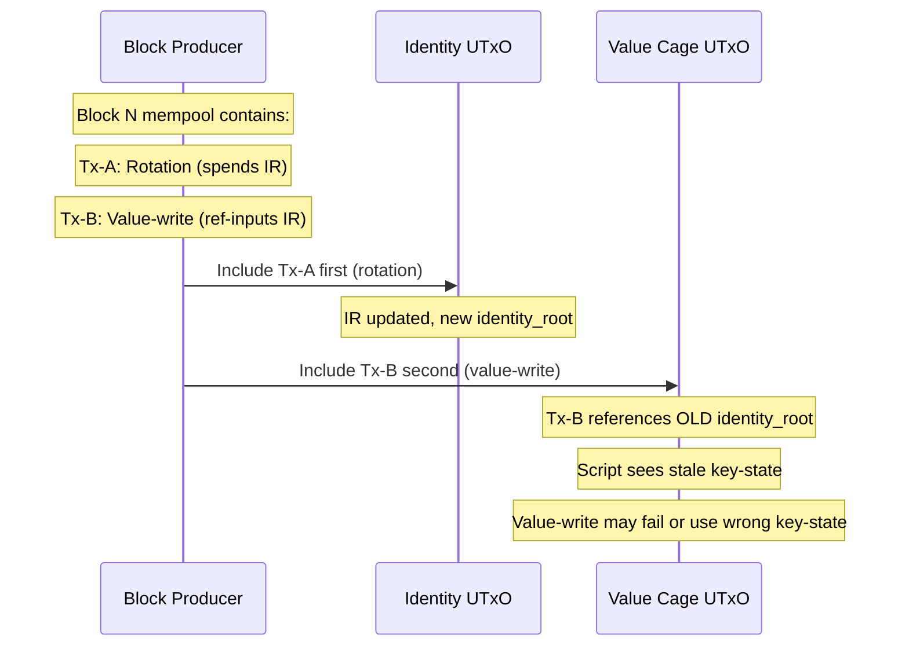

# Operational Constraints

## Single-UTxO throughput

The identity registry is a single UTxO. Every inception and rotation transaction spends and recreates it. This means at most one such transaction can be included per block.

All in-flight MPF inclusion and absence proofs are computed against the current identity root. The instant a block is produced that changes the root (an inception or rotation), every proof computed before that block is stale. Submitters must recompute their proofs before resubmitting.

**Effective throughput:** approximately one identity operation per 20 seconds (average Cardano block time). This is acceptable for a global identity registry that is not expected to onboard millions of identities rapidly. High-throughput use cases require a sharding strategy or a batched-relay architecture.

**Design mitigation (TBD):** options include:
- Parallel registry shards (multiple UTxOs, AID → shard by prefix)
- A relay/batcher that aggregates multiple operations into a single transaction using a more complex script
- An off-chain sequencing queue with optimistic proof recomputation

## Permissionless inception flooding

Inception is permissionless — any party can register a new identity at any time, paying only transaction fees. This creates a flooding attack against the single global registry UTxO.

**The attack:** an adversary (or a coordinated group) submits permissionless inception transactions in every block. Each uses legitimately-generated key material and passes all on-chain checks. Because the registry allows only one operation per block, the attacker captures the slot budget. Legitimate rotations — including emergency rotations for stolen keys — cannot land.

This is more dangerous than rotation griefing: rotation griefing requires the attacker to possess the victim's `cur_key`, which is a high bar. Inception flooding requires no victim key at all. The grinding primitive is cheap, permissionless, and system-wide in effect: every identity holder's emergency rotation latency increases while the flood is active.

**Threat model:** inception flooding is a direct amplifier of the stolen-key window. If an attacker steals `cur_key` and simultaneously floods the registry, the victim's emergency rotation cannot land. The stolen key retains value-write authorization for all cages until the rotation settles.

## ADA inception deposit

To make inception flooding economically prohibitive, each inception must lock a minimum ADA deposit in the registry UTxO. The deposit is irrecoverable except via a closing operation that requires the owner's current-key signature.

**Deposit mechanism:**
- Inception transaction: includes `deposit_amount` ADA (protocol-defined minimum, e.g. 20 ADA) locked in the registry UTxO value alongside the entry.
- Close operation: removes `trie_key` from the trie and returns the deposit to the owner. Requires `Ed25519(cur_pubkey, close_msg)`.
- No partial withdrawal. The deposit is all-or-nothing.

**Economic analysis:**

| Flood scale | Deposit (20 ADA/entry) | Capital locked |
|---|---|---|
| 100 blocks (~33 min) | 100 entries | 2,000 ADA |
| 1 epoch (432,000 blocks / ~5 days) | 432,000 entries | 8,640,000 ADA |
| Sustained (until rotation lands) | ~N blocks | N × 20 ADA |

An attacker who wants to extend a stolen-key window by even one hour (~180 blocks) must lock ≥3,600 ADA. This is prohibitive for casual griefing. Against a sophisticated adversary the deposit alone is not sufficient — it must be combined with the freeze registry (see below) to give the legitimate holder an emergency revocation channel that does not compete with inceptions.

**Deposit amount:** protocol-defined at deployment, stored in the registry script datum. Governance changes require a new script deployment. Recommended initial value: 20 ADA (high enough to deter casual flood attacks, low enough for legitimate users). Minimum enforced by the ledger's UTxO min-ADA is separate and smaller.

**Interaction with the single-UTxO model:** both inception (locks deposit) and close (returns deposit) transactions spend and recreate the global registry UTxO. They compete in the same block queue. This is acceptable: the deposit discourages frivolous inceptions, so the steady-state queue is primarily legitimate operations. A close operation by the attacker also uses a block slot, self-limiting the flood.

## Freeze registry (emergency revocation)

!!! important "Separate from the main registry"
    The freeze registry is a **distinct UTxO** from the identity registry. It must not be combined with the inception-heavy main registry, or it inherits the same contention that creates the emergency window.

The freeze registry provides a fast revocation channel for a compromised `cur_key`. Its contention profile is benign because it handles only freezes — rare, monotonic-append operations — never inceptions.

**Authorization by next_key, not cur_key:**

```
FreezeRedeemer {
  trie_key            : ByteArray[32]
  seq                 : Int             -- current KeyState.seq being frozen
  reveal_key          : ByteArray[32]  -- public key whose digest == KeyState.next_digest
  sig                 : ByteArray[64]  -- Ed25519(reveal_key, freeze_msg)
  id_inclusion_proof                   -- trie_key → KeyState at identity_root
  freeze_proof                         -- absence/update proof for freeze trie
}

freeze_msg = cbor({
  domain                  : "cardano-aid/freeze/v1",
  network_id              : NetworkId,
  identity_registry_token : AssetName,
  freeze_registry_token   : AssetName,
  trie_key                : ByteArray[32],
  seq                     : Int,
  cur_pubkey_hash         : ByteArray[32],   -- blake2b_256(KeyState.cur_pubkey)
  next_digest             : ByteArray[32],
  identity_root           : ByteArray[32],
  freeze_input_root       : ByteArray[32]
})
```

**On-chain freeze checks:**
1. Identity reference input (CIP-31) is the real registry UTxO.
2. Inclusion proof yields `KeyState{cur_pubkey, next_digest, seq, cesr_aid}` for `trie_key`.
3. `blake2b_256(reveal_key) == next_digest`.
4. `Ed25519.verify(reveal_key, freeze_msg, sig)`.
5. Freeze root records `(trie_key, seq, cur_pubkey_hash, next_digest)`.

**Why next_key, not cur_key:** if `cur_key` is the compromised material, authorizing freeze with it gives the thief a permanent DoS (they can freeze the identity from the outside, and the legitimate holder has no counter). The pre-committed `next_key` is still under the legitimate holder's control precisely because the thief cannot derive it from `cur_key`.

**How cages use the freeze registry:**

Value cages using Option B (native signer) check both the identity root and the freeze root:
1. Identity inclusion proof yields `KeyState.cur_pubkey`.
2. Freeze check: no active marker for `(trie_key, seq, cur_pubkey_hash, next_digest)` in freeze root.
3. If a freeze marker exists, the value-write is rejected regardless of the native signer.

Once the main registry rotation to `seq + 1` lands, the freeze marker no longer matches the current `KeyState.seq`, so the new key can write without requiring a separate unfreeze operation.

**Same-block race:** a freeze tx and a stolen-key value-write in the same block can be ordered adversarially by the block producer. This collapses the revocation exposure to one block of ordering latency — a much smaller window than the unbounded contention on the global identity UTxO. For irreversible cages: wait for the freeze root to settle after a KERI emergency rotation signal before accepting high-value writes.

**Freeze-aware settlement policy:** after a KERI watcher signals that a key has been rotated/compromised, high-value applications should:
1. Cease accepting value-writes for the affected `trie_key` immediately.
2. Wait for the freeze tx to land and settle (N blocks).
3. Resume accepting writes only after the new `cur_pubkey` (from the rotation) is visible in the identity root.

## Recovery-rotation griefing

A stolen `cur_key` cannot advance `seq` (no access to `next_key`). But it can still write to all cages that only check `cur_pubkey` without consulting the freeze registry. The window runs from key theft until either the freeze tx lands or the rotation lands.

With the deposit + freeze registry combination, the window has a bounded worst-case: the attacker cannot profitably keep the main registry congested (deposit cost), and the legitimate holder has a fast low-contention freeze channel.

## Block-ordering coupling (MEV)

Value-writes take the identity UTxO as a CIP-31 reference input (non-consuming). The identity UTxO is not spent by value-writes. However, if a rotation and a value-write appear in the same block, the block producer controls their ordering.



**Current position:** this is a property of the CIP-31 design. If the identity UTxO is spent (by a rotation) earlier in the same block, the reference input in the value-write transaction will fail to resolve. The value-write transaction will be invalid in that block.

**Mitigation:** applications sensitive to ordering risk should wait for the identity UTxO to be stable for N blocks before submitting a value-write. Alternatively, the value-write redeemer can include the expected identity root, and the script can check it matches the reference input — this makes ordering failures explicit and reproducible.

## Revocation

The freeze registry provides emergency revocation during the window between key theft and rotation. A successfully landed rotation implicitly un-revokes the identity (the freeze marker no longer matches `seq`).

**Permanent revocation (tombstone):** a rotation that sets `new_next = 0x00...00` makes future rotations impossible (no key hashes to zero). But `cur_pubkey` remains live for value-write authorization unless cage scripts explicitly check for a revocation flag.

A complete permanent-revocation mechanism requires:
1. A `revoked : Bool` flag in `KeyState`.
2. A revocation operation authorized by the current-seq's `next_key` (same pattern as freeze).
3. All cage scripts checking the flag before authorizing any operation.

Without this, tombstone is a rotation freeze, not a revocation — it prevents future rotations but does not terminate existing cage authorization.

## Settlement depth

The identity registry does not specify a settlement depth. Applications that rely on the finality of a key-state or a spent value-write authorization must choose a settlement depth consistent with Cardano's Praos/Genesis finality guarantees.

For high-value identity operations (e.g., legal identity binding), waiting for deep settlement (hours) is appropriate. For low-value or reversible operations, shorter settlement windows may be acceptable.

## Trie growth and deposit economics

The identity MPF trie grows monotonically with registrations. The ADA deposit per entry means the registry UTxO value scales linearly with the number of live identities. This is intentional: it creates an economic pressure toward closing unused entries (reclaiming deposits).

Mitigation options for extreme scale:
- Sharding (multiple UTxOs, each holding a subtrie)
- Off-chain archival with on-chain root anchoring (compress old entries into a Merkle batch proof)
- Expiry with renewal (requires a new operation type)

For reasonable identity counts (tens of thousands), the deposit accumulation in a single UTxO is operationally fine. The min-ADA requirement for the UTxO itself scales slowly relative to the deposit pool.
