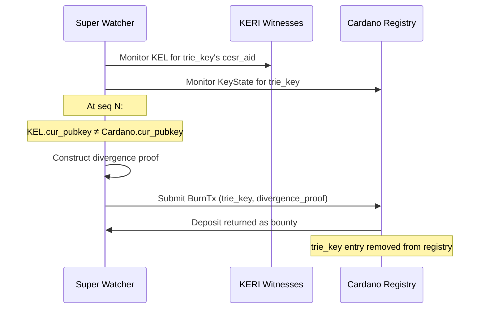

# Super Watcher: Convergence Enforcement

!!! warning "Superseded for identity — the KERI-sovereign model (2026-07-09)"
    This design was written against the **two-independent-state-machines** premise. The
    identity model (`specs/68-keystate-shape/identity-model.md`, PR #87) retires it:
    there is **one** state machine (the witnessed KEL) and Cardano advances an on-chain
    checkpoint only through **witness-receipted anchoring seals** — an identity cannot
    fork, so **divergence-burn is no longer needed for identity**. What survives of the
    super-watcher role: freshness/liveness of anchoring, credential-plane (R-TEL) mirror
    policing, genesis-binding challenges during the registration window (§7a), and —
    if open thread 4 closes that way — seal↔native **correspondence spot-checks**, for
    which the divergence-proof/burn mechanics below remain the reference design.

## The two-registry problem

The Cardano identity registry and the [KERI](https://github.com/WebOfTrust/ietf-keri) KEL are two independent state machines sharing inception material. Nothing at the protocol level forces them to stay in sync. A controller can rotate on KERI but not on Cardano, rotate to different keys on each, or deliberately fork the two chains while `cesr_aid` keeps asserting they represent the same identity.

This is not a theoretical edge case — it is a structural property of the bridge. See [Veridian Bridge — One state machine, one stated limit](../architecture/veridian-bridge.md#one-state-machine-one-stated-limit) (which now records why the fork premise is retired).

## The super watcher role

The super watcher is a permissionless off-chain agent that monitors both registries and enforces convergence by punishing forks.

!!! note "Design hypothesis"
    This is a proposed interpretation of the super watcher role based on the bridge's structural properties. It is consistent with the Veridian team's direction but not yet a confirmed specification.

**It is not:**
- A passive monitor that alerts humans
- A trusted actor with freeze key custody
- A governance body that adjudicates disputes

**It is:**
- A bounty hunter — detects divergence and submits a burn transaction to collect the deposit
- Permissionless — anyone can run one, no registration or trust required
- Economically aligned — the deposit is the incentive; larger deposits attract more watchers

## Fork = forfeit

The core invariant: **a controller who diverges their Cardano identity from their KERI KEL loses their registry deposit to the first watcher that detects it.**

This makes convergence the rational choice. A controller considering a fork must weigh the deposit loss against whatever benefit the fork provides. The deposit is therefore not just an anti-flood mechanism — it is a convergence bond.



## Burn transaction

The burn transaction removes a diverged identity from the Cardano registry and transfers the deposit to the presenter.

```
BurnRedeemer {
  trie_key           : ByteArray[32]
  seq                : Int             -- sequence number where divergence occurs
  keri_event         : ByteArray       -- raw KERI rotation event at seq
  keri_receipts      : ByteArray       -- witness receipts for keri_event
  cardano_key_state  : KeyState        -- Cardano KeyState at seq
  inclusion_proof    : InclusionProof  -- trie_key → KeyState in registry
}
```

**On-chain checks (current, without Blake3):**
1. Inclusion proof validates `trie_key → cardano_key_state` against current identity root
2. `keri_event` contains a `cur_pubkey` field (extracted and presented by the watcher)
3. That `cur_pubkey ≠ cardano_key_state.cur_pubkey` at the same `seq`
4. Ed25519 signature in `keri_event` is valid against the presented key
5. Remove `trie_key` from trie, return deposit to tx submitter

**The [Blake3](https://github.com/BLAKE3-team/BLAKE3) gap here too:** checks 2–4 require parsing [CESR](https://github.com/WebOfTrust/ietf-cesr) event structure and verifying witness receipt signatures on-chain. Without Blake3 and CESR parsing builtins, the watcher must present the extracted fields and the script trusts the extraction — which a malicious watcher could forge against an innocent identity.

**With Blake3:** the script verifies `blake3(keri_event) == expected_event_hash`, which the watcher derives from the KEL. Combined with witness receipt verification, the burn becomes fully trustless.

## Without Blake3: the trust problem

Without Blake3, the burn check is weaker. The script cannot verify that the presented `keri_event` bytes are a legitimate KERI event or that the witness receipts are genuine. A malicious watcher could construct a fake divergence proof against a controller who has NOT forked.

**Mitigations without Blake3:**
1. **Require a challenge period** — the burn is not immediate; the controller has N blocks to refute by presenting their own signed counter-proof. This turns a one-sided burn into a dispute resolution process.
2. **Require threshold watcher agreement** — N independent watchers must all present the same divergence proof before the burn executes. Colluding to burn an innocent identity requires compromising N watcher operators.
3. **Governance veto** — a governance token holder can veto a burn within the challenge period. Adds a trusted party but protects against malicious watchers.

Option 1 (challenge period) is the most trust-minimized and most consistent with the rest of the design.

## Deposit mechanics

The identity registry is a single UTxO holding the entire MPF trie (the MPFS model). Deposit ADA from all inceptions is pooled in that UTxO — there is no separate per-identity UTxO. The burn script must know exactly how much ADA to release per entry and to whom.

**Chosen: Option A — deposit recorded in `KeyState`**

The inception redeemer records the exact ADA amount locked at inception as a field in `KeyState`. The burn script reads this from the inclusion proof and releases that exact amount to the watcher. Allows variable deposit sizes — controllers choose their own convergence bond.

```
KeyState {
  cur_pubkey   : ByteArray[32]
  next_digest  : ByteArray[32]
  seq          : Int
  cesr_aid     : ByteArray[32]
  deposit      : Lovelace          -- amount to release on burn or close
}
```

In all cases: the deposit is forfeited permanently on burn. It goes to the watcher, never back to the controller.

!!! note "Option B not adopted"
    Option B (fixed protocol-wide deposit) was considered but rejected to allow variable convergence bonds. A fixed deposit would be simpler to audit but prevents controllers from signaling their own bond strength.

## Economic alignment

The deposit size determines how aggressively watchers monitor:

| Deposit | Watcher incentive | Fork deterrence |
|---|---|---|
| 5 ADA | Weak — barely worth the tx fee | Low |
| 20 ADA | Moderate | Meaningful |
| 100 ADA | Strong — attracts dedicated watchers | High |
| 1000 ADA | Very strong — professional watchers | Very high |

The deposit creates a market for convergence enforcement. Controllers who want strong guarantees that their fork will be detected quickly should use a higher deposit. The protocol does not mandate a specific amount beyond the minimum — controllers choose their own convergence bond size.

## Relationship to the freeze registry

The freeze registry and the super watcher serve different purposes:

| Mechanism | Authorized by | Purpose | Initiated by |
|---|---|---|---|
| Freeze registry | next_key (legitimate holder) | Emergency revocation of stolen cur_key | Identity owner |
| Super watcher burn | Divergence proof | Punishment for forking | Anyone |

They are complementary. A controller whose `cur_key` is stolen uses the freeze registry. A watcher that detects a fork uses the burn. Neither requires the other.

## Super watcher as KERI infrastructure extension

KERI watchers already monitor KELs for duplicity — two conflicting events for the same AID at the same sequence number. A super watcher extends this:

- **Existing watcher:** monitors one registry (KERI witnesses), detects intra-registry duplicity
- **Super watcher:** monitors two registries (KERI + Cardano), detects inter-registry divergence

The implementation delta is: subscribe to Cardano registry events, compare Cardano KeyState against KEL state at each seq, know how to construct and submit a Cardano burn transaction.

Any existing KERI watcher operator is a natural candidate to run a super watcher. The bounty mechanism means no coordination or governance is needed to bootstrap the network of watchers.
