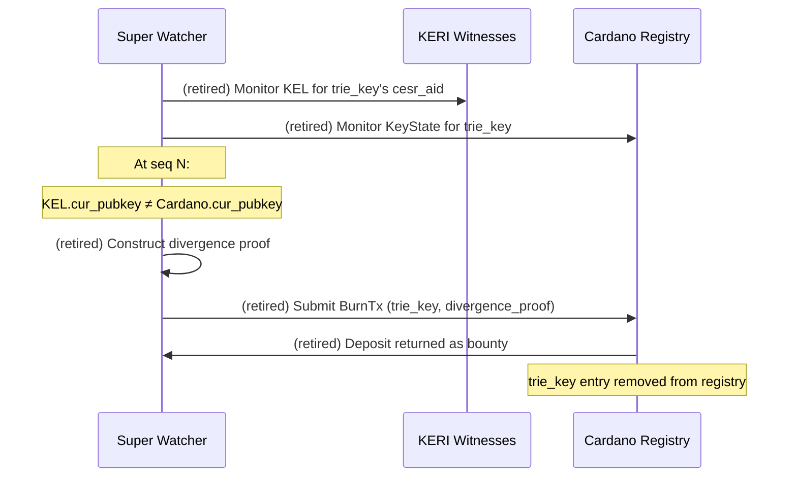

# Super Watcher: Permissionless Cross-Plane Relayer & Evidence Submitter

!!! note "Live role (2026-07-15, #92 / NOTE-022) — a relayer + evidence submitter, not a convergence enforcer"
    The live super-watcher role is a **first-class, permissionless cross-plane relayer and
    evidence submitter** spanning **KERI ↔ Cardano** and the **credential-status (R-TEL)
    mirror** — **not** the divergence-burn convergence enforcer this page was originally
    written around. Identity is KERI-sovereign (one witnessed KEL); the Cardano per-AID
    checkpoint is a globally ordered, **spend-linearized projection of current authority**,
    **not a second independently sovereign identity history** — it cannot fork the identity,
    it can only lag. The retired divergence-burn / deposit / `trie_key` / "Fork = forfeit" /
    bounty-burn mechanics are quarantined, in the past tense, in the
    [historical appendix](#historical-appendix-the-retired-divergence-burn-design) at the
    foot of this page.

## The two-plane relay problem

The witnessed [KERI](https://github.com/WebOfTrust/ietf-keri) KEL is the sole identity
state machine; Cardano carries a per-AID **checkpoint** that projects the current authority
KERI has settled. This page formerly described the two as independently advancing machines
sharing inception material — that framing is **superseded**: the checkpoint is a
**projection of current authority, not a rival history**, so an identity **cannot fork; it
can only lag** a very recent KERI event. What remains is a real cross-plane
**synchronization** and **evidence** problem — witnessed KERI events must be relayed onto
the checkpoint, objective duplicity / correspondence fraud must be submitted, and
stale / false credential-status mirrors must be policed.

See [Veridian Bridge — One state machine, one stated limit](../architecture/veridian-bridge.md#one-state-machine-one-stated-limit)
and `specs/68-keystate-shape/identity-model.md` §11.

## What the super watcher is — and is not

A super watcher is a **first-class, permissionless cross-plane relayer and evidence
submitter**. It is **not** a trusted oracle, identity authority, key custodian, backup
service, recovery authority, or authoritative indexer. Ordinary KERI watchers police
**intra-KEL** duplicity for a single AID; a super watcher spans **KERI ↔ Cardano** and the
**credential-status (R-TEL) mirror**.

**It is:**
- A **permissionless cross-plane relayer and evidence submitter** — anyone can run one, no registration or trust required.
- **Bounty-compatible** — its submissions can carry incentives, but incentives are not what confer its standing.
- **Evidence-bound** — it only ever relays witnessed events or submits cryptographic proofs; it never adjudicates.

**It is not:**
- A trusted oracle, identity authority, or key custodian — it holds no freeze key and speaks for no one's identity.
- A backup service or recovery authority — it cannot reconstruct a lost KEL or manufacture keys.
- An authoritative indexer or resolver — locator / freshness lookups are for **liveness only, never identity truth**.

!!! note "Normative live-duty contract (#92 / NOTE-022)"
    The relayer / evidence-submitter role and the live duties below are the **normative**
    super-watcher contract (`specs/92-checkpoint-contention/spec.md` §"Loss / fork semantics
    and the superwatcher live-duty contract", NOTE-022; `specs/68-keystate-shape/identity-model.md`
    §11). What remains design-stage is the **implementation surface** — the SDK / relayer
    wiring and the submission transaction shapes — not the role itself.

## Live duties

A super watcher observes witnessed KERI events against the Cardano checkpoint and acts only
on evidence:

- **Relay a fully witnessed anchoring** transition onto the checkpoint when the seal and its threshold witness receipts are valid (the §4 / §6a two-seal handoff).
- **Submit** objective **duplicity** or seal↔native-**correspondence proofs** — the §7b fraud-proof shape, drilled via #90 — wherever the stored witness threshold receipted the divergent establishment event.
- **Request or trigger the applicable freeze** path when safe advancement is impossible: an upheld correspondence-fraud verdict, or a compromise signal that only a freeze can contain during the synchronization lag.
- **Police stale or false R-TEL** credential-status mirrors, submitting evidence when a mirror misreports issuance / revocation.
- Support **permissionless, bounty-compatible** operation across all of the above.

**A super watcher never chooses truth when cryptographic evidence is absent.** Where no
threshold-receipted proof exists — for example the §7b witness-swap residual, or a
witness-threshold collusion — the super watcher can **expose and forward** the discrepancy
off-chain, but it **cannot manufacture a canonical truth branch** on-chain. It relays and
evidences; it does not adjudicate.

## Relationship to the freeze registry

The freeze registry (R-FRZ) and the super watcher serve different purposes:

| Mechanism | Authorized by | Purpose | Initiated by |
|---|---|---|---|
| Freeze registry (R-FRZ) | next_key (legitimate holder) | Emergency revocation of a stolen cur_key | Identity owner |
| Super-watcher freeze request | Objective fraud / duplicity proof | Contain an unrecoverable divergence pending correction | Anyone (permissionless) |

They are complementary and both **evidence-gated**: a controller whose `cur_key` is stolen
uses the freeze registry directly; a super watcher **requests or triggers the applicable
freeze** only on an objective proof. The super watcher never holds a freeze key of its own —
it submits the evidence that authorizes the freeze path.

## Super watcher as a KERI infrastructure extension

KERI watchers already monitor KELs for duplicity — two conflicting events for the same AID
at the same sequence number. A super watcher extends this across planes:

- **Existing watcher:** observes one plane (KERI witnesses), detects **intra-KEL** duplicity.
- **Super watcher:** spans **KERI ↔ Cardano** and the R-TEL mirror, **relays** valid anchoring transitions, and **submits** cross-plane duplicity / correspondence evidence.

The implementation delta is: subscribe to Cardano checkpoint events, compare the checkpoint
against witnessed KEL state at each bound sequence number, and know how to construct and
submit the relay / fraud-proof / freeze-request transactions. Any existing KERI watcher
operator is a natural candidate to run a super watcher; because operation is permissionless
and bounty-compatible, no coordination or governance is needed to bootstrap the fleet.

---

## Historical appendix: the retired divergence-burn design

!!! warning "Historical / superseded — retained for reference only (do not implement)"
    Everything in this appendix is the **legacy divergence-burn design**, written against the
    retired **two-independent-state-machines** premise. It is **no longer** the live role
    (see the top of this page and `specs/68-keystate-shape/identity-model.md` §11): under the
    KERI-sovereign checkpoint an identity cannot fork, so a divergence-burn is not needed for
    identity. It is preserved, in the past tense, only as a reference for the proof / freeze
    mechanics that the live evidence-submission duties inherit.

### The retired two-registry framing

Formerly, the Cardano identity registry and the KERI KEL were described as two independently
advancing machines sharing inception material, and the super watcher was cast as a
permissionless off-chain agent that **monitored** both registries and **enforced convergence
by punishing forks**. That premise is superseded: the checkpoint is a projection of current
authority, not a second sovereign history.

### Fork = forfeit (retired)

The core invariant of the retired design was: *a controller who diverged their Cardano
identity from their KERI KEL lost their registry deposit to the first watcher that detected
it.* The deposit was framed as a convergence bond, making convergence the rational choice.
Under the sovereign checkpoint this mechanism is unnecessary — the identity cannot fork —
so it is retained only for the proof mechanics below.



### Burn transaction (retired)

The retired burn transaction removed a diverged identity from the Cardano registry and
transferred the deposit to the presenter.

```
BurnRedeemer {
  trie_key           : ByteArray[32]
  seq                : Int             -- sequence number where divergence occurs
  keri_event         : ByteArray       -- raw KERI rotation event at seq
  keri_receipts      : ByteArray       -- witness receipts for keri_event
  cardano_key_state  : KeyState        -- Cardano KeyState at seq
  inclusion_proof    : InclusionProof  -- trie_key → KeyState in registry
}
```

**On-chain checks (as designed, without Blake3):**
1. Inclusion proof validated `trie_key → cardano_key_state` against the current identity root.
2. `keri_event` contained a `cur_pubkey` field (extracted and presented by the watcher).
3. That `cur_pubkey ≠ cardano_key_state.cur_pubkey` at the same `seq`.
4. Ed25519 signature in `keri_event` was valid against the presented key.
5. Remove `trie_key` from the trie, return the deposit to the tx submitter.

**The [Blake3](https://github.com/BLAKE3-team/BLAKE3) gap here too:** checks 2–4 required
parsing [CESR](https://github.com/WebOfTrust/ietf-cesr) event structure and verifying
witness receipt signatures on-chain. Without Blake3 and CESR parsing builtins, the watcher
had to present the extracted fields and the script trusted the extraction — which a
malicious watcher could have forged against an innocent identity. The receipts-over-raw-bytes
fact (§5) later simplified the *correspondence* proof the live design keeps.

### Without Blake3: the trust problem (retired)

Without Blake3, the burn check was weaker: the script could not verify that the presented
`keri_event` bytes were a legitimate KERI event or that the witness receipts were genuine,
so a malicious watcher could have constructed a fake divergence proof against a controller
who had **not** forked.

**Mitigations that were considered (without Blake3):**
1. **Challenge period** — the burn was not immediate; the controller had N blocks to refute with a signed counter-proof, turning a one-sided burn into dispute resolution.
2. **Threshold watcher agreement** — N independent watchers had to present the same divergence proof before the burn executed.
3. **Governance veto** — a governance token holder could veto a burn within the challenge period.

Option 1 (challenge period) was judged the most trust-minimized.

### Deposit mechanics, economic alignment (retired)

The retired design recorded the exact ADA locked at inception as a `deposit` field in
`KeyState`; the burn script released that amount to the watcher, and larger deposits were
meant to attract more watchers. The deposit-size / watcher-incentive market was purely a
convergence-bond mechanism and does **not** apply under the sovereign checkpoint — the live
super watcher is bounty-compatible for **evidence submission**, not for burning forks.
