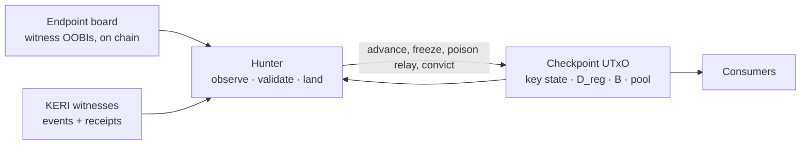

# The hunter: relayer, evidence submitter, and paid maintainer

A **hunter** is an off-chain service that watches KERI and Cardano and lands
the transactions that keep an identity's checkpoint current. It is a role any
party may perform, not a trusted oracle or an identity administrator. Earlier
pages called this role the *super watcher*; the M1 return gives it a wage and a
name.

!!! abstract "Where this page stands"
    The cross-plane problem, the evidence rules for advance, and what the role
    is *not* are **shipped on `main` today** — those transactions settle. The
    hunter's economics (the premium, the freeze, the conviction payout) are the
    **accepted design**, proved in the Lean and playable in the checkpoint
    simulator. No hunter daemon is shipped; it is epic
    [K7](https://github.com/lambdasistemi/cardano-keri/issues/325).

## The cross-plane problem

KERI events happen off chain. Cardano checkpoints move only when a transaction
reveals and validates an event. Therefore either side can temporarily be
ahead:

- KERI may have a new witnessed rotation while Cardano still shows the old key
  state.
- Cardano may have settled an advance while a particular off-chain client has
  not refreshed its KEL or ledger view.

The hunter observes both and closes that gap. The owner does not: in the M1
return the owner rotates with `kli` and never touches Cardano except to put
money in. That asymmetry is deliberate.

```mermaid
flowchart LR
    K["KERI witnesses<br/>events + receipts"]
    B["Endpoint board<br/>witness OOBIs, on chain"]
    W["Hunter<br/>observe · validate · land"]
    C["Checkpoint UTxO<br/>key state · D_reg · B · pool"]
    A["Consumers"]

    B --> W
    K --> W
    C --> W
    W -->|"advance, freeze, poison relay, convict"| C
    C --> A
```

The hunter seeds its own watcher from the witness OOBIs published on the
[endpoint board](../user/discovery-endpoint-board.md), so discovery itself does
not require asking anybody.

## What a hunter may do today

Against the programs shipped on `main`, a hunter may:

- relay a public inception through premint and register;
- relay a genuine witnessed rotation through advance;
- monitor transaction settlement and the new unspent checkpoint.

There is no payment for any of it. Routine event relay has no on-chain fee
today, so a commercial relayer needs an off-chain payment model. That is the
gap the M1 return closes.

## The hunter's wage — accepted design

The owner parks three separate sums in the checkpoint, and only two of them
can ever reach a hunter:

| Component | What it is for | Reaches a hunter when |
|---|---|---|
| the **pool** | advance funds | a landed rotation pays the premium `P` |
| `B`, the **freeze bond** | forcing the owner's engagement | a freeze, and only while `pool < P` |
| `D_reg`, the **conviction bond** | the stake a duplicity proof seizes | a conviction, never a fee |

**The loop.** The hunter sees the owner's rotation on KERI. It looks at
Cardano:

- if the pool covers the premium, it lands the rotation and takes `P`;
- if it does not, it takes `B` and **freezes** the checkpoint on its old keys —
  the same evidence, applied to nothing. The datum is unchanged, `B` leaves,
  and the checkpoint is unconsumable until the owner rotates with a deposit
  that restores it.

The freeze is therefore not a punishment for lag. It is what makes a
non-paying owner come back, and it is bounded by two things the owner
controls: fund the pool, or do not rotate.

**Two hunters racing** produce one winner. If the pool covers `P` the first
advance wins and the second fails on the spent input; if it does not, the
first freeze takes `B` and the second finds nothing to take.

**No bounty.** There is no payment for detecting misbehaviour, because a flow
whose profitability depends on another party's misbehaviour invites staged
misbehaviour. The single exception is the conviction, and it is an exception
on principled ground: two witnessed rotations at one sequence are a KERI
verdict, not a judgement the chain invents.

## What a hunter is not

A hunter is not:

- a KERI witness;
- a controller key custodian;
- a recovery service;
- a source of legal identity;
- an authoritative indexer;
- a checkpoint owner;
- a branch-selection oracle; or
- a service capable of rolling back settled Cardano actions.

It can submit only evidence the validators accept. When cryptographic evidence
is absent, it may alert users but cannot manufacture an on-chain truth. It
cannot forge controller signatures or witness receipts, activate uncommitted
keys, move the owner's refund address, park the owner, reset her juvenility
window, or close her: every bond option other than `keep`, and every new refund
address, is signed by the keys of the epoch the rotation opens.

## Evidence rules

### Advance

The hunter must collect:

- the exact next KERI rotation bytes;
- controller signatures satisfying both thresholds;
- the required witness receipts; and
- the current checkpoint outref.

The advance observer reconstructs and validates the transition. The hunter
cannot choose alternate keys or skip a sequence, and the sequence only ever
moves forward — the checkpoint cannot roll back (ruling D-022).

!!! warning "One unsettled question inside advance"
    For a rotation that cuts or adds witnesses, the shipped validator counts
    receipts against the **new** witness set and the **new** `toad`. Whether
    `keripy` applies the same rule, or tallies against the parent's set, is not
    yet established. Epic
    [K2](https://github.com/lambdasistemi/cardano-keri/issues/320) builds the
    parity oracle that settles it. It matters most on exactly the rotations
    that matter: witness replacement after a compromise.

### Freeze — accepted design

The hunter presents the same evidence it would use to advance: a later
witnessed rotation with its receipts. The freeze runs the advance predicate and
differs only in effect. It additionally requires that the pool is below `P`,
and it is not enabled from a poisoned checkpoint, which is already
unconsumable.

### Poison relay — accepted design

The poison is a declaration the owner's current keys sign at their own
threshold, over a short preimage bound to the policy, the AID and the sequence.
It is never witnessed, and anyone may land it. A hunter that carries poisons
promptly is doing the most valuable thing in the system: the poison's whole
purpose is to be fast.

### Convict — accepted design

The conviction proof is narrower than any lag evidence. It requires a **second**
rotation at the tip's own sequence that reveals exactly the tip's current keys,
is signed at the current threshold, and carries receipts from at least `toad` of
the tip's witnesses — and differs in content from the accepted one. No history
is needed, because the revealed keys *are* the current keys.

A stranger cannot manufacture this. Only a holder of the pre-committed keys
could have signed the second rotation, and only colluding witnesses could have
receipted both. The convictor names a payee and takes `D_reg` in full; the
identity becomes `convicted`, which is terminal.

## Operational loop

A robust hunter would:

1. maintain verified KEL state for watched AIDs, seeded from the endpoint
   board;
2. collect and verify witness receipts;
3. resolve each AID's current Cardano checkpoint and read its pool;
4. compare the native KERI sequence with the checkpoint's;
5. choose the permitted public projection — advance when the pool pays, freeze
   when it does not, a poison relay when one exists, a conviction when the
   proof is in hand, and no transaction when evidence is incomplete;
6. construct the thin-checkpoint and observer envelope;
7. evaluate and budget every script purpose;
8. submit and wait for settlement;
9. handle contention and rollback; and
10. record transaction IDs and evidence provenance.

The service must never treat mempool acceptance as settlement.

## Freshness and availability

A hunter improves discovery latency but cannot eliminate KERI witness outages,
network partitions, Cardano inclusion delay, chain rollbacks, block-level
censorship, or a colluding witness threshold.

Applications should not silently outsource all freshness policy to one hunter.
The **juvenility window** `W` exists for that reason: a consumer refuses a
checkpoint younger than `W` slots after a registration, a reopen or a
resurrecting rotation, and `W` is calibrated above measured relayer latency
rather than guessed. Its value is set from the measurement taken in epic
[K7](https://github.com/lambdasistemi/cardano-keri/issues/325).

## Credential-plane extension

Later, a hunter may also follow ACDC credential chains and TEL revocation
events. That duty is separate from identity checkpoint authority: identity
relay answers which keys currently control the AID; credential monitoring
answers which issued roles remain valid. Only the first plane is in M1.

## Security principle

The hunter is safe to make permissionless because it pays to submit public
proofs whose on-chain result is deterministic, and it is paid from value the
owner chose to park. A hostile hunter can withhold its own service or waste
fees on invalid transactions. It cannot choose a different valid successor,
take `D_reg` without a duplicity proof, take `B` while the pool pays, or move
one lovelace to an address the owner's keys did not authorize.
