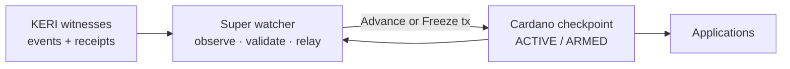

# Super watcher: relayer and evidence submitter

A super watcher is an off-chain service that observes KERI and Cardano,
relays public KERI events to checkpoints, and submits objective conflict
evidence. It is a role any party may perform, not a trusted oracle or identity
administrator.

The current repository does not ship a production super-watcher daemon. Its
settled vertical stories prove the transactions such a service would submit.

## The cross-plane problem

KERI events happen off chain. Cardano checkpoints move only when a transaction
reveals and validates an event. Therefore either side can temporarily be
ahead:

- KERI may have a new witnessed rotation while Cardano still shows the old
  ACTIVE checkpoint.
- Cardano may have settled an Advance while a particular off-chain client has
  not refreshed its KEL or ledger view.

The watcher observes both and helps close that operational gap.

```mermaid
flowchart LR
    K["KERI witnesses<br/>events + receipts"]
    W["Super watcher<br/>observe · validate · relay"]
    C["Cardano checkpoint<br/>ACTIVE / ARMED"]
    A["Applications"]

    K --> W
    C --> W
    W -->|"Advance or Freeze tx"| C
    C --> A
```

## What it may do today

Against the settled small-story checkpoint, a watcher may:

- relay a public inception through premint and Register;
- relay a genuine witnessed rotation through Advance;
- submit fresh witnessed conflict evidence through Freeze;
- relay the honest branch as an ARMED response Advance;
- detect and report stale-evidence replay rejection; and
- monitor transaction settlement and the new unspent checkpoint.

Close is controller-authorized. A watcher may build or submit it, but it
cannot create the required controller signatures or redirect the signed refund
address.

## Future economic duties

The two bonds give later watcher actions precise conditions:

- After a complete unanswered ARMED window, anyone may trigger
  `ClaimFreeze`, but exactly `B` goes to the hunter recorded in the ARMED
  datum. This is [#138](https://github.com/lambdasistemi/cardano-keri/issues/138).
- A fully witnessed irreconcilable fork may trigger Convict and its protected
  payouts, burning the checkpoint token. This is
  [#151](https://github.com/lambdasistemi/cardano-keri/issues/151).

Neither payment is live in the small production-story wire today. Routine
event relay also has no automatic on-chain fee. Commercial relayers need an
off-chain payment model unless a future protocol adds one.

## What it is not

A super watcher is not:

- a KERI witness;
- a controller key custodian;
- a recovery service;
- a source of legal identity;
- an authoritative indexer;
- a checkpoint owner;
- a branch-selection oracle; or
- a service capable of rolling back settled Cardano actions.

It can submit only evidence the validators accept. When cryptographic evidence
is absent, it may alert users but cannot manufacture an on-chain truth.

## Evidence rules

### Advance

The watcher must collect:

- exact next KERI rotation bytes;
- controller signatures satisfying both thresholds;
- required incoming-set witness receipts; and
- the current checkpoint outref.

The Advance observer reconstructs and validates the transition. The watcher
cannot choose alternate keys or skip a sequence.

### Freeze

The watcher acting as hunter must provide a witnessed conflicting rotation
that remains ahead of the current ACTIVE tip. Freeze records the hunter and
deadline but preserves the whole escrow.

After a response advances the tip, the old proof is stale. The watcher must
discover a fresh conflict at the new sequence for another Freeze. PR
[#150](https://github.com/lambdasistemi/cardano-keri/pull/150) proved this
two-round boundary.

### Convict

The planned Convict proof is narrower than Freeze evidence. It must establish
a fully witnessed irreconcilable fork, not merely lag, a private signed draft,
or a conflict that a supported KERI recovery rule could resolve.

The exact small-identity transaction and payouts remain #151 work.

## Operational loop

A robust watcher would:

1. maintain verified KEL state for watched AIDs;
2. collect and verify witness receipts;
3. resolve each AID's current Cardano checkpoint;
4. compare native KERI sequence and digest with the checkpoint;
5. choose the permitted public projection:
   - Advance for one genuine next event;
   - Freeze for admissible witnessed conflict evidence;
   - no transaction when evidence is incomplete;
6. construct the thin-checkpoint and observer envelope;
7. evaluate and budget every script purpose;
8. submit and wait for settlement;
9. handle contention and rollback; and
10. record txids and evidence provenance.

The service must never treat mempool acceptance as settlement.

## Freshness and availability

A watcher improves discovery latency but cannot eliminate:

- KERI witness outages;
- network partitions;
- Cardano inclusion delay;
- chain rollbacks;
- block-level censorship; or
- a colluding KERI witness threshold.

Applications should not silently outsource all freshness policy to one watcher.
They should define acceptable KERI-to-Cardano lag and use redundant event and
ledger sources for high-value actions.

## Credential-plane extension

Later, a watcher may also follow ACDC credential chains and TEL revocation
events. That duty is separate from identity checkpoint authority:

- identity relay answers which keys currently control the AID;
- credential monitoring answers which issued roles remain valid.

The current settled stories cover only the first plane.

## Security principle

The watcher is safe to make permissionless because it pays to submit public
proofs whose on-chain result is deterministic. A hostile watcher can withhold
its own service or waste fees on invalid transactions. It cannot:

- forge controller signatures;
- forge witness receipts;
- activate uncommitted keys;
- re-arm with stale evidence;
- turn ARMED into current authority; or
- collect a future timeout or conviction payout without the exact proof and
  state boundary.
