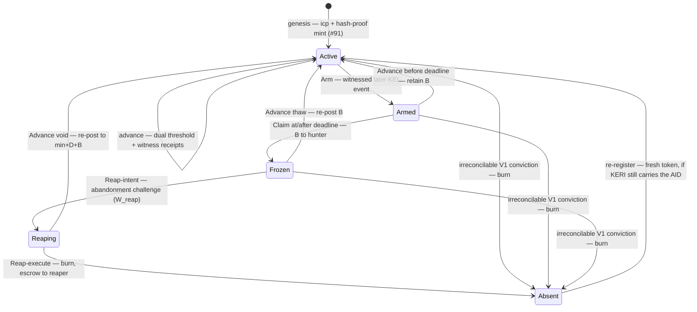

# Trust Model

!!! warning "Current-authority storage + discovery reframed to the sovereign per-AID checkpoint (#92)"
    The single-registry `trie_key` / `identity_root` key-state snapshot described below is
    the **rejected Candidate-B shared/global MPFS** shape. Per
    `specs/92-checkpoint-contention/DECISION.md`, each AID's current authority now lives in
    its **own sovereign, per-AID, quantity-one uniquely-tokenized checkpoint UTxO** — asset
    id `(checkpoint_policy_id, aid_asset_name)`, current weighted keys/threshold in the
    inline `CheckpointDatum` — read as a CIP-31 **reference input**. A `delta = 0` rotation
    (`seq + 1`) advances it and makes pending authorizations **stale** (universal
    re-authorization). Consumers **discover** the checkpoint by a **generic
    `(policy_id, asset_name)` multi-asset index lookup** (any indexer / node / sidecar),
    which supplies **only a candidate outref for liveness — never identity or
    current-authority truth** (the consuming transaction revalidates it against the ledger).
    **KEL replay is not in this hot path**: it belongs only to **historical credential-chain
    validation at admission** (the admission-cache split is preserved). The mechanical
    redeemer/proof re-cut is downstream #24.

## On-chain guarantees

The identity registry script enforces the following properties within a single block:

**Per-AID checkpoint token (no global uniqueness gate).** Registration is permissionless public projection: anyone may present a valid inception event (`icp`) and fund the deployment-fixed reserve `D_reg + B` (where `D_reg` and `B` are validator deployment parameters with 5 ADA mechanical floors, and `D_reg = 1,000,000,000` lovelace is a reference fixture). Minting produces the AID's **sovereign per-AID checkpoint token** — quantity-one at mint (`+1` of the AID-derived asset name) with keys-must-match and explicit parameter floors enforced. Value above the continuing-output reserve is conservative change. There is **no** MPFS absence/unicity proof, no shared registry, and no global uniqueness scan: registration and re-registration are sovereign and contend on nothing. A third-party bridger donates `D_reg + B` with no refund right. If multiple live candidate checkpoints exist for the same AID, consumers fail closed when supplied multiple ACTIVE references — an admitted fail-closed ambiguity residual. Under held #117, the legitimate datum-key holder can open the challengeable CLOSING `0x03` flow and recover the donated escrow, making duplicate grief bounded, deposit-deterred, and victim-profitable. This is the registration path — **not** the live current-authority store, which is the sovereign per-AID checkpoint (see the box above and the value-write guarantee below).

**Pre-rotation binding.** A rotation is valid only if the revealed keys match the committed `next_keys` digests (`blake3_256(qb64(reveal_key))` membership) **and** the signer evidence satisfies both thresholds — the rotation's own and the committed next threshold (the KERI dual-threshold rule). This cannot be circumvented without a preimage of blake3_256.

**Witness-gated advancement.** An advance's witness receipts are verified against its
**incoming (new)** set at the new toad (`new_toad`): when `new_toad > 0` the advance requires
at least `new_toad` valid Ed25519 receipts over the exact KEL anchoring evidence, and
controller signatures alone are insufficient even after a timeout. For a pure key rotation the
incoming set equals the stored one. A witness-set change is validated against that incoming
set — exactly as KERI does, with no outgoing-set endorsement and no two-seal handoff. A
rotation to `new_toad = 0` validates against the empty incoming set (zero receipts); the
resulting checkpoint visibly carries `toad = 0`, a weaker mode consumers may reject.

## Divergence enforcement

Ratified 2026-07-17 and corrected after the Cardano-first attack review
([#106](https://github.com/lambdasistemi/cardano-keri/issues/106), ships inside the V1
validator with [#24](https://github.com/lambdasistemi/cardano-keri/issues/24)). Post-hoc
slashing cannot undo a settled Cardano action, so the first defense is preventive:
**a witnessed identity cannot activate new Cardano keys until its KERI witness threshold has
receipted the anchoring evidence.**

| Divergence | On-chain consequence | Trigger |
|---|---|---|
| Cardano-first attempt on a witnessed AID | **Rejected before activation** — no successor checkpoint and therefore no action under the proposed keys | Advance lacks the configured threshold's receipts |
| Cardano behind (lag) | **Armed, then frozen only after abandonment** — Arm immediately moves the checkpoint from bare-role ACTIVE to ARMED `0x02`, so consumers fail closed; Claim moves it to FROZEN `0x00` only after a full unanswered `W_freeze` | Anyone presents the witnessed later KEL event; Claim pays only the hunter recorded by Arm |
| Recoverable or ambiguous conflict | **Fail closed under its owning dispute rule** — preserve the same token for a supported recovery/correction; this is not a direct #116 ACTIVE-to-FROZEN shortcut | Anyone presents objective mismatch or duplicity evidence that is not provably terminal |
| Irreconcilable V1 fork | **Convicted** — the token is burnt and the full escrow released; the conviction record lives in the convict transaction, in history; prover paid | Anyone proves two incompatible, controller-threshold-signed and threshold-witness-receipted nondelegated establishment rotations from the same prior commitment |

### Bonded lag lifecycle

The role address is the consumer boundary: ACTIVE uses the bare checkpoint role; FROZEN is
`0x00`, ARMED is `0x02`, and REAPING reuses the freed `0x01` (ex-tombstone) or a reserved
`0x04` — the spec picks. There is no tombstone role: convict burns straight to nothing.
ARMED wraps the checkpoint datum with
`hunter_pkh` and `deadline`. A consumer MUST accept only the bare ACTIVE role as current;
ARMED, FROZEN and REAPING MUST fail closed immediately by address. Arming therefore protects
consumers at once but pays nothing. It is not an immediate ACTIVE-to-FROZEN transition.

`B` (the freeze bond) and `D_reg` (the conviction deposit) are separate deployment
parameters. ACTIVE and ARMED carry `min-ADA + D_reg + B`; FROZEN carries
`min-ADA + D_reg`. An Arm transaction must have a finite validity upper bound `u`, from
which the validator derives `deadline = u + W_freeze`. An ordinary permissionless Advance
responds from ARMED only when its validity upper bound is strictly before `deadline` and
retains `B`; Claim requires a validity lower bound at or after `deadline`, pays exactly `B`
to the recorded `hunter_pkh`, and enters FROZEN. An ordinary permissionless Advance thaws
FROZEN by applying the real next KEL event and re-posting `B`. Neither response nor thaw
requires current, historical, or retired key authority beyond the public event proof.

The economics reward abandonment cleanup, not lag. A responsive or catching-up checkpoint
pays nothing; a full unanswered `W_freeze` pays the recorded hunter. A third party that
funds `D_reg+B` at registration or adds `B` for a thaw makes an on-chain donation and gains
no refund right; any commercial compensation is off chain. Value above the required
continuing-output minimum remains ordinary transaction change.

Convict **burns** the token and releases the whole escrow — nothing is left behind —
routing by the input role: from ACTIVE, `D_reg + B` plus the freed min-ADA to the convictor;
from ARMED, `D_reg` and the freed min-ADA to the convictor and `B` to the recorded hunter;
from FROZEN, `D_reg` and the freed min-ADA to the convictor. The conviction is recorded the
way everything is on a blockchain — in the convict transaction, in its evidence bytes and
signatures, in history, forever — not in an eternal UTxO.

**Reap — the third challenge window.** A truly abandoned FROZEN checkpoint (its bond already
paid to a hunter) would otherwise strand `D_reg + min-ADA` forever; the burn axiom forbids
such a residue. Anyone may post a **reap-intent** on FROZEN (or on a stale, still-behind
CLOSING — see #117), recording the reaper and `deadline = now + W_reap` (a third deployment
parameter, months-scale, `≫ W_freeze`). Any single permissionless Advance voids it — thawing
and topping the escrow back to `min-ADA + D_reg + B` — so the reap is challengeable the whole
window. An untouched full window lets the reaper **burn the UTxO and take the remainder**.
Every exit therefore burns: close (voluntary), reap (abandonment), convict (punitive). The
ledger's permanent footprint is exactly the live identities; the rest lives in history.

### Normative anti-griefing invariants

The final lifecycle MUST satisfy both rules below; it MUST NOT create an absorbing busy
state.

1. **Advance-totality.** From every reachable live behind state, at every slot, progress to
   ACTIVE at the next KEL sequence MUST remain admissible within at most two transitions.
   ACTIVE, FROZEN, and held #117 CLOSING use one ordinary permissionless Advance; ARMED
   uses one before its hard deadline, while expired ARMED protects the hunter's earned
   Claim and progresses by Claim followed by thaw-Advance; REAPING uses one advance-void.
   No live state is a dead end: every reachable state can advance to ACTIVE or be reclaimed
   and burnt to ABSENT (dead-end freedom), from which the AID may re-register.
   No actor has exclusive authority to submit these public projections.
2. **Bounded adversarial interference.** Every adversarial touch MUST either apply the real
   next KEL event, open one bounded exclusive state window, or require later-event/fork
   evidence the adversary cannot fabricate. Arm is possible only once per genuinely-behind
   ACTIVE state; repeated Arm and early Claim MUST reject; before the deadline ARMED admits
   no proof-free state change other than its ordinary Advance response. A current ACTIVE
   checkpoint has no permissionless spender. State exclusion MUST be impossible absent
   block-level censorship.

Held #117 adds CLOSING `0x03` and a datum-key-gated CloseIntent with its distinct deployment
parameter `W_close`, never `W_freeze`. A false intent must be voidable in one transaction by
ordinary permissionless Advance, even after the close deadline until finalize wins the
race. No cryptographic express-close or pre-rotation shortcut is sound.

This branch is deliberately not deployable: the current #114 staging head opens Register plus the existing Arm, Claim, and Convict paths. #115 will open ordinary Advance, including ARMED response and FROZEN thaw; #117 will open CLOSING `0x03` and Close. Ordinary Advance, response, thaw, and Close remain fail closed in #114 staging. Delivered Convict still writes the terminal tombstone output; the burn implementation remains PENDING and lands no later than #115.

Conviction is terminal **for that token** by **burning** it: everything not spendable — even
by reference — is burnt (the burn axiom). The quantity-one token is destroyed, its whole
escrow released per the payouts above; there is no tombstone and no conviction UTxO, because
no validator ever read one. The conviction is recorded the way everything is on a blockchain
— in the convict transaction, in its evidence bytes and signatures, in history, forever.
Burning is more terminal than a tombstone and leaves the ledger's permanent footprint as
exactly the live identities. It does **not** bar
the AID — Cardano mirrors KERI, so if the identity legitimately continues in KERI it may
register a fresh checkpoint, and any renewed fork is convicted again, forfeiting another
deposit. There is no mint-once unicity and no permanent re-registration bar. Neither evidence
class suffices alone: the conflicting event
must satisfy the pre-committed controller threshold **and** carry the applicable KERI witness
threshold's receipts. The Cardano branch's receipts were already verified at advance. This
keeps private or abandoned signed drafts out of `Convict`; a witnessless conflict cannot be
convicted in V1. The proof must also establish irreconcilability under V1's
independent-AID rules. Potentially recoverable evidence freezes instead of destroying the
AID. Delegated and superseding recovery remain outside V1 and must define their own dispute
rules before admission.

Conviction stops future use; it does not roll back Cardano actions that already settled.
That is why the receipt requirement belongs on `Advance`, before the new keys can authorize
anything.

**Monotonic sequence.** `seq` increases by exactly one per rotation. The on-chain script checks `seq_to == cur_state.seq + 1`. There is no skip or rollback.

**Key possession at rotation.** The rotation message is signed with `reveal_key`. The on-chain script verifies the Ed25519 signature. Possession of the hash alone is insufficient.

**Value-write authorization against the sovereign per-AID checkpoint.** The cage script resolves current authority by reading the AID's own quantity-one uniquely-tokenized checkpoint UTxO — asset id `(checkpoint_policy_id, aid_asset_name)`, current weighted keys/threshold in the inline `CheckpointDatum` — as a CIP-31 reference input (#92). A `delta = 0` rotation (`seq + 1`) advances that checkpoint and makes pending authorizations stale, so a value-write is authorized only while it references the AID's current checkpoint.

## What is NOT on-chain

**Full KEL history.** The on-chain state holds only the current key-state. The full sequence
of inception and rotation events is not stored or replayed on-chain. An advance verifies the
specific anchoring event and its threshold receipts; it does not verify or retain the entire
event-receipt chain.

**Genesis identity binding (byte binding vs semantic projection).** The **BLAKE3 genesis byte binding** — that the inception bytes hash to the qualified AID — is verified **on-chain for ≤1-chunk inceptions** (#97/#98) and **attested for >1-chunk**. The **semantic projection** — that the AID's keys/threshold are faithfully decoded into its checkpoint — remains **oracle/attester-trusted**, with a **permissionless challenge + mechanical freeze**. Candidate A's `aid_asset_name` is a **native, domain-separated `blake2b_256` locator derived from the already-qualified AID** — a cheap label, **not a second self-certification**. Note that public inception bytes are intentionally sufficient for permissionless bridging: anyone can present a public inception event and fund the deposit. Security rests on **four distinct boundaries**: the **byte binding** (`blake3(icp) == cesr_aid`, on-chain ≤1-chunk / attested >1-chunk); the `icp`'s **own indexed controller signatures and witness receipts** over exact event bytes; the **keys-must-match** requirement; and the **attested semantic projection** (that keys/threshold are faithfully decoded), which **remains attester-trusted** (permissionless challenge + mechanical freeze). **Semantic correspondence stays attester-trusted** — signatures alone do **not** carry the weight against a corrupt projection attester, who could pair a victim's inception bytes with attacker-controlled keys and then sign. See [Binding verification protocol](../architecture/veridian-bridge.md#binding-verification-protocol).

**KERI duplicity detection.** Detecting that a controller published conflicting KERI events is off-chain work (watchers, witness receipts). Once detected, the evidence *can* be recorded on-chain as a permanent [duplicity freeze](../architecture/identity-ops.md#duplicity-freeze); the proposed [super watcher](super-watcher.md) is a **permissionless cross-plane relayer and evidence submitter** (KERI ↔ Cardano + the R-TEL mirror) that **relays** valid anchoring transitions and **submits** the duplicity / correspondence proofs that authorize a freeze — **not** a trusted oracle, identity authority, key custodian, backup service, recovery authority, or authoritative indexer, and it never chooses truth when cryptographic evidence is absent. The chain itself never observes KERI.

**Instant revocation of data-plane authority.** Arming or freezing an identity revokes value-write authority at the lifecycle transition — cages require that the referenced checkpoint is the AID's **current live UTxO in the accepted mint/spend lineage** at the bare ACTIVE role address, not ARMED, FROZEN, CLOSING, or REAPING (a convicted identity has no checkpoint UTxO at all — it was burnt). Lifecycle exclusion is therefore enforced on the sovereign per-AID checkpoint itself, without a shared freeze-registry UTxO. A compromised old key retains value-write capability during the [synchronization lag](#synchronization-lag) window only until a successor Advance or valid Arm reaches the ledger.

**Next-key compromise before rotation.** If `next_key` is stolen before rotation, the on-chain state provides no protection. The response is to rotate before the attacker does (a race condition outside the protocol).

## CESR AID correlation — legacy Candidate-B metadata vs Candidate-A resolution

*The first paragraph describes the rejected Candidate-B metadata shape; the Candidate-A
resolution follows it.* The `cesr_aid` field in the legacy Candidate-B `KeyState` is the decoded CESR AID, stored unverified and carried forward through rotations for off-chain correlation. The historical F-prefix (Blake2b-256) requirement is retired by the E-native contract — verifiers recompute the standard Blake3 derivation; see [Blake2b-256 Requirement](blake2b256-requirement.md) for the archived rationale.

Off-chain resolution works as follows: given a CESR AID (e.g., `FKYLUMm...`), derive the asset id `(checkpoint_policy_id, aid_asset_name)` from the AID, then resolve the AID's current checkpoint UTxO by a generic `(policy_id, asset_name)` asset lookup (candidate outref for liveness only) and re-validate it against the ledger. (The rejected Candidate-B shape instead decoded the base64url prefix and scanned `KeyState` values across the shared MPF trie for a matching `cesr_aid`, then used the associated `trie_key` — a shared/global registry, superseded by #92.)

Under the sovereign per-AID checkpoint (#92), discovery of an AID's current authority is a **generic `(policy_id, asset_name)` asset lookup** — not a KEL replay. **AID identity** is settled on-chain by **deterministic asset derivation**, not by a global uniqueness gate: the checkpoint token's asset name derives from the qualified AID and the datum binds AID/sequence. Registration mints `+1` of that asset name after Step/Finish byte binding + the oracle / projection gate — there is **no** MPFS absence/unicity proof (that shared-registry gate was removed). A controller can mint a duplicate for their own AID (a benign, fail-closed self-harm residual), so on-chain uniqueness is upheld by consumer fail-closed + controller incentive, not by a global proof or by disambiguating rival `cesr_aid` claims after the fact. KEL / TEL replay is **solely for historical credential issuance / admission** and does **not** select the current checkpoint identity. The legacy Candidate-B `cesr_aid` *metadata field* was a convenience correlation label, never an identity selector; under Candidate A the **qualified AID deterministically derives** the asset id `(checkpoint_policy_id, aid_asset_name)` and **binds the checkpoint datum** (AID/sequence binding) — identity is settled on-chain, not by a label.

## On/off-chain boundary

!!! note "Under #92 the current-authority store is the sovereign per-AID checkpoint"
    The identity rows below are Candidate A: an AID's current authority is its **sovereign
    per-AID checkpoint** keyed by the asset id `(checkpoint_policy_id, aid_asset_name)`
    derived from the qualified AID — **not** a shared `trie_key`-keyed MPF leaf. The third
    column names either **historical credential-chain admission** or a **separate
    compromise-signal plane** (watchers / KERI duplicity) — neither is current-authority
    discovery.

| Property | On-chain | Off-chain / separate plane |
|---|---|---|
| Per-AID checkpoint identity (no global uniqueness gate) | Deterministic — asset name derives from the qualified AID + datum AID/sequence binding; each mint is `+1` after Step/Finish byte binding + oracle/projection gate. **No** MPFS absence/unicity proof; duplicate mint is a benign self-harm residual | Consumers fail closed on checkpoint count ≠ 1 |
| Checkpoint asset + datum bound to the qualified AID | Yes — domain-separated `blake2b_256` `aid_asset_name` derivation + inline datum AID/sequence binding + accepted mint/spend lineage | — |
| Genesis byte binding | Yes for ≤1-chunk inceptions (#97/#98); attested for >1-chunk | Attester for >1-chunk |
| Genesis semantic projection (keys/threshold faithfully decoded) | Partial — oracle/attester-trusted with permissionless challenge + mechanical freeze | Trusted slash / unfreeze (the honest #91 residual) |
| Current authority thereafter | Yes — the inductively validated sovereign per-AID checkpoint (current weighted keys/threshold; each advance proved its step; consumer does a bounded boundary check) | — |
| Value-write was authorized | Yes — against the sovereign per-AID checkpoint (#92) | — |
| Identity has not been armed, frozen, closing, reaping, or convicted (burnt) | Yes — the consumer requires the sovereign checkpoint's current live UTxO in the accepted mint/spend lineage at the bare ACTIVE role address | — |
| Key was not stolen / AID not compromised | No | Off-chain compromise signal — watchers / KERI duplicity detection (a distinct plane from current-actor authority and from historical credential admission) |
| KEL is complete and un-forked | No | Witness receipts |
| Settlement is final | No | Praos/Genesis finality depth |
| Current authorization on Cardano | Yes — the current live sovereign checkpoint is authoritative | Veridian/KERI governs identity + the credential/external plane |

## Synchronization lag

After a KERI rotation in Veridian, the Cardano registry still shows the old key until the rotation transaction settles (approximately 20 seconds at typical Cardano block times). During this window:

- KERI witnesses see the new key
- Cardano cage scripts see the old key

Applications that need consistency across both registries must account for this lag. Distinguish two things: **Veridian / KERI governs identity and rotations** (the identity source of truth), and the mirror caveat applies to the **credential / external plane** (R-TEL / R-ACDC / R-MAP). But the **current live sovereign per-AID checkpoint is the authoritative Cardano current-actor boundary** — R-KEL identity is an on-chain checkpoint, not a mere mirror: for **current Cardano authorization**, the current checkpoint is authoritative (during the lag window a consumer simply reads the checkpoint as it currently stands).

**The honest Cardano-only safety window.** Sovereignty does not eliminate synchronization lag. When KERI has rotated but the checkpoint has not yet been advanced or armed, a **Cardano-only consumer still sees, and may accept, the old checkpoint key**. The old key is **stale in KERI** immediately, but **Cardano enforcement changes only when a successor Advance or valid Arm reaches the ledger**. Arm immediately moves the checkpoint to consumer-fail-closed ARMED; only a later unanswered Claim enters FROZEN. This is a real safety window, not a second identity branch.

**Honest consumer contract.** Every future protected action references the current unspent per-AID checkpoint at the bare ACTIVE role address and meets its current weighted threshold; historical credentials still use KEL / TEL admission evidence. Because a Cardano transaction cannot know about an unseen off-chain KERI event, high-security protocols **fail closed** as soon as valid later-event evidence arms the checkpoint, as well as on FROZEN or REAPING (and a burnt checkpoint has no UTxO to reference at all), and **must publish an anchoring-freshness policy / SLA** rather than pretend replay protection alone supplies revocation freshness. #92 invents no universal numeric timeout; the appropriate freshness window is a per-use-case policy the protocol publishes.

## Relationship to KERI

cardano-keri borrows the pre-rotation primitive from [KERI](https://github.com/WebOfTrust/ietf-keri) (Key Event Receipt Infrastructure). It does not implement KERI. Specifically, there are no:

- Witnesses or backer receipts
- CESR encoding of the KEL
- Duplicity-evidence gossip
- Watcher/judge roles

The on-chain layer is a minimal root of trust. For applications that require the full KERI trust model, an off-chain KEL infrastructure must be built on top of cardano-keri, treating the on-chain checkpoint as the canonical current key-state anchor. Veridian / KERI governs identity and rotations; the Cardano **credential / external** plane (R-TEL / R-ACDC / R-MAP) mirrors that off-chain truth, while the **R-KEL identity is an on-chain checkpoint** whose current live UTxO is **authoritative for current Cardano current-actor authorization** — not a mere mirror.

## Standing rolling-preprod demo policy and pinned-keripy compatibility boundary

From #115 onward, closing every ticket means manually refreshing the latest contracts on preprod, updating the demo scripts and experience, and proving the lifecycle-so-far with introduced AIDs on preprod. Every demo AID and KEL MUST be a genuine `keripy`-verifiable artifact produced under the pinned oracle; KERI-incompatible synthetic fixtures are forbidden. Witness and watcher services may be local or simulated because the demo target is KERI compatibility, not operation of production KERI infrastructure. This #114 slice documents the rule only: it makes no deployment claim and performs no live preprod action.
