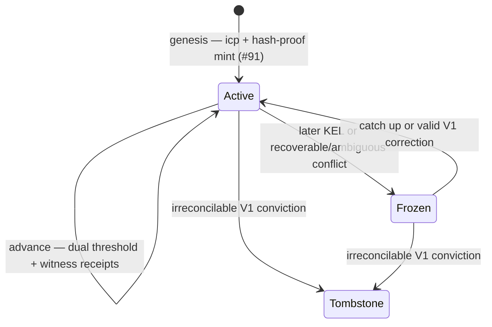

# Trust Model

!!! warning "Current-authority storage + discovery reframed to the sovereign per-AID checkpoint (#92)"
    The single-registry `trie_key` / `identity_root` key-state snapshot described below is
    the **rejected Candidate-B shared/global MPFS** shape. Per
    `specs/92-checkpoint-contention/DECISION.md`, each AID's current authority now lives in
    its **own sovereign, per-AID, quantity-one uniquely-tokenized checkpoint UTxO** — asset
    id `(checkpoint_policy_id, aid_asset_name)`, current weighted keys/threshold in the
    inline `CheckpointDatum` — read as a CIP-31 **reference input**. A `delta = 0` rotation
    (`seq + 1`) advances it and makes pending authorizations **stale** (universal
    re-authorization). Consumers **discover** the checkpoint by a **generic
    `(policy_id, asset_name)` multi-asset index lookup** (any indexer / node / sidecar),
    which supplies **only a candidate outref for liveness — never identity or
    current-authority truth** (the consuming transaction revalidates it against the ledger).
    **KEL replay is not in this hot path**: it belongs only to **historical credential-chain
    validation at admission** (the admission-cache split is preserved). The mechanical
    redeemer/proof re-cut is downstream #24.

## On-chain guarantees

The identity registry script enforces the following properties within a single block:

**AID uniqueness (the #91 registration gate).** Registration is the fixed **logical registration gate**: the MPFS absence/unicity proof at inception admits an AID at most once and **promotes** the registered leaf into its **per-AID checkpoint token** (minted exactly once, `+1`). This is the one-time registration gate — **not** the live current-authority store, which is the sovereign per-AID checkpoint (see the box above and the value-write guarantee below).

**Pre-rotation binding.** A rotation is valid only if the revealed keys match the committed `next_keys` digests (`blake3_256(qb64(reveal_key))` membership) **and** the signer evidence satisfies both thresholds — the rotation's own and the committed next threshold (the KERI dual-threshold rule). This cannot be circumvented without a preimage of blake3_256.

**Witness-gated advancement.** If the spent checkpoint has `toad > 0`, a normal advance
also requires at least `toad` valid Ed25519 witness receipts over the exact KEL anchoring
evidence. Controller signatures alone are insufficient, even after a timeout. A witness-set
change uses the two-seal handoff: the outgoing set receipts the proposed replacement before
the incoming set receipts activation. An explicitly witnessless checkpoint (`toad = 0`) is
a visible weaker mode that consumers may reject.

## Divergence enforcement

Ratified 2026-07-17 and corrected after the Cardano-first attack review
([#106](https://github.com/lambdasistemi/cardano-keri/issues/106), ships inside the V1
validator with [#24](https://github.com/lambdasistemi/cardano-keri/issues/24)). Post-hoc
slashing cannot undo a settled Cardano action, so the first defense is preventive:
**a witnessed identity cannot activate new Cardano keys until its KERI witness threshold has
receipted the anchoring evidence.**

| Divergence | On-chain consequence | Trigger |
|---|---|---|
| Cardano-first attempt on a witnessed AID | **Rejected before activation** — no successor checkpoint and therefore no action under the proposed keys | Advance lacks the configured threshold's receipts |
| Cardano behind (lag) | **Frozen** — advance-only until the controller catches up; consumers fail closed by address; no conviction bounty | Anyone presents the witnessed later KEL event |
| Recoverable or ambiguous conflict | **Frozen/disputed** — preserve the same token and allow a valid supported recovery/correction | Anyone presents objective mismatch or duplicity evidence that is not provably terminal |
| Irreconcilable V1 fork | **Convicted** — move the token to a permanent tombstone; prover paid | Anyone proves two incompatible, controller-threshold-signed and threshold-witness-receipted nondelegated establishment rotations from the same prior commitment |

The tombstone is terminal: the quantity-one token is **moved** to the designated tombstone
address, not burned and later re-minted. With mint-once unicity, consumers get positive
evidence of the conviction. Neither evidence class suffices alone: the conflicting event
must satisfy the pre-committed controller threshold **and** carry the applicable KERI witness
threshold's receipts. The Cardano branch's receipts were already verified at advance. This
keeps private or abandoned signed drafts out of `Convict`; a witnessless conflict cannot be
permanently convicted in V1. The proof must also establish irreconcilability under V1's
independent-AID rules. Potentially recoverable evidence freezes instead of destroying the
AID. Delegated and superseding recovery remain outside V1 and must define their own dispute
rules before admission.

Conviction stops future use; it does not roll back Cardano actions that already settled.
That is why the receipt requirement belongs on `Advance`, before the new keys can authorize
anything.

**Monotonic sequence.** `seq` increases by exactly one per rotation. The on-chain script checks `seq_to == cur_state.seq + 1`. There is no skip or rollback.

**Key possession at rotation.** The rotation message is signed with `reveal_key`. The on-chain script verifies the Ed25519 signature. Possession of the hash alone is insufficient.

**Value-write authorization against the sovereign per-AID checkpoint.** The cage script resolves current authority by reading the AID's own quantity-one uniquely-tokenized checkpoint UTxO — asset id `(checkpoint_policy_id, aid_asset_name)`, current weighted keys/threshold in the inline `CheckpointDatum` — as a CIP-31 reference input (#92). A `delta = 0` rotation (`seq + 1`) advances that checkpoint and makes pending authorizations stale, so a value-write is authorized only while it references the AID's current checkpoint.

## What is NOT on-chain

**Full KEL history.** The on-chain state holds only the current key-state. The full sequence
of inception and rotation events is not stored or replayed on-chain. An advance verifies the
specific anchoring event and its threshold receipts; it does not verify or retain the entire
event-receipt chain.

**Genesis identity binding (byte binding vs semantic projection).** The **BLAKE3 genesis byte binding** — that the inception bytes hash to the qualified AID — is verified **on-chain for ≤1-chunk inceptions** (#97/#98) and **attested for >1-chunk**. The **semantic projection** — that the AID's keys/threshold are faithfully decoded into its checkpoint — remains **oracle/attester-trusted**, with a **permissionless challenge + mechanical freeze**. Candidate A's `aid_asset_name` is a **native, domain-separated `blake2b_256` locator derived from the already-qualified AID** — a cheap label, **not a second self-certification**. Note that **public inception bytes alone do not prove controller possession** (inception events are public, so anyone can supply a victim's event bytes). Security instead rests on **three distinct boundaries**: the **byte binding** (`blake3(icp) == cesr_aid`, on-chain ≤1-chunk / attested >1-chunk); the **signed registration package** (key possession — proves control of the keys carried in the package); and the **attested semantic projection** (that keys/threshold are faithfully decoded), which **remains attester-trusted** (permissionless challenge + mechanical freeze). **Semantic correspondence stays attester-trusted** — signatures alone do **not** carry the weight against a corrupt projection attester, who could pair a victim's inception bytes with attacker-controlled keys and then sign. See [Binding verification protocol](../architecture/veridian-bridge.md#binding-verification-protocol).

**KERI duplicity detection.** Detecting that a controller published conflicting KERI events is off-chain work (watchers, witness receipts). Once detected, the evidence *can* be recorded on-chain as a permanent [duplicity freeze](../architecture/identity-ops.md#duplicity-freeze); the proposed [super watcher](super-watcher.md) is a **permissionless cross-plane relayer and evidence submitter** (KERI ↔ Cardano + the R-TEL mirror) that **relays** valid anchoring transitions and **submits** the duplicity / correspondence proofs that authorize a freeze — **not** a trusted oracle, identity authority, key custodian, backup service, recovery authority, or authoritative indexer, and it never chooses truth when cryptographic evidence is absent. The chain itself never observes KERI.

**Instant revocation of data-plane authority.** Closing or freezing an identity revokes value-write authority at the next update — cages require that the referenced checkpoint is the AID's **current live UTxO in the accepted mint/spend lineage** (not a closed/tombstoned one) **and** that the AID is **absent from the separate shared R-FRZ freeze registry** — but a compromised current key retains value-write capability during the [synchronization lag](#synchronization-lag) window until the [emergency freeze](../architecture/identity-ops.md#emergency-freeze) or rotation lands. These are two **validation rules**, not datum fields: lifecycle status is **not** a `CheckpointDatum` field (the datum carries only the AID/sequence binding + current weighted key state), and freeze lives in R-FRZ. That shared **R-FRZ** registry is an **attacker-contendable residual** (not sovereign; unlike the per-AID checkpoint, unrelated parties can contend on it) — the sovereign emergency path must not reintroduce a shared attacker-contendable UTxO (downstream #24).

**Next-key compromise before rotation.** If `next_key` is stolen before rotation, the on-chain state provides no protection. The response is to rotate before the attacker does (a race condition outside the protocol).

## CESR AID correlation — legacy Candidate-B metadata vs Candidate-A resolution

*The first paragraph describes the rejected Candidate-B metadata shape; the Candidate-A
resolution follows it.* The `cesr_aid` field in the legacy Candidate-B `KeyState` is the decoded CESR AID, stored unverified and carried forward through rotations for off-chain correlation. The historical F-prefix (Blake2b-256) requirement is retired by the E-native contract — verifiers recompute the standard Blake3 derivation; see [Blake2b-256 Requirement](blake2b256-requirement.md) for the archived rationale.

Off-chain resolution works as follows: given a CESR AID (e.g., `FKYLUMm...`), derive the asset id `(checkpoint_policy_id, aid_asset_name)` from the AID, then resolve the AID's current checkpoint UTxO by a generic `(policy_id, asset_name)` asset lookup (candidate outref for liveness only) and re-validate it against the ledger. (The rejected Candidate-B shape instead decoded the base64url prefix and scanned `KeyState` values across the shared MPF trie for a matching `cesr_aid`, then used the associated `trie_key` — a shared/global registry, superseded by #92.)

Under the sovereign per-AID checkpoint (#92), discovery of an AID's current authority is a **generic `(policy_id, asset_name)` asset lookup** — not a KEL replay. **AID uniqueness** is enforced on-chain by the **#91 gate** (the steady per-AID checkpoint token is minted exactly once, `+1`, only after Step/Finish byte binding + the oracle / projection gate + MPFS absence / unicity), not by disambiguating rival `cesr_aid` claims after the fact. KEL / TEL replay is **solely for historical credential issuance / admission** and does **not** select the current checkpoint identity. The legacy Candidate-B `cesr_aid` *metadata field* was a convenience correlation label, never an identity selector; under Candidate A the **qualified AID deterministically derives** the asset id `(checkpoint_policy_id, aid_asset_name)` and **binds the checkpoint datum** (AID/sequence binding) — identity is settled on-chain, not by a label.

## On/off-chain boundary

!!! note "Under #92 the current-authority store is the sovereign per-AID checkpoint"
    The identity rows below are Candidate A: an AID's current authority is its **sovereign
    per-AID checkpoint** keyed by the asset id `(checkpoint_policy_id, aid_asset_name)`
    derived from the qualified AID — **not** a shared `trie_key`-keyed MPF leaf. The third
    column names either **historical credential-chain admission** or a **separate
    compromise-signal plane** (watchers / KERI duplicity) — neither is current-authority
    discovery.

| Property | On-chain | Off-chain / separate plane |
|---|---|---|
| Registered-AID uniqueness | Yes — #91 MPFS absence/unicity proof + the exactly-once `+1` steady-token gate (minted once, only after Step/Finish byte binding + oracle/projection gate + MPFS unicity) | — |
| Checkpoint asset + datum bound to the qualified AID | Yes — domain-separated `blake2b_256` `aid_asset_name` derivation + inline datum AID/sequence binding + accepted mint/spend lineage | — |
| Genesis byte binding | Yes for ≤1-chunk inceptions (#97/#98); attested for >1-chunk | Attester for >1-chunk |
| Genesis semantic projection (keys/threshold faithfully decoded) | Partial — oracle/attester-trusted with permissionless challenge + mechanical freeze | Trusted slash / unfreeze (the honest #91 residual) |
| Current authority thereafter | Yes — the inductively validated sovereign per-AID checkpoint (current weighted keys/threshold; each advance proved its step; consumer does a bounded boundary check) | — |
| Value-write was authorized | Yes — against the sovereign per-AID checkpoint (#92) | — |
| Identity has not been closed or frozen | Yes — the consumer enforces the applicable checkpoint lifecycle / close lineage (the referenced checkpoint is the current live UTxO in the accepted mint/spend lineage) plus the separate shared R-FRZ freeze rule (attacker-contendable) | — |
| Key was not stolen / AID not compromised | No | Off-chain compromise signal — watchers / KERI duplicity detection (a distinct plane from current-actor authority and from historical credential admission) |
| KEL is complete and un-forked | No | Witness receipts |
| Settlement is final | No | Praos/Genesis finality depth |
| Current authorization on Cardano | Yes — the current live sovereign checkpoint is authoritative | Veridian/KERI governs identity + the credential/external plane |

## Synchronization lag

After a KERI rotation in Veridian, the Cardano registry still shows the old key until the rotation transaction settles (approximately 20 seconds at typical Cardano block times). During this window:

- KERI witnesses see the new key
- Cardano cage scripts see the old key

Applications that need consistency across both registries must account for this lag. Distinguish two things: **Veridian / KERI governs identity and rotations** (the identity source of truth), and the mirror caveat applies to the **credential / external plane** (R-TEL / R-ACDC / R-MAP). But the **current live sovereign per-AID checkpoint is the authoritative Cardano current-actor boundary** — R-KEL identity is an on-chain checkpoint, not a mere mirror: for **current Cardano authorization**, the current checkpoint is authoritative (during the lag window a consumer simply reads the checkpoint as it currently stands).

**The honest Cardano-only safety window.** Sovereignty does not eliminate synchronization lag. When KERI has rotated but the checkpoint has not yet been advanced or frozen, a **Cardano-only consumer still sees, and may accept, the old checkpoint key**. The old key is **stale in KERI** immediately, but **Cardano enforcement changes only when a successor checkpoint, an applicable freeze, or valid evidence reaches the ledger**. This is a real safety window, not a second identity branch.

**Honest consumer contract.** Every future protected action references the current unspent per-AID checkpoint and meets its current weighted threshold; historical credentials still use KEL / TEL admission evidence. Because a Cardano transaction cannot know about an unseen off-chain KERI event, high-security protocols **fail closed** once a later witnessed event, an active freeze, or a valid mismatch / duplicity proof is presented, and **must publish an anchoring-freshness policy / SLA** rather than pretend replay protection alone supplies revocation freshness. #92 invents no universal numeric timeout; the appropriate freshness window is a per-use-case policy the protocol publishes.

## Relationship to KERI

cardano-keri borrows the pre-rotation primitive from [KERI](https://github.com/WebOfTrust/ietf-keri) (Key Event Receipt Infrastructure). It does not implement KERI. Specifically, there are no:

- Witnesses or backer receipts
- CESR encoding of the KEL
- Duplicity-evidence gossip
- Watcher/judge roles

The on-chain layer is a minimal root of trust. For applications that require the full KERI trust model, an off-chain KEL infrastructure must be built on top of cardano-keri, treating the on-chain checkpoint as the canonical current key-state anchor. Veridian / KERI governs identity and rotations; the Cardano **credential / external** plane (R-TEL / R-ACDC / R-MAP) mirrors that off-chain truth, while the **R-KEL identity is an on-chain checkpoint** whose current live UTxO is **authoritative for current Cardano current-actor authorization** — not a mere mirror.
