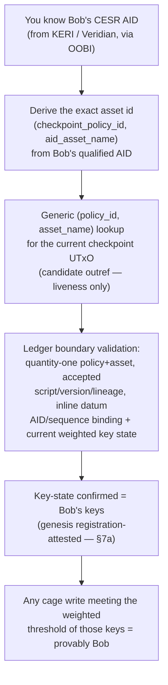

# User Experience: Veridian User on Cardano

## What you can verify about another Veridian user's Cardano actions

You know a peer by their Veridian AID — established out-of-band (OOBI exchange, QR code, direct share). This is the same trust root as any KERI interaction. Cardano extends what you can do with that trust.

## The verification chain

!!! warning "Updated for the checkpoint model (2026-07-09) — asset-derived under #92"
    Previously this chain required you to **replay Bob's KEL** and recompute a
    `trie_key`. Per `specs/68-keystate-shape/identity-model.md` (PR #87), the on-chain
    entry is a **per-AID checkpoint** that advances only through
    seals receipted by Bob's own witnesses — so post-genesis, the chain itself proves
    the key-state. What replay no longer buys you: nothing for rotations. What you may
    still care about: the **genesis binding** splits — the **byte binding** (inception bytes
    hash to the qualified AID) is **cryptographic on-chain for ≤1-chunk inceptions**
    (attested for >1-chunk), while the **semantic projection** (keys/threshold decoded) is
    **attested and permissionlessly challengeable** — §7a — and **freshness** (the checkpoint
    may lag a very recent rotation — §9). **Superseded by #92** (box below): the current-authority store is
    the **sovereign per-AID checkpoint UTxO** whose asset id
    `(checkpoint_policy_id, aid_asset_name)` is **derived from the qualified AID**; the
    earlier `cesr_aid`-keyed leaf shape is the rejected Candidate-B form.

!!! warning "Current-authority + discovery reframed to the sovereign per-AID checkpoint (#92)"
    Per `specs/92-checkpoint-contention/DECISION.md`, an AID's current authority is its
    **own sovereign, per-AID, quantity-one uniquely-tokenized checkpoint UTxO** — asset id
    `(checkpoint_policy_id, aid_asset_name)`, current weighted keys/threshold in the inline
    `CheckpointDatum`, read as a CIP-31 reference input; a `delta = 0` rotation advances it.
    You **discover** Bob's checkpoint by a **generic `(policy_id, asset_name)` asset lookup**
    (any indexer / node) that yields a candidate outref **for liveness only** — the
    consuming transaction revalidates it against the ledger, never trusting the indexer for
    identity truth. **Failure behavior:** a **stale / cached outref consumed by a rotation
    fails ledger validation** (it no longer exists or no longer matches) → **refresh and
    retry**, never forged authority; an **unavailable or censoring resolver blocks only
    transaction construction (liveness)** — mitigated by cache + resolver failover or a local
    chain-sync — and **never yields false authorization**. So the "with KEL replay" framing below no longer describes the
    **current-actor authority** path: **KEL replay is not in the hot path**. It stays only
    for **historical credential issuance / admission** (the KEL/TEL credential chain) and
    does **not** select the current checkpoint identity — the admission-cache split is
    preserved. **AID uniqueness** is enforced on-chain by the **#91 gate** (the steady per-AID
    checkpoint token is minted exactly once), not by a KEL-replay squatting resolution. The
    mechanical `trie_key` / freeze re-cut is downstream #24.

## What you can trust (current authority — no KEL replay)

Current-actor authority resolves from Cardano state alone via Bob's **sovereign per-AID
checkpoint** — no KEL replay in this path:

| Claim | Verifiable? | How |
|---|---|---|
| Bob wrote a specific value | Yes | Cage write meeting the weighted threshold of the keys in Bob's checkpoint `CheckpointDatum`, on-chain |
| Bob rotated his key | Yes | Bob's checkpoint advanced (`delta = 0`, `seq + 1`); pending authorizations went stale |
| Bob has not been frozen | Yes | No active marker for Bob in the shared **R-FRZ** freeze registry (attacker-contendable, **not** sovereign — the sovereign emergency path must not reintroduce a shared attacker-contendable UTxO; downstream #24) |
| This cage write happened before that one | Yes | Cardano ledger provides global total order |
| Bob's key is currently live | Yes | The current weighted key state in Bob's checkpoint UTxO datum |

## AID uniqueness and genesis — the #91 on-chain gate

*Which* checkpoint is Bob's is settled **on-chain**, not by replaying KELs. Under Candidate A
(`specs/92-checkpoint-contention/DECISION.md`) a registered AID has **exactly one** steady
per-AID checkpoint token: it is minted **exactly once, `+1`, only after** the #91
**Step/Finish byte binding** + the **oracle / projection gate** + the **MPFS absence /
unicity** proof. There is no pool of rival registrants for the same AID to disambiguate later.

- **Discovery is the AID-derived asset, revalidated by lineage.** The asset id
  `(checkpoint_policy_id, aid_asset_name)` is **deterministically derived from the AID**; the
  **ledger revalidates** the AID-derived asset and its **mint / spend lineage** (quantity-one,
  accepted checkpoint script / version / lineage, inline datum AID/sequence binding + current
  weighted key state). No off-chain "scan for a matching `cesr_aid`, pick a `trie_key`".
- **KEL / TEL replay is solely for historical credential issuance / admission** (the vLEI
  credential chain — see [The Regulated DeFi Gate](defi-gate.md)); it does **not** select the
  current checkpoint identity.

!!! note "Honest #91 residual"
    The genesis **projection is attester-trusted** (the oracle / projection gate), with a
    **permissionless-challenge / censorship** residual — a challenger can contest a bad
    projection, and censorship of a genuine registration remains the residual risk. This is a
    falsifiable trust boundary, not a fully trustless one.

## The squatting limitation

!!! warning "Superseded by Candidate A (#92 / #91) — rejected Candidate-B framing"
    The earlier framing here — *anyone can register any `cesr_aid`; multiple entries claim
    the same AID; a one-time KEL / admission binding then selects the legitimate controller*
    — was the **rejected Candidate-B** shared-registry metadata/index model. Under Candidate
    A there is **no rival-registrant pool**: uniqueness is enforced by the **on-chain #91
    gate** (the steady per-AID checkpoint token is minted exactly once — see the *AID
    uniqueness and genesis* section above). The old Candidate-B `cesr_aid` *metadata field*
    was a convenience correlation label, never an identity selector; under Candidate A the
    **qualified AID deterministically derives** the asset id `(checkpoint_policy_id,
    aid_asset_name)` and **binds the checkpoint datum** (AID/sequence binding) — identity is
    settled on-chain, not by a label. The reason on-chain CESR self-cert cannot help (KERI
    inception events are public; binding event bytes to the registrant would need CESR
    parsing, out of scope) is preserved in [AID Model — attack
    B](aid-model.md#inception-security-two-attacks-different-fixes).

**Current-actor** authority resolves from Cardano state alone — via the AID's sovereign per-AID checkpoint, discovered by a generic `(policy_id, asset_name)` asset lookup and re-validated against the ledger. The only thing outside that hot path is **historical credential issuance / admission** (the KEL/TEL credential chain), which never selects the current checkpoint identity.

## Practical workflow (two Veridian users)

**OOBI already establishes Bob's AID** — sufficient to **resolve his current checkpoint**, so credential admission never *selects* his current authority (that is always the sovereign checkpoint). Distinguish **authority selection** from **protocol eligibility**: a dApp may nonetheless *require* KEL / TEL credential admission as a **separate eligibility gate** — OOBI resolving the checkpoint does **not** by itself satisfy every dApp policy:

1. You receive Bob's AID via Veridian (OOBI or contact share) — the AID is established
2. *(If the dApp requires credential admission as an eligibility gate)* verify Bob's KEL / credential chain once at admission — a distinct precondition to act; it never *selects* his current authority (the checkpoint does that)
3. The `cardano-keri-sdk` derives Bob's asset id `(checkpoint_policy_id, aid_asset_name)` from his AID automatically
4. You resolve Bob's current checkpoint UTxO by a generic `(policy_id, asset_name)` asset lookup (candidate outref for liveness only), re-validated against the ledger
5. Any cage write meeting the weighted threshold of the keys in that checkpoint is **authoritatively authorized *for Cardano*** by the current live checkpoint (a fully bound threshold signature), **subject to the stated KERI→Cardano sync lag**, plus Cardano's immutability and global ordering. (During the lag the checkpoint keys may trail a very recent KERI rotation, so this does not assert they are necessarily Bob's identical *current* KERI keys.)

Steps 3–5 are handled by the SDK. The user experience is: "verify Bob in Veridian, then Bob's Cardano actions are automatically trusted."

## What happens when things go wrong — loss, recovery, and forks

Identity lives in KERI; the Cardano checkpoint is a **projection of current authority**, not
a second sovereign copy. So loss and fork outcomes are KERI outcomes first — Cardano keeps a
checkpoint / audit anchor but cannot reconstruct what only KERI holds.

**If you lose something (recovery):**

| What you lost | Outcome |
|---|---|
| Your **local public KEL** | Recover it from your KERIA / witness / watcher replicas. Cardano keeps a checkpoint / audit anchor but **cannot reconstruct the full KEL**. |
| A peer's **AID / OOBI or the semantic locator** (you forgot *which* AID) | Once the qualified AID is known, exact-asset lookup finds its checkpoint — but Cardano does **not** guarantee recovery of the forgotten mapping. Your wallet / contact / KERIA / witness backups own that. |
| Your **current private key**, but you still hold valid next / recovery material | Perform KERI recovery / rotation, then relay the checkpoint transition (or freeze the old projection during the lag). |
| Your **current key *and* all next / recovery material** | **No Cardano recovery exists in the current scope.** KERI superseding / delegated recovery is out of scope here, so the AID is **unrecoverable** / abandonable under this design. |

**If keys or events conflict (forks):** an **unreceipted local KEL fork has no accepted
authority** — nothing Cardano or any watcher will admit it. Conflicting threshold-receipted
events are duplicity evidence that a super watcher can submit, driving a freeze / slashing
path. A native-KERI vs Cardano-facing mismatch is correspondence fraud, handled by the same
permissionless proof / freeze path. What a super watcher **cannot** do is manufacture a
canonical truth branch when the cryptographic evidence is absent — it relays and evidences,
it never adjudicates.

## The honest sync-lag caveat

After you rotate in KERI, there is a window before the Cardano checkpoint advances. During
that window a **Cardano-only consumer may still accept the old checkpoint key** — the old
key is stale in KERI immediately, but the **old checkpoint key stays enforceable on Cardano
until a successor checkpoint, an applicable freeze, or valid evidence reaches the ledger**.
This is a real safety window, not a second identity branch. High-security protocols should **fail
closed** on a presented later event / freeze / proof and publish an anchoring-freshness
policy rather than assume instant global revocation.

## What Cardano adds on top of KERI

| Property | KERI alone | + Cardano registry |
|---|---|---|
| Key ownership proof | Yes (CESR self-cert) | Yes (checkpoint weighted keys + Ed25519) |
| Global event ordering | Approximate (witness receipts) | Exact (ledger slot order) |
| Immutable event history | Yes (append-only KEL) | Yes (on-chain, permanent) |
| Finality | Sub-second (witness receipts) | ~20s (Praos block) |
| Data anchoring | Off-chain only | On-chain MPFS leaf writes |
| Interop with non-KERI apps | Hard | Natural (Cardano-native apps read the AID's checkpoint UTxO) |
