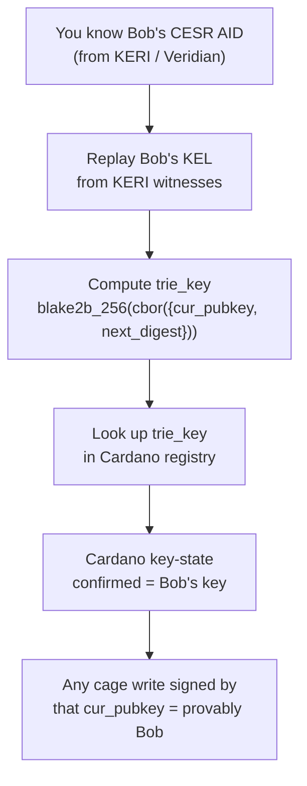

# User Experience: Veridian User on Cardano

## What you can verify about another Veridian user's Cardano actions

You know a peer by their Veridian AID — established out-of-band (OOBI exchange, QR code, direct share). This is the same trust root as any KERI interaction. Cardano extends what you can do with that trust.

## The verification chain

The KEL replay is not optional — it is the step that proves the Cardano entry belongs to Bob and not a squatter. If you skip it and trust the `cesr_aid` field in the registry directly, the guarantee breaks.

## What you can trust (with KEL replay)

| Claim | Verifiable? | How |
|---|---|---|
| Bob wrote a specific MPFS leaf | Yes | Cage write signed by Bob's `trie_key` cur_pubkey, on-chain |
| Bob rotated his key | Yes | On-chain rotation + KEL rotation mirror |
| Bob has not been revoked | Yes | No active freeze marker for Bob's `(trie_key, seq)` |
| This cage write happened before that one | Yes | Cardano ledger provides global total order |
| Bob's key is currently live | Yes | Identity root KeyState + freeze root |

## What you cannot trust without KEL replay

| Claim | Without replay | With replay |
|---|---|---|
| `cesr_aid` in registry is really Bob | No — squatter can assert any AID | Yes — KEL derivation is unique |
| First registration is the real Bob | No | Yes |
| The registry entry is not a forgery | No | Yes |

## The squatting limitation (current)

Anyone can register any `cesr_aid` value in the Cardano registry. The on-chain script stores it as metadata without verification — Plutus has no Blake3 builtin, so it cannot check that `blake3(inception_event) == cesr_aid`.

This means `cesr_aid → trie_key` is a one-to-many untrusted index. Multiple entries can claim the same Veridian AID. The KEL replay finds the unique legitimate `trie_key` and discards the rest.

For applications that need to resolve KERI identity purely from Cardano state (without touching the KERI network), this is a hard limitation. They cannot be built securely until Blake3 lands in Plutus. See [Blake3 requirement](blake3-requirement.md).

## Practical workflow (two Veridian users)

For Veridian users who already interact via KERI, the KEL replay is a natural step:

1. You receive Bob's AID via Veridian (OOBI or contact share)
2. Veridian already has Bob's KEL (you've verified his KERI identity)
3. The `cardano-aid-sdk` computes Bob's `trie_key` from the KEL automatically
4. You look up Bob's `trie_key` in the Cardano registry
5. Any cage write at that `trie_key` is as trustworthy as a KERI-signed message from Bob — same key, plus Cardano's immutability and global ordering

Steps 3–5 are handled by the SDK. The user experience is: "verify Bob in Veridian, then Bob's Cardano actions are automatically trusted."

## What Cardano adds on top of KERI

| Property | KERI alone | + Cardano registry |
|---|---|---|
| Key ownership proof | Yes (CESR self-cert) | Yes (trie_key + Ed25519) |
| Global event ordering | Approximate (witness receipts) | Exact (ledger slot order) |
| Immutable event history | Yes (append-only KEL) | Yes (on-chain, permanent) |
| Finality | Sub-second (witness receipts) | ~20s (Praos block) |
| Data anchoring | Off-chain only | On-chain MPFS leaf writes |
| Interop with non-KERI apps | Hard | Natural (Cardano-native apps see trie_key) |
