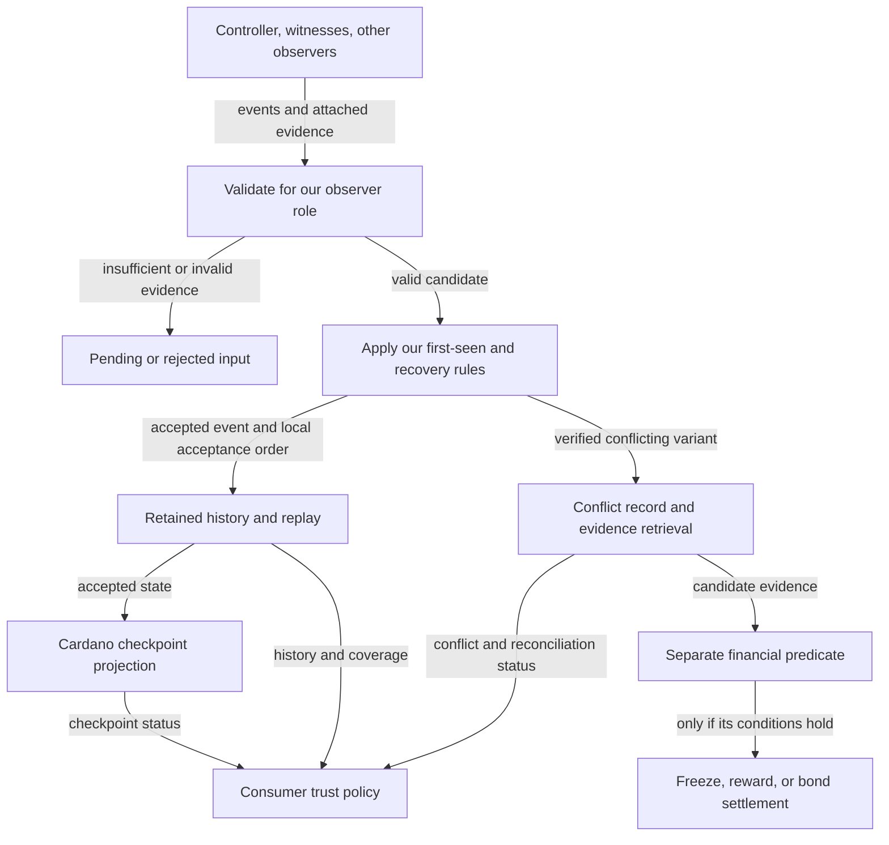
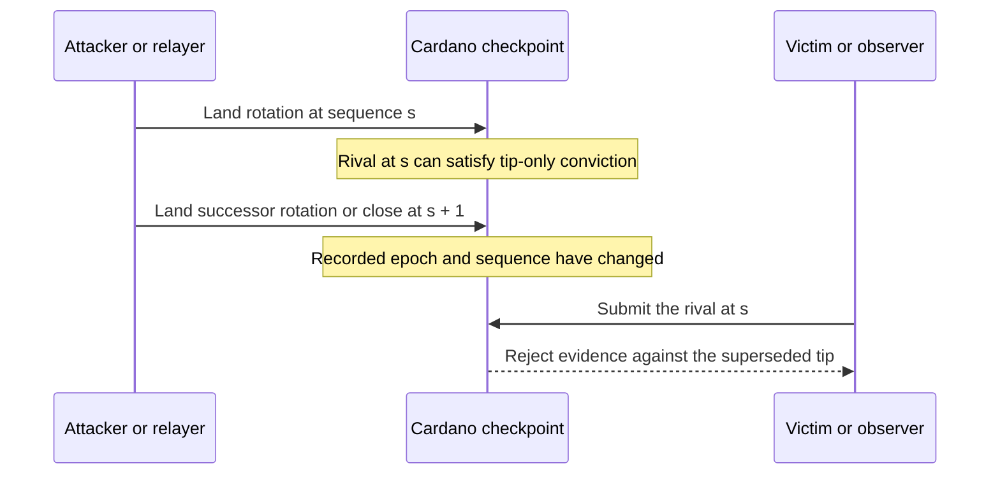

# Watcher conformance review

## The consumer story

A Cardano application uses a checkpoint to recognize an external identity. It
needs to keep its accepted history when someone later acquires old keys, accept
permitted KERI recovery, and learn about conflicts that affect its decisions.
When evidence is missing, the application needs to see that limitation rather
than mistake a quiet checkpoint for a globally uncontested or current KEL.

**Review result, 11 September 2026:** KERI specifies first-seen processing,
validation, and recovery. Our current predicates cover a narrower checkpoint
service. The missing work is an explicit contract connecting observation,
retained history, conflict reporting, consumer policy, and financial actions.
The checkpoint predicate alone does not establish watcher conformance.

The subsequent double-rotation review also identifies an economic gap: evidence
can be admissible at one tip and become unusable before an observer can act.
The model provides no guaranteed challenge interval; both another rotation and
close can move the target immediately. See [Rapid rotation and the challenge
interval](#rapid-rotation-and-the-challenge-interval).

This is a design review and proposed acceptance criteria, not a replacement
product ruling or a claim that a deployed watcher has been certified. It reviews
invariants and executable behavior; it does not complete Lean proofs.

## Sources and scope

| Source | Fixed identity and use |
|---|---|
| Key Event Receipt Infrastructure (KERI), version 1.1 | [Specification source][spec] at `fbdd4a6155e48248873cccd5cf6f79b6b631a021`, dated 28 August 2026; [published specification][published], DOI `10.5281/zenodo.18887102`. Authority for the KERI rules discussed here. |
| Cardano KERI | [Reviewed commit][candidate] `811843b313d9005923ba205e86d7a3afa6fb3d0d`. Current Aiken code, Lean models, and design documents are evaluated separately. A planned operation in prose is not treated as shipped code. |
| KERIpy | [Source snapshot][keripy] `1a7d68a1fcf487f8c40d8d57031e2ac3d6b3b738`, dated 10 September 2026. Implementation comparison only; not the authority that overrides a specification clause. |
| Incentive cross-check | [Operator-linked gist][gist], revision `9e7edd8b6afe7d237f77cb41a6659052f5933afd`. Reviewed against the same repository commit; its conclusions are assessed below rather than adopted as rulings. |

The specification is attributed above under its [copyright terms][copyright].
Clause references below point to the fixed source, including its validation and
recovery material in Annex A. TEL observations below concern this repository's
mirror and credential models; this is not a complete TEL or vLEI conformance
review. No production network or GLEIF deployment was tested.

## The boundary we need to specify

The diagram describes responsibilities the design must assign. It does not
assert that every box is implemented or requires its own service.



**First-seen means first accepted under the validation rules**, not the first
unverified packet. It belongs to the observing KEL copy. Different observers
can have different acceptance ordinals. An observer cannot replace its accepted
rotation with a later conflicting rotation merely because the later submitter
has valid old keys. The specified recovery exceptions still apply.
See [First Seen Policy and Superseding Recovery][first-seen].

Cardano can record the order in which *its own* projection accepts observations.
That cannot recover a witness's private arrival order or establish the globally
earliest version. Nor is the current checkpoint advance counter automatically
the KERI first-seen ordinal: it does not enumerate every accepted event.

## Specification to implementation map

“Source gap” below means the inspected representation or contract does not
establish the invariant. It is not an executed exploit or a claim that no other
component could provide it. Only the explicitly named test boundaries have
execution evidence in this review.

| Required behavior or distinction | Specification basis | Repository evidence and assessment | Acceptance criterion still needed |
|---|---|---|---|
| Validate before accepting | [Verifier and Validator][validation]; [observer validation rules][roles] require historical control authority, structural checks, signatures, and applicable witness and delegation evidence. | [Enforcement observer][observer] binds supplied wire evidence and calls the conviction predicate. [Lean's environment][environment] abstracts cryptographic facts. **Partial:** these are not a replay of the full observer validation procedure. | Replay valid and invalid histories through the actual ingestion interface, including bad prior digests, missing establishment history, wrong authority, receipts, and delegation seals. |
| Preserve our first accepted version | [First Seen Policy][first-seen] and the [watcher overview][overview]. | [Key-compromise prose][firstseen-prose] incorrectly limits first-seen to witness-local observation. **Documentation mismatch.** Abstaining from inventing another observer's order is appropriate; denying our own first-seen obligation is not. | A later non-superseding variant cannot change the accepted event. Reversing arrival order at a different observer may change that observer's accepted copy without making either order universal. |
| Identify conflicts by event content | [Validator and Duplicity][validation] define differing versions at the same native sequence by event content. | [Conviction predicate][predicate] only considers a `rot` at the current tip, with the same revealed keys, and differences in `kt`, `n`, `nt`, or `bt`. It deliberately excludes witness-set comparison. **Narrow financial detector:** not general KEL conflict detection. | Distinct, otherwise verifiable events with identical projected key state must remain distinguishable to the observation service. Exercise differences in seals, prior digest, and valid witness deltas, as well as interactions and delegated events. Do not automatically extend slashing to all of them. |
| Require applicable witness evidence | [Watcher overview][overview] and [observer validation rules][roles]. | [Predicate][predicate] verifies distinct witness receipts against the tip's witness set and tally. **Tested at this predicate:** missing receipts and repeated receipts cannot satisfy it. Witnessless operation deliberately has no such protection. | Preserve historical witness-set and threshold attribution across rotations. State the witnessless tier explicitly; old controller signatures alone must not satisfy a witnessed profile. |
| Retain accepted and superseded history | [First Seen Policy and Superseding Recovery][first-seen] preserve accepted events and their acceptance order, including superseded branches. | [Current datum][datum] contains projected state and counters, not an accepted-event archive. [History model][history] maps sequence to a leaf and replaces the latest leaf on delegated supersession. **Source gap:** neither is a complete observer record. | Assign persistent event, attachment, acceptance-order, and recovery-relation storage and replay. Ledger transaction data may supply some bytes, but identify its retrieval, retention, and replay guarantees. This does not require restoring the retired on-chain branch-tree design. |
| Keep ordinary rotation recovery narrow | [Recovery rules][recovery]: a rotation may replace an eligible interaction; a non-delegated rotation cannot replace a rotation; an interaction cannot supersede an event. | [History model][history] advances establishment state and rejects non-delegated same-position replacement. It does not retain an interaction trunk. **Partial abstraction.** | Run complete event traces for permitted interaction recovery, forbidden rotation replacement, and forbidden recovery behind a later rotation, with accepted-history retention. |
| Bind delegated recovery to the actual parent approval | [Recovery rules][recovery] distinguish later parent sequence, later seal in the **same parent event**, and a parent rotation that actually supersedes an interaction. They also include recursive ancestor comparison. | [Approval and supersede][history] keep parent sequence, event class, and seal index, but no parent-event identity in `Approval.before`. Equal sequence and class are not themselves evidence of the exact same event. Recursive precedence is explicitly excluded and refused. **Refinement gap and declared subset.** | Demonstrate how parent-event identity and permitted supersession are established at the interface to this abstraction. Equal sequence on different parent branches must not masquerade as a later seal in one event. Test recursive recovery, or declare a profile that refuses those otherwise valid KERI recoveries. |
| Separate conflict detection from trust and money | [Duplicity][validation], [KAWA Advantages][choice], and the trust-text tension below. | [Checkpoint step][settlement] consumes abstract `duplicityAt` and makes conviction terminal, paying the registration bond in the live case. **Application policy**, not a KERI-mandated financial operation. | Specify exactly which admissible evidence affects future use, historical use, recovery, and each sponsor-funded balance. A discovery alert alone must not authorize a payout. |
| Limit claims about unseen events | [KAWA availability and security assumptions][availability] and [witness dissemination policy][witness-policy]. | [Super-watcher design][hunter] acknowledges discovery and outage limits. Removing the evidence tree does not remove those limits. **Operational contract incomplete for a watcher claim.** | Withhold evidence, partition peers, and stop all responses. The result must expose unknown coverage or staleness, rather than report global absence of duplicity. |
| Qualify receipt-based branch binding | [KAWA immunity and collusion discussion][availability] depends on fault and connectivity assumptions. | [Credential design][branch-binding] relies on historical witness receipts instead of a digest chain. A positive tally alone does not establish the required honesty or unique-branch assumptions. **Explicit assumption needed.** | Test two independently sufficient, conflicting receipt sets under violated witness assumptions. Report the conflict if observed; do not claim signatures alone prove no competing branch exists. |
| Carry recovery consequences into credential use | KERI recovery supplies the accepted branch; credential cache behavior is an application obligation. | [Credential gate][gate] checks cached freshness and mirror absence. Its documented interval after supersession and before eviction remains. **Known model limitation**, not closed by detecting a fork. | Demonstrate consumer behavior before and after recovery, before and after eviction, and after expiry. Decide whether use requires an immediate dependency check or accepts a stated bounded interval. |
| Scope TEL absence to the mirror | This follows from the local set being queried, not a KERI promise of complete observation. | [Mirror][mirror] checks the seal walk before inserting a pushed revocation; `miss` checks the resulting set. **Partial observation:** absence means absent from that mirror at that state. | Withhold a genuine sealed revocation and show that mirror absence alone cannot become a claim of globally current credential validity. Bind any stronger claim to a declared observation and freshness contract. |

Tip-only conviction is **not by itself a conformance defect**. Broadening it to
every historical fork would create a new denial-of-service and funding policy,
and would not by itself implement a watcher. Conversely, retaining a valid
historical conflict for inspection need not overwrite history or seize a bond.

The distinction matters for a late compromise: when the witness requirement
applies, historical controller keys alone do not establish the required receipt
quorum. Even a subsequently forged, sufficiently witnessed alternate history
does not erase a retained proper history. KERI discusses this explicitly under
[dead exploits][dead-exploit]. Handling the resulting trust decision remains
separate from changing the accepted event.

## The specification has a trust-text tension

The [overview][overview] uses MUST language for trusting when no duplicity is
known and withholding trust until duplicity is reconciled. The [Duplicity
section][validation] uses SHOULD for withholding trust. [KAWA Advantages][choice]
then explicitly gives the validator discretion to retain its original copy as
authoritative and continue trusting it, or stop trusting the identifier.

These passages cannot support our current blanket assertion that KERI requires
every proven establishment conflict to produce permanent loss of trust. They
also do not justify silently interpreting first-seen as unconditional continued
trust. A conformance profile must state the applicable scope and interpretation;
upstream clarification of these passages remains an open question.

The unambiguous obligations remain useful now: validate before acceptance,
preserve first-seen history, apply specified recovery, and distinguish the
accepted copy from a later conflict. None of the cited clauses specifies a
Cardano bond recipient, sponsor liability, or an irreversible payout.

## What KERIpy shows in practice

The pinned implementation provides concrete examples of some of these
boundaries:

- [Event processing][keripy-events] distinguishes an already recorded event,
  permitted progression or recovery, and a likely conflicting version.
- [Likely-duplicitous escrow][keripy-escrow] stores event material for further
  processing. [Retry processing][keripy-retry] can retain or expire the escrow
  entry; expiration of that index is not evidence that all raw event bytes
  disappear.
- [Database definitions][keripy-db] distinguish event storage, first-seen
  ordinals, and likely or confirmed duplicity indexes. Merely possessing event
  bytes is not the same as having accepted that event as first-seen.
- [Watcher adjudication][keripy-watch] emits mismatch cues from compared watcher
  key states. Such a cue is not, by itself, the complete signed conflicting
  history needed by our financial predicate.

There is also a [`duplicity()` placeholder][keripy-placeholder] in this snapshot.
That prevents treating that particular function as evidence of a completed
adjudication path. It does **not** establish that every watcher implementation
or production deployment lacks duplicity handling. No KERIpy runtime or deployed
watcher was exercised in this review.

KERI describes retaining and serving conflicting evidence as the optional juror
role, and allows witness dissemination policies to vary. We must specify the
evidence retrieval and notification service on which our consumers rely; there
is no basis here for assuming every witness broadcasts every conflict.
See the [watcher overview][overview] and [witnessing policy][witness-policy].

## Decisions and unresolved alternatives

| Subject | Position for the next design iteration | Alternative and reason |
|---|---|---|
| Our accepted history | Preserve our first-seen copy and apply specified recovery; this follows the operator's correction and the KERI rules. | Recovering a universal arrival order from Cardano settlement cannot establish what other observers saw. |
| Where history lives | Require a persistent, replayable observer record; placement remains open. | Neither a mandatory on-chain branch tree nor an undocumented off-chain archive is established by this review. The implementation must name its actual provider and interface. |
| Trust after conflicting evidence | Open: define effects on historical uses, future uses, recovery, and consumer refusal, with the specification interpretation attached. | Both automatic permanent distrust and automatic continued trust overstate what the combined cited passages establish without a profile. |
| Financial consequences | Open: separate eligibility for conviction, freeze, recovery, advance rewards, and sponsor refunds. | Mapping every observed conflict to terminal bond confiscation is an additional application choice with adversarial consequences. |
| Third-party funding | Preserve the operator's requirement for sponsorable freeze and a locked, prepaid unfreeze reserve. Design the payment and refund ownership rules explicitly. | Requiring a fresh issuer payment to recover assumes cooperation from an external entity that may have no interest in Cardano. |
| Absence and freshness | Describe the observations supporting each response and what remains unknown. | A mirror membership proof, a quiet hunter, or a paid premium does not establish that every relevant event was supplied. |

Existing design tickets provide the economic follow-up: [shared-root
sponsorship](https://github.com/lambdasistemi/cardano-keri/issues/404), [locked
unfreeze funding](https://github.com/lambdasistemi/cardano-keri/issues/405),
[sponsor protection against farming and closure](https://github.com/lambdasistemi/cardano-keri/issues/406),
and [TEL incentives and freshness](https://github.com/lambdasistemi/cardano-keri/issues/398).
The watcher contract belongs with the [off-chain commands and hunter
work](https://github.com/lambdasistemi/cardano-keri/issues/325) and its consumers.
These are proposed mappings to existing work, not claims that those tickets
already implement the criteria in this review.

## Required behavioral scenarios

Each scenario needs the real observer input and output interface once that
interface is specified. A Boolean evidence oracle or a unit test of the financial
predicate cannot close the whole scenario.

| Scenario | Required observable result | Evidence in this review |
|---|---|---|
| Forged old event with controller signatures but insufficient required receipts | No witnessed acceptance or witnessed financial conviction; retained history unchanged. | Receipt rejection tested at the current conviction predicate only. |
| Fully verifiable late alternate rotation at an already accepted location | Original accepted event retained; conflict disposition visible; no implicit replacement. A separate policy decides any consumer restriction or payout. | Same-tip predicate tests only; complete observer scenario unverified. |
| Historical alternate delivered after later rotations | Retained history is not rewritten; report any retained conflict under the chosen observation policy. Historical automatic conviction is not assumed. | Sequence mismatch rejected at the predicate; full history and evidence-retention behavior unverified. |
| Same key-state projection, different event content | Observer distinguishes the events even when the narrow conviction predicate finds no financial conflict. | Source-level projection gap; no signed end-to-end vector executed. |
| Superseding rotation after an eligible interaction | Trunk changes according to recovery rules; previously accepted material remains replayable; affected provisional consumers follow the declared policy. | Model and design inspected; complete scenario unverified. |
| Delegated recovery with a later seal in another parent event at the same sequence | It cannot pass the exact-same-parent-event case just because sequence and event class match. Another permitted recovery rule must justify it. | Abstraction boundary identified; complete scenario unverified. |
| Fresh observer bootstrapped from only one of two branches | Response identifies its observation basis; it does not claim its copy proves universal first arrival. | No bootstrap or peer-diversity test executed. |
| All peers unavailable, or a sealed revocation withheld | Unknown coverage or stale state stays distinguishable from no known conflict and from global non-revocation. | No network test executed; mirror semantics inspected. |
| Issuer, sponsor, relayer, and hunter collude; then replay, rotate repeatedly, and close | Each payout needs its own funded authorization; aggregate rewards and refunds obey sponsor ownership and reserve rules without assuming issuer cooperation. | Economic design work outstanding; no assertion that current models settle these cases. |
| A dormant identity receives evidence against its closing epoch long after close | Preserve its authenticated closing context; explicitly decide whether late evidence can permanently bar revival without replacing accepted history. | The gist cross-check below exercises the timeless model transition, conditional on its evidence predicate. |
| A loser has evidence for conviction but lacks the accepted branch's next keys | Compare conviction with the actions actually available to that actor in that state; do not use an unavailable close to dismiss a bounty incentive. | Executed in the model in the gist cross-check. |

## Cross-check against the incentive gist

The [gist][gist] strengthens the review with dormant-conviction and quorum
intersection analysis. Its broad verdict that the incentive machine faithfully
implements the juror role is not established. Several financial conclusions
depend on ownership and key capabilities that it does not hold fixed.

### Agreements and corrections

| Gist claim | Cross-check result |
|---|---|
| Dormant conviction has no expiry and can permanently prevent revival without paying a bounty. | **Supported at the model boundary.** [The parked transition][settlement] has no age guard. Execution below confirms the consequence once `duplicityAt` holds. This is an additional explicit risk missing from the first review. Constructing valid evidence remains a separate condition. |
| This necessarily contradicts KERI because a prior copy always wins. | **Too strong.** Preserving a prior copy prevents substitution; it does not settle every validator's future trust policy. The trust-text tension above still applies. The operator's first-seen requirement makes dormant terminality a design decision to revisit, not a reason to pretend the conflicting evidence was never received. |
| A dormant proof submitter can currently choose unauthenticated witnesses because the parked hash omits them. | **A refinement gap, not an established deployed exploit.** `Hash` abstracts key state as epoch and sequence; the [registry model][registry-context] abstracts it as a number. Neither defines the concrete commitment encoding. The [inspected Aiken observer][observer] instead obtains a complete datum from an active, armed, or frozen checkpoint input. A concrete dormant verification path with attacker-selected witnesses was not demonstrated. Require authentication of the whole verification context, including witnesses and tally, either directly in the commitment or through authenticated derivation. |
| Two sufficient receipt sets imply colluding witnesses. | **Correctly challenged by the gist.** For one common set of size `N` and equal threshold `M`, the guaranteed overlap is `max(0, 2*M - N)`. With four witnesses and threshold two, disjoint honest subsets can each first-see a different version. This concerns non-superseding variants; authorized recovery is not witness misconduct. |
| Counting against the tip's witnesses is always stricter than counting against the rival's witnesses. | **Not generally true.** These are different sets and possibly different thresholds. Either check can pass while the other fails. Also, `tip.witnesses` is the effective set of the already accepted rotation, not necessarily the pre-rotation set. Validate each branch's applicable receipt requirements before asserting that the financial predicate is a conservative subset. |
| Replacing witnesses necessarily makes conviction impossible. | **Conditional.** Rival-set receipts alone may fail the tip-set check; replacing a set does not prove that valid receipts from the tip's witnesses cannot also be obtained. The check creates an asymmetry, but its existence is not by itself evidence of KERI conformance or a reason to declare it safe. |
| The bounty adds zero loot because close pays more. | **Rejected as a general argument.** A loser can have same-position conflict evidence but lack the next keys committed by the accepted branch, making close unavailable. The model execution below accepts that conviction and refuses close. A maximum payoff on another branch does not establish the marginal incentive in this state. |
| Self-conviction just returns the owner's own bond, so staging has no incentive. | **Assumes the issuer funded the bond.** With sponsorship, the issuer and refund owner may differ. Even where close is a larger available payout, domination by another extraction path does not establish protection of sponsor funds. Keep the farming and closure ticket open. |
| Compromise exposure should be `D_reg + B + pool`. | **Supported as a conditional maximum of held balances.** Close can redirect the registration bond, the freeze bond still held, and the remaining pool when the required next-key rotation and signed intent are available. A frozen checkpoint holds no freeze bond; fees and prior rewards also matter. A statement limited specifically to the conviction payout can correctly remain bounded by `D_reg`. Do not replace that action-specific bound with a different action's total. |
| KERI responsiveness responsibility justifies charging the controller's freeze bond. | **Application policy, not a specification consequence.** Responsibility for publishing KERI events does not assign Cardano funding liability. A controller can publish promptly while a sponsor's Cardano pool is empty. The payer and the actor being penalized must be named separately. |
| Only the owner or a key thief can produce the conviction proof. | **Distinguish creating a fork from submitting evidence.** Anyone who obtains the already signed public evidence can submit it; holding the private keys is not a prerequisite for the hunter. Reward competition and copied submissions belong in the economic analysis. |
| Delegated recovery requires a separate treatment before delegated identifiers are supported. | **Supported.** Legitimate superseding recovery must not trigger the non-delegated terminal rule. It does not follow that every delegated conflict is recoverable or that a delegated terminal policy is impossible. Compare the actual approval chain and the permitted recovery cases. |
| A ledger anchor can resolve a total dead exploit. | **Supported with a condition.** [The cited passage][priority] permits a mechanism jointly agreed by validator and controller. An arbitrary parked commitment is not automatically that agreement or a commitment to the exact accepted event. Our independent first-seen policy remains distinct; this optional mechanism must not silently require cooperation from an unwilling issuer. |

### Pin the specification profile

The gist combines sources with different terminology. In the reviewed KERI
version, [event location is native sequence number within the AID's KEL][validation].
The [whitepaper][whitepaper], section 11.2, includes prior digest when discussing
location and distinguishes event classes. These should be recorded as versioned
definitions, not merged into one unqualified definition or used to weaken event
comparison silently. The gist's IETF terminology comes from an [expired
informational Internet-Draft][ietf], not an adopted RFC.

The whitepaper's section 11.5 requires sufficient receipts from the new set and
also discusses additional confirmation from the previous set. Our [advance
code][advance-receipts] counts against the derived incoming set; conviction
counts against the accepted tip. The three contexts—previous, accepted sibling,
and candidate sibling—must not be collapsed into “old versus new.” A profile
must identify its chosen witness-rotation rules and bind every receipt index to
the correct set.

For a common fixed witness set, requiring `2*M > N + F` forces any two sufficient
quorums to share more than `F` witnesses. With at most `F` faulty witnesses, that
prevents two incompatible quorums under the assumed honest first-seen behavior.
The whitepaper's equation 11.16 also supplies the availability constraint
`M <= N - F`. A consumer can inspect `N` and `M`; it cannot infer the actual
number of faulty witnesses from those two values. These assumptions are not a
global absence certificate.

### Executed cross-checks and remaining obligations

Eight checks in [GistProbe.lean](watcher-conformance/GistProbe.lean) import the
unchanged production `CardanoKeri.Checkpoint` module. They build states through
registration, advance, close, and freeze. All [eight checks
passed](watcher-conformance/gist-probes.jsonl):

- With registration bond 1000, held freeze bond 5, and remaining pool 20,
  an authorized close directs 1025 total to the same chosen refund and premium
  recipient. Without the next rotation evidence, close is refused.
- In that latter capability state, conviction evidence still pays 1000 to the
  convictor, with 25 returned to the existing refund address.
- A frozen close returns the registration bond and remaining pool, without
  returning the freeze bond already paid out.
- A reachable parked state refuses conviction without evidence, accepts it
  with evidence at times 20 and 1,000,000,000,000, and cannot reopen after
  conviction.

These execute model policy with explicit environmental capabilities. They do
not construct attacker signatures, prove that a dormant commitment is malformed,
or run a Cardano transaction. The distant-time example illustrates the absence
of a policy age guard; it does not measure the practical cost of compromising
keys or obtaining receipts.

The [set-arithmetic check](watcher-conformance/quorum_cases.py) enumerated 4,699
pairs of receipt sets across 28 configurations, with one through seven witnesses,
confirming the overlap bound and its fault-threshold condition. Its
[results](watcher-conformance/quorum-cases.json) also exhibit both directions of
non-implication between tip and rival receipt checks. These are arithmetic
counterexamples to the claimed “stricter” relation, not signed end-to-end
conviction vectors.

The added invariant work is therefore concrete: authenticate dormant verification
context; decide the effect of late evidence on revival; compare rewards over the
same actor capabilities and sponsor ownership; and test conflicting witness
configurations through the actual wire and transaction path. Source pins,
commands, outcomes, and hashes are in the
[cross-check manifest](watcher-conformance/gist-crosscheck-manifest.json).

## Rapid rotation and the challenge interval

A victim or independent observer may possess a valid conflicting event and still
have no scheduling opportunity to submit it. The prior payoff example showed
that conviction can be enabled while the loser's close is unavailable. It did
**not** establish a usable intervention window. This distinction changes what
the bounty can credibly promise.



[Twelve additional model checks](watcher-conformance/escape-probes.jsonl), using
[EscapeProbe.lean](watcher-conformance/EscapeProbe.lean), passed against the
unchanged checkpoint module. Starting from registration, they exercise two
rotations at the same model time, and alternatively rotation followed by close
at that same time. The old rival convicts before those steps and is refused
afterward. Both paths work with an empty pool and with a paying pool.

The inspected [current register advance path][advance-register] has no general
per-rotation cooldown. Its armed-state deadline is a different rule. The model
also leaves an already mature checkpoint consumable after rotation: `bornAt`
does not reset. These observations do not constitute execution of a full
transaction bundle. Cardano's [ledger transition][ledger-order] processes
transactions against the state updated by earlier transactions, so dependent
transactions in one block must be included in the adversarial scheduling cases.
That possibility defeats a guaranteed opportunity between them. It does not
mean an ordinary submitter can guarantee atomic inclusion of both transactions,
or that transaction fees and evidence preparation have zero cost.

### What a cooldown would and would not establish

Refusing another on-chain establishment transition for a period can preserve a
tip-only challenge target. It is an application policy over the Cardano
projection. It cannot prevent the external KEL from rotating, and may delay
projection of a legitimate emergency recovery. No cooldown is implemented by
this review.

| Proposed claim or rule | Required qualification or invariant |
|---|---|
| A cooldown guarantees the victim a move. | It guarantees only a period in which defined transitions are refused. Detection, evidence availability, signing if fresh evidence is needed, receipt collection, and transaction inclusion require separate liveness assumptions. Censorship or unavailable signers can outlast any fixed interval. |
| Blocking the second rotation closes the escape. | Every target-changing path needs coverage: close and any relevant revival, migration, batch, or initial-import path. Test the actual reachable paths rather than infer coverage from one action name. |
| The interval protects the honest controller. | It is symmetric. The same interval can let an attacker convict after the honest controller wins, while delaying that controller's next recovery. The proof does not label one shared-key holder as the victim. |
| Count the rival against its own witnesses and the problem is solved. | Necessary branch validation is broader than a receipt check. [The current conviction predicate][predicate] also requires equality with the accepted tip's whole current key list and uses its current threshold. [Partial and augmented rotations][general-rotation] can admit different key lists or thresholds from a common prior commitment. Validate both branches against authenticated predecessor context and their own applicable requirements; do not mechanically exchange witness lists. |
| No historical context is needed. | A tip-only rule can avoid an unbounded history, but comparing two general KERI rotations still needs authenticated evidence of their common predecessor authority. Context can be committed and supplied with proofs; raw historical key states need not all be inline on chain. |
| Holding the tip protects consumers during the interval. | An already mature checkpoint is immediately consumable in the present model after rotation. If the interval is meant to protect irreversible uses, specify pending authority or consumer restrictions and hold the exposed funds accordingly. Merely delaying the next rotation does neither. |
| A day is the minimum for a three-of-seven ceremony. | No ceremony-duration measurements were supplied. Threshold size alone does not determine human availability, automation, receipt latency, or inclusion delay. Choose the interval from a declared operational envelope; do not assert a universal duration or guaranteed timely action. |
| The script can store the exact slot when an event landed. | Ordinary script context exposes a transaction validity interval rather than an authenticated exact inclusion time. Prevent backdating from shortening the challenge. For example, a deadline based conservatively on a finite upper bound, with bounded interval width, needs a corresponding lower-bound check on later transitions. This is a proposed construction to validate, not a finished clock design. |
| Only the two key holders can claim the bounty. | They may create the conflicting signatures, but anyone obtaining the evidence may relay it. Payout ownership, copied submissions, and sponsor recovery cannot be inferred from possession of a public proof. |

The invariant to decide is: **while evidence remains admissible under the chosen
challenge policy, advancing or closing must not erase its authenticated target
or release the funds subject to that challenge.** The admissibility policy must
also preserve accepted first-seen history, account for legitimate recovery, and
avoid an unlimited terminal penalty for every later compromise of historical
keys. A clock alone does not provide that distinction; authenticated observation
and an explicit late-evidence policy are needed.

Two designs deserve comparison before choosing the cooldown:

| Design direction | Consequence to evaluate |
|---|---|
| Hold the on-chain tip and funds for a challenge interval. | Keeps the financial target local to the held tip, but delays honest projected rotations and recovery. Requires a defined pending consumer state and coverage of every exit. |
| Let key state advance while retaining authenticated challenge targets and financial liability for a bounded interval. | Avoids coupling key-update speed to evidence expiry, but requires retained commitments, proof availability, resource bounds, and rules preventing later updates from resetting or shortening existing obligations. |

These are alternatives for design, not adopted changes. Neither supplies a
victim's signatures or receipts, distinguishes the victim from a shared-key
attacker, or guarantees timely inclusion. The existing economic tickets still
need sponsor ownership and payout rules whichever direction is chosen.

Source identities, the model command, and artifact hashes are recorded in the
[escape-check manifest](watcher-conformance/escape-check-manifest.json). The
checks establish model reachability conditional on the declared evidence
predicates; no full same-block attack or proposed cooldown has been executed.

## Verification and limits

The existing Aiken enforcement test module was run in a fresh detached worktree
at the reviewed commit using the repository's compiler version, **Aiken 1.1.23**:

```sh
cd onchain
aiken check -m cardano_keri/checkpoint/enforcement_tests
```

The [baseline result](watcher-conformance/enforcement-tests.json) is **31 passed,
zero failed**, all unit tests. Relevant controls include valid and honest
witnessed events, insufficient receipts, duplicate receipt indexes, controller
quorum, sequence mismatch, and wire-field binding. Some predicate tests alter
decoded evidence directly; they are not all signed wire-to-settlement scenarios.

A [scratch mutation](watcher-conformance/receipt-guard-mutant.patch) disabled only
the conviction receipt threshold comparison. The [mutated
run](watcher-conformance/receipt-guard-mutant.json) exited with failure:
**29 passed, two failed**. Both failures were the intended receipt controls:
`f1b_witnessed_fork_insufficient_receipts` and
`duplicate_receipt_cannot_fake_convict_toad_two`. The mutated predicate returned
`ConvictValid` where each expected insufficient receipts. The scratch source was
then restored and its tracked diff checked empty.

This establishes that those tests detect removal of that guard. It does not
establish broad mutation adequacy, full transaction settlement, a maximum relay
delay, evidence availability, or watcher conformance. The original review
inspected Lean definitions; the gist cross-check additionally compiled the
unchanged checkpoint module and executed the eight checks described above.
The rapid-rotation follow-up executed twelve further model checks.
No new theorem proofs were supplied and the full test suite was not rerun. Source identities,
commands, test summaries, and artifact hashes are in the
[evidence manifest](watcher-conformance/manifest.json).

## Documentation corrections to carry forward

| Existing claim | Required correction |
|---|---|
| [First-seen is only witness-local and not on Cardano][firstseen-prose] | A watcher has its own first-seen copy. Cardano cannot infer someone else's private order, but the service still needs a defined acceptance order and retained history. |
| [No evidence set means nothing needs to be complete][firstseen-prose] | A smaller datum removes an on-chain data structure, not observation, availability, or freshness assumptions. |
| [KERI makes conviction and distrust permanent][terminal-prose] | Recorded evidence cannot be unseen. Accepted-history recovery, future trust, terminal application status, and bond seizure are separate propositions. State the selected policy and its justification. |
| [Any two witnessed rotations can be proved through conviction][conviction-prose] | Document the actual same-tip, same-reveal, event-type, and projected-field restrictions. A general signed conflict may fall outside that financial predicate. |
| [Historical receipts establish branch binding][branch-binding] | State the witness honesty, threshold, and observation assumptions and how conflicts outside those assumptions reach consumers. |
| [Only colluding witnesses could have receipted both][hunter] | For non-superseding variants, state the actual quorum-intersection bound. Low thresholds can permit disjoint honest receipt sets. |
| The [dormant key-state abstraction][registry-context] defines a complete concrete proof context | The encoding and authentication of keys, thresholds, witness sets, tally, and event context remain refinement obligations. Do not infer attacker-selected witnesses from an abstract number alone. |

The next acceptance point is a written observer profile plus executable traces
for the unverified scenarios above, with the provider of every event, attachment,
observation record, and payment identified. Completing more theorems over an
abstract duplicity predicate cannot substitute for that contract.

[published]: https://trustoverip.github.io/kswg-keri-specification/
[general-rotation]: https://github.com/trustoverip/kswg-keri-specification/blob/fbdd4a6155e48248873cccd5cf6f79b6b631a021/spec/spec-body.md#L1483-L1497
[advance-register]: https://github.com/lambdasistemi/cardano-keri/blob/811843b313d9005923ba205e86d7a3afa6fb3d0d/onchain/validators/checkpoint_register.ak#L625-L672
[ledger-order]: https://cardano-ledger.cardano.intersectmbo.org/cardano-ledger-shelley/src/Cardano.Ledger.Shelley.Rules.Ledgers.html#ledgersTransition
[gist]: https://gist.github.com/paolino/23b7afb8a3eebecbf5d39d8e2c0dbbbb/9e7edd8b6afe7d237f77cb41a6659052f5933afd
[whitepaper]: https://github.com/SmithSamuelM/Papers/blob/b47f2159779fa7dda19c40c509eb2fa0eea38ea5/whitepapers/KERI_WP_2.x.web.pdf
[ietf]: https://datatracker.ietf.org/doc/html/draft-ssmith-keri-00#section-2
[priority]: https://github.com/trustoverip/kswg-keri-specification/blob/fbdd4a6155e48248873cccd5cf6f79b6b631a021/spec/spec-body.md#L1886-L1888
[registry-context]: https://github.com/lambdasistemi/cardano-keri/blob/811843b313d9005923ba205e86d7a3afa6fb3d0d/lean/CardanoKeri/Registry.lean#L73-L113
[advance-receipts]: https://github.com/lambdasistemi/cardano-keri/blob/811843b313d9005923ba205e86d7a3afa6fb3d0d/onchain/lib/cardano_keri/checkpoint/advance.ak#L217-L263
[spec]: https://github.com/trustoverip/kswg-keri-specification/tree/fbdd4a6155e48248873cccd5cf6f79b6b631a021
[copyright]: https://github.com/trustoverip/kswg-keri-specification/blob/fbdd4a6155e48248873cccd5cf6f79b6b631a021/COPYRIGHT_POLICY.md
[overview]: https://github.com/trustoverip/kswg-keri-specification/blob/fbdd4a6155e48248873cccd5cf6f79b6b631a021/spec/spec-body.md#L39-L53
[validation]: https://github.com/trustoverip/kswg-keri-specification/blob/fbdd4a6155e48248873cccd5cf6f79b6b631a021/spec/spec-body.md#L1733-L1744
[roles]: https://github.com/trustoverip/kswg-keri-specification/blob/fbdd4a6155e48248873cccd5cf6f79b6b631a021/spec/spec-body.md#L1768-L1782
[first-seen]: https://github.com/trustoverip/kswg-keri-specification/blob/fbdd4a6155e48248873cccd5cf6f79b6b631a021/spec/spec-body.md#L1784-L1799
[recovery]: https://github.com/trustoverip/kswg-keri-specification/blob/fbdd4a6155e48248873cccd5cf6f79b6b631a021/spec/spec-body.md#L1802-L1827
[choice]: https://github.com/trustoverip/kswg-keri-specification/blob/fbdd4a6155e48248873cccd5cf6f79b6b631a021/spec/spec-body.md#L1838-L1844
[witness-policy]: https://github.com/trustoverip/kswg-keri-specification/blob/fbdd4a6155e48248873cccd5cf6f79b6b631a021/spec/spec-body.md#L1852-L1858
[availability]: https://github.com/trustoverip/kswg-keri-specification/blob/fbdd4a6155e48248873cccd5cf6f79b6b631a021/spec/spec-body.md#L1864-L1874
[dead-exploit]: https://github.com/trustoverip/kswg-keri-specification/blob/fbdd4a6155e48248873cccd5cf6f79b6b631a021/spec/spec-body.md#L1876-L1882
[candidate]: https://github.com/lambdasistemi/cardano-keri/tree/811843b313d9005923ba205e86d7a3afa6fb3d0d
[predicate]: https://github.com/lambdasistemi/cardano-keri/blob/811843b313d9005923ba205e86d7a3afa6fb3d0d/onchain/lib/cardano_keri/checkpoint/enforcement.ak#L217-L266
[observer]: https://github.com/lambdasistemi/cardano-keri/blob/811843b313d9005923ba205e86d7a3afa6fb3d0d/onchain/lib/cardano_keri/checkpoint/enforcement_observer.ak#L100-L128
[datum]: https://github.com/lambdasistemi/cardano-keri/blob/811843b313d9005923ba205e86d7a3afa6fb3d0d/onchain/lib/cardano_keri/checkpoint/datum.ak#L35-L47
[environment]: https://github.com/lambdasistemi/cardano-keri/blob/811843b313d9005923ba205e86d7a3afa6fb3d0d/lean/CardanoKeri/Checkpoint.lean#L130-L150
[settlement]: https://github.com/lambdasistemi/cardano-keri/blob/811843b313d9005923ba205e86d7a3afa6fb3d0d/lean/CardanoKeri/Checkpoint.lean#L525-L534
[history]: https://github.com/lambdasistemi/cardano-keri/blob/811843b313d9005923ba205e86d7a3afa6fb3d0d/lean/CardanoKeri/Statements/History.lean#L76-L177
[gate]: https://github.com/lambdasistemi/cardano-keri/blob/811843b313d9005923ba205e86d7a3afa6fb3d0d/lean/CardanoKeri/Statements/Credential.lean#L230-L239
[mirror]: https://github.com/lambdasistemi/cardano-keri/blob/811843b313d9005923ba205e86d7a3afa6fb3d0d/lean/CardanoKeri/Statements/Mirror.lean#L87-L150
[firstseen-prose]: https://github.com/lambdasistemi/cardano-keri/blob/811843b313d9005923ba205e86d7a3afa6fb3d0d/docs/design/key-compromise.md#L72-L108
[terminal-prose]: https://github.com/lambdasistemi/cardano-keri/blob/811843b313d9005923ba205e86d7a3afa6fb3d0d/docs/design/trust-model.md#L16-L32
[conviction-prose]: https://github.com/lambdasistemi/cardano-keri/blob/811843b313d9005923ba205e86d7a3afa6fb3d0d/docs/design/key-compromise.md#L191-L202
[branch-binding]: https://github.com/lambdasistemi/cardano-keri/blob/811843b313d9005923ba205e86d7a3afa6fb3d0d/docs/design/credential-verification.md#L133-L161
[hunter]: https://github.com/lambdasistemi/cardano-keri/blob/811843b313d9005923ba205e86d7a3afa6fb3d0d/docs/design/super-watcher.md
[keripy]: https://github.com/WebOfTrust/keripy/tree/1a7d68a1fcf487f8c40d8d57031e2ac3d6b3b738
[keripy-events]: https://github.com/WebOfTrust/keripy/blob/1a7d68a1fcf487f8c40d8d57031e2ac3d6b3b738/src/keri/core/eventing.py#L4325-L4441
[keripy-escrow]: https://github.com/WebOfTrust/keripy/blob/1a7d68a1fcf487f8c40d8d57031e2ac3d6b3b738/src/keri/core/eventing.py#L5791-L5839
[keripy-retry]: https://github.com/WebOfTrust/keripy/blob/1a7d68a1fcf487f8c40d8d57031e2ac3d6b3b738/src/keri/core/eventing.py#L7366-L7490
[keripy-placeholder]: https://github.com/WebOfTrust/keripy/blob/1a7d68a1fcf487f8c40d8d57031e2ac3d6b3b738/src/keri/core/eventing.py#L7491-L7503
[keripy-db]: https://github.com/WebOfTrust/keripy/blob/1a7d68a1fcf487f8c40d8d57031e2ac3d6b3b738/src/keri/db/basing.py#L184-L363
[keripy-watch]: https://github.com/WebOfTrust/keripy/blob/1a7d68a1fcf487f8c40d8d57031e2ac3d6b3b738/src/keri/app/watching.py#L80-L160
