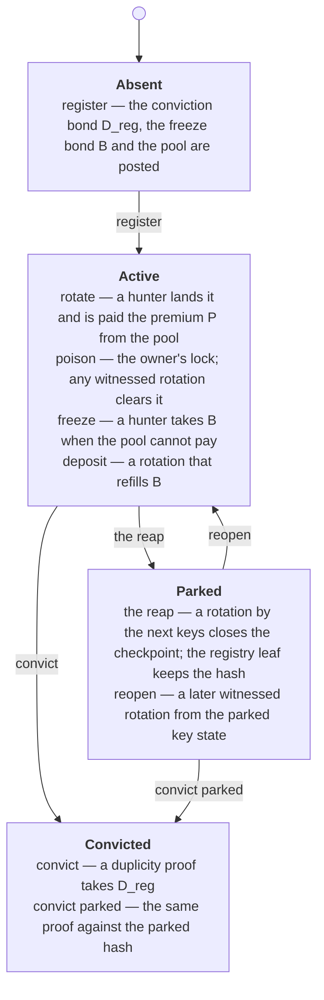

# The project's words

You are reading these pages for the first time, and every page uses the same
dozen words: poison, hunter, pool, premium, the reap, parked. This page is
where each of them is decided: what it means, why it was kept when readers
objected to it, and what it was kept over. Every other page repeats the
meaning in one clause the first time it uses the word, so you never need to
come back here; this page exists so that the clause is the same everywhere.

The words below are the project's own. KERI's words — AID, KEL, inception,
rotation, witness, toad, receipt, duplicity — keep KERI's meaning; the
[KERI primer](../keri-primer.md) introduces them and the simulator's story file
links each to its clause of the specification.

## Where the words sit

A consumer trusts an active checkpoint only once it is older than the
juvenility window `W`.

## The decision record

Two independent readers of the onboarding material, in September 2026, met
these words on every page before any page defined them, and objected to some
of the names themselves. The table records each objection, the alternatives
weighed, and the outcome. The outcome for every word is *keep and define*: a
rename would also rename a Lean definition, a simulator transition or a
planned `ckeri` command, and that cost is recorded in the last column rather
than paid here.

| Word | What it means (the clause every page uses) | The readers' objection | Alternatives weighed | Outcome and the cost of renaming |
|---|---|---|---|---|
| **poison** | The owner's own lock on the checkpoint: a declaration signed by the current keys at their threshold that makes the checkpoint unconsumable until a witnessed rotation clears it. | Reads as an attack on the identity when it is the owner's defence against a thief holding the current keys. | *lock* (collides with locking a UTxO at a script), *hold* and *seal* (ACDC and KERI already use *seal*), *alarm*. | Keep and define. Renaming touches `Checkpoint.lean`, both simulators and the planned `ckeri poison` command. |
| **hunter** | Anyone paid to land an owner's rotation on chain, or to freeze a checkpoint whose pool cannot pay for one. | Reads as a bounty hunter, when the ordinary paid work is relaying valid rotations. | *relayer* (already names the unpaid role that submits what the owner signed), *keeper* (another ecosystem's word), *operator* (collides with the stake-pool operator). | Keep and define. The simulator's cast, the Lean economics and the planned hunter daemon all use it. |
| **juvenility window** `W` | The age a checkpoint must reach, counted from its last registration or reopening, before a consumer trusts it. | Infantilises what is a consumer-side aging rule. | *maturity window*, *settling window*, *aging window*, *quarantine*. | Keep and define. `W`, `born_at` and the refusal `juvenile` are in the Lean, the API and the simulators. |
| **the reap** | The owner's only close: a witnessed rotation by the *next* keys that burns the token, names who is paid the premium and where the bonds go, and parks the registry leaf with the hash of the key state reached. | An agricultural metaphor; and older pages used *reap* for something else, a hunter consuming a paused checkpoint after a grace period. | *close* (kept as the operation name), *leave*, *retire*. | Keep and define; the older meaning is retired with the enforcement economy and no longer appears. The Lean economics are `Samaritan.Reap`. |
| **the cage** | An MPFS store: a Merkle Patricia Forestry map whose every update passes through one validator. The registry is such a store, made permissionless. | Undefined jargon on the pages that use it. | *store*, *vault*, *registry contract*. | Keep and define. It is the MPFS project's own word for the pattern. |
| **the samaritan** | The economic role of whoever performs a reap or a fold on another identity's behalf; the Lean module of that name proves they never lose money doing it. | Appears as a Lean file name in prose, undefined. | *reaper*, *applier*. | Keep, define, and confine it to the registry design page. |
| **parked** | No checkpoint UTxO on chain; the registry leaf holds the hash of the last key state, and a later witnessed rotation from that state reopens the identity with fresh bonds. | None; the objection was to its undefined use. | *dormant*, *closed*, *tombstoned* (the last two name states the design no longer has). | Keep and define. |
| **convicted** | The terminal state a duplicity proof puts an identity in, active or parked; the conviction bond goes to whoever proved it, and nothing reopens it. | None; the objection was to its undefined use. | *tombstoned*, *burned*. | Keep and define. |
| **freeze bond** `B` | What a hunter takes when the owner's pool cannot pay for a rotation; a `deposit` rotation refills it. | Older pages call the same money the *delay bond*. | *delay bond* (the retired enforcement economy's name). | Keep and define; *delay bond* is not used for the accepted design. |
| **conviction bond** `D_reg` | The stake a duplicity proof seizes. Never a fee source. | Older pages call it the *divergence bond*, the *registration bond* or the *deposit*. | *registration bond* (survives only as the shipped V1 deployment parameter). | Keep and define. |
| **the pool** | The owner's advance funds, from which the premium is paid; anyone may top it up. | Collides with the *witness pool* and the *stake pool*. | *advance fund*, *purse*. | Keep and define; the other two pools are always written with their qualifier. |
| **premium** `P` | The fee the pool pays whoever lands a rotation. | None; the objection was to its undefined use. | *fee*, *bounty* (retired with the enforcement economy), *tip* (the registry's word for the same idea). | Keep and define. |

## The name of the design

Issues, pull requests and the wiki from September 2026 call the design *the
M1 return*: the return, inside the first milestone, from an abandoned
enforcement economy to a checkpoint that only projects key state. The name
tells a newcomer nothing, so reader-facing pages say **the accepted design**
instead, and the [home page](../index.md#how-to-read-these-pages) and the
[roadmap](../roadmap.md) each carry one sentence explaining the old name so
that the older record stays readable.

## Where else the words are fixed

- The simulator's story file, `simulator/M1-STORIES.md`, carries a glossary
  with the same clauses.
- The [consumer checklist](../user/consumer-checklist.md) is the shortest
  page that uses most of them, and a good place to see the clauses in use.
