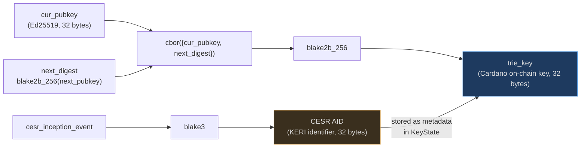
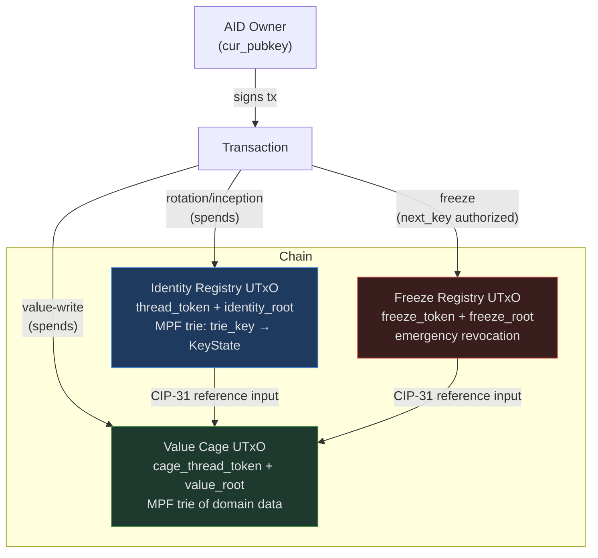

# cardano-aid

Self-certifying identities on Cardano, bridged to the Veridian / [KERI](https://datatracker.ietf.org/doc/draft-ssmith-keri/) ecosystem.

**New here? Start with the [KERI primer](keri-primer.md)** — it explains what KERI is, how pre-rotation works, what Veridian is, and what Cardano adds.

---

## The one idea

At inception, you commit to two things: the key you use now, and the *hash* of the key you will use next. That commitment lives on-chain. When you rotate, you reveal the pre-committed next key. A thief who steals your current key cannot rotate your identity — they do not know the pre-committed next key.

## Real-world use case: vLEI

cardano-aid is the bridge layer for [GLEIF vLEI](design/vlei.md) — the cryptographic extension of the Legal Entity Identifier used for MiFID II, Basel III, and eIDAS 2.0 compliance. A legal entity's KERI AID (the root of its vLEI credential chain) maps to a stable Cardano `trie_key`, enabling compliance-gated contracts, non-censorable key history, governance eligibility, and on-chain ACDC notarization. See [vLEI Bridge](design/vlei.md) for the full use-case analysis.

---

## Key derivation: trie_key vs CESR AID

Two separate identifiers exist for the same identity. They serve different roles.

The **trie_key** is the [MPF](https://github.com/aiken-lang/merkle-patricia-forestry) key used in the on-chain registry — Cardano-verifiable, front-run-proof, stable across rotations.

The **[CESR](https://datatracker.ietf.org/doc/draft-ssmith-cesr/) AID** is the KERI-native identifier used by Veridian and KERI witnesses. Cardano cannot verify it today (no [Blake3](https://github.com/BLAKE3-team/BLAKE3) builtin). It is stored as metadata for off-chain KERI correlation. See [Blake3 requirement](design/blake3-requirement.md).

## System components

