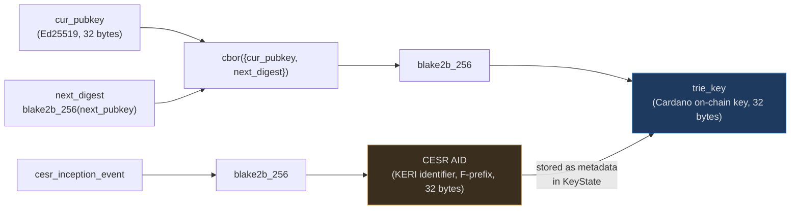
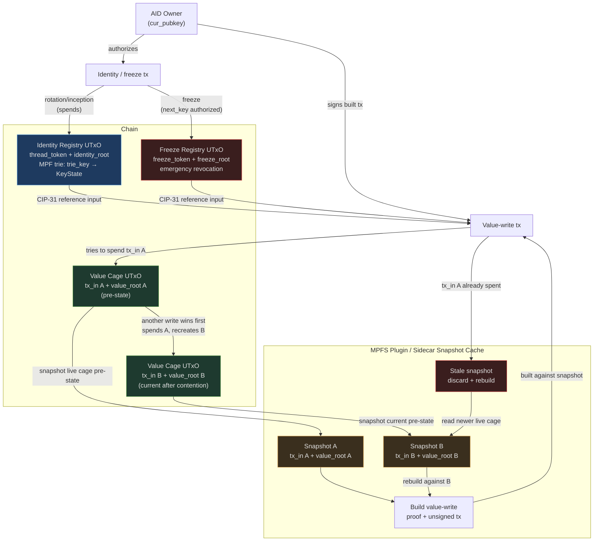

# cardano-aid

Self-certifying identities on Cardano, bridged to the Veridian / [KERI](https://github.com/WebOfTrust/ietf-keri) ecosystem.

**New here? Start with the [KERI primer](keri-primer.md)** — it explains what KERI is, how pre-rotation works, what Veridian is, and what Cardano adds.

---

## Implementation status

- **Shipped substrate:** MPFS plugin support. This is the concrete extension
  point for domain-specific value-cage authorization.
- **cardano-aid status:** research/design and prototypes for an MPFS identity
  plugin. The identity registry, freeze registry, super watcher, and
  Veridian/KERI bridge are not shipped runtime infrastructure in this repo.
- **Design target:** on-chain-verifiable key-state operations using
  `blake2b_256`, Ed25519, MPF proofs, and MPFS cage/plugin composition.

---

## The one idea

In the proposed identity plugin, inception commits to two things: the key you
use now, and the *hash* of the key you will use next. That commitment lives
on-chain. When you rotate, you reveal the pre-committed next key. A thief who
steals your current key cannot rotate your identity — they do not know the
pre-committed next key.

## Real-world use case: vLEI

cardano-aid explores an MPFS plugin bridge for [GLEIF vLEI](design/vlei.md) —
the cryptographic extension of the Legal Entity Identifier used for MiFID II,
Basel III, and eIDAS 2.0 compliance. In the design, a legal entity's KERI AID
(the root of its vLEI credential chain) maps to a stable Cardano `trie_key`,
enabling compliance-gated contracts, non-censorable key history, governance
eligibility, and on-chain ACDC notarization. See [vLEI Bridge](design/vlei.md)
for the full use-case analysis.

## Node-level attribution: the Amaru question

Where does cardano-aid sit relative to the proposed Veridian × Amaru node-level attribution work, what is still missing for full ACDC support (schema + revocation/TEL anchoring), and does anything actually need to live *inside* the node? See [Amaru Integration Analysis](architecture/amaru-integration.md).

That analysis also records the MPFS-side contention pattern: snapshot the cage
UTxO datum/value root for a value-write, then rebuild from a newer snapshot if
another write advances the cage before submission.

---

## Key derivation: trie_key vs CESR AID

Two separate identifiers exist for the same identity. They serve different roles.

The **trie_key** is the [MPF](https://github.com/aiken-lang/merkle-patricia-forestry)
key used by the proposed on-chain registry — Cardano-verifiable,
front-run-proof, stable across rotations.

The **[CESR](https://github.com/WebOfTrust/ietf-cesr) AID** is the KERI-native identifier used by Veridian and KERI witnesses. cardano-aid requires F-prefix (Blake2b-256) AIDs, which Cardano can verify on-chain via the `blake2b_256` builtin. See [Blake2b-256 AID Requirement](design/blake2b256-requirement.md).

## System components

