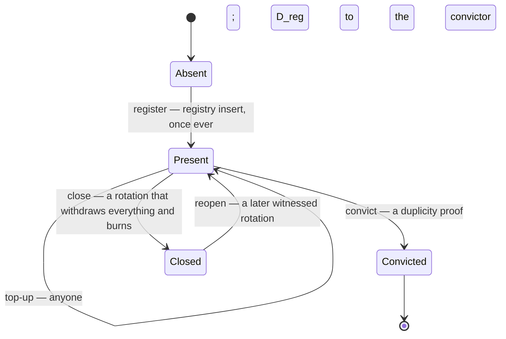

# cardano-keri

cardano-keri projects a rotating KERI identity into a stable Cardano
checkpoint.

!!! tip "Play the design before you read it"
    The M1 design is a proved Lean machine, and the two simulations below are
    transcriptions of it, checked against the Lean by replay on every step.
    Pick a story and play it; every refusal names the rule that refused.

    - **[The checkpoint simulator](simulator/index.html)** — one identity, its
      keys, its three sums of money, the hunters, the treasury: fifteen
      stories with their forks, the theorems lighting up as you play.
    - **[The registry simulator](https://preview.dev.plutimus.com/lambdasistemi/cardano-keri/pr-317/simulator/registry/)** — one incarnation per
      identity: requests, batches, the gating plugin, the leaf every
      identity has. Lands under `simulator/registry/` with its pull request.

**KERI** is Key Event Receipt Infrastructure, the identity protocol used by
the Global Legal Entity Identifier Foundation's verifiable LEI ecosystem. A
KERI **AID** (Autonomic Identifier) keeps its identity while its controller
keys rotate. Cardano applications can refer to the AID-derived checkpoint
token instead of permanently binding themselves to one key.

## How to read these pages

The project is mid-way through the **M1 return**: a design settled in
September 2026 that keeps the checkpoint, adds a poison and a registry, and
removes the enforcement economy that `main` still carries. So every claim in
these docs is in one of three states, and each page says which one it is
making:

| State | What it means | Where it lives |
|---|---|---|
| **Shipped on `main` today** | Code you can run, or a program published on preprod | `onchain/`, `offchain/`, `deploy/preprod/m1-manifest.json` |
| **Accepted design** | Proved in Lean and playable in the simulator; no on-chain code yet | `lean/CardanoKeri/Checkpoint.lean`, 62 theorems, no `sorry` |
| **Planned** | An epic with an issue number and an acceptance criterion | the [roadmap](roadmap.md) |

Nothing here that is only designed is described as if it were deployed.

---

## Shipped on `main` today

Five applied programs are published as reference scripts on Cardano preprod
(`deploy/preprod/m1-manifest.json`, published 2026-07-28 from commit
`50a5820`):

| Program | Role | Size |
|---|---|---|
| `hash-proof` | minting policy | 9,233 B |
| `observer-lifecycle` | withdrawal observer | 6,523 B |
| `observer-advance` | withdrawal observer | 16,130 B |
| `observer-enforcement` | withdrawal observer | 14,417 B |
| `checkpoint-register` | validator and minting policy | 11,512 B |

Deployment parameters: registration bond 1,000 tADA, freeze bond 5 tADA,
freeze window 10,000 slots.

The checkpoint datum is **pure key state** — nine fields, no lifecycle flag:
the AID, current keys and threshold, next-key commitments and next threshold,
witnesses and `toad`, the Cardano sequence, and the native KERI sequence
(`onchain/lib/cardano_keri/checkpoint/datum.ak`). Enforcement state is carried
by role addresses around the same token.

The packaged `ckeri` exposes `deploy`, `manifest verify`, `register`,
`advance`, `close`, `status`, `list`, `checkpoint`, `payer`, and the five
`board` verbs. It does **not** expose freeze, claim, or convict: those
transactions exist only in the end-to-end harness. Its runtime closure does
not include `cardano-cli`, and a closure check enforces that boundary.

Settled on preprod on 2026-08-06 with a genuine KLI identity: registration
`6ecc2e07…`, advance `f0f3a18f…`, close `446f0d83…`. Earlier, on a
protocol-11 development network running production transaction limits, a
two-key identity settled Register, Close, Advance, and two Freeze/response
rounds. Dates, transaction IDs and their sources are on the
[story ladder](story-ladder.md).

!!! warning "Not a production deployment"
    Settled development-network and preprod transactions prove the vertical
    path through the production validators and the node boundary. They do not
    make this a mainnet service.

---

## The accepted design: the M1 return

The design settled between 2026-09-02 and 2026-09-03 (project rulings D-022 to
D-038). It is proved in `lean/CardanoKeri/Checkpoint.lean` — 62 theorems, no
`sorry`, standard axioms only — and the simulator above is a transcription of
that Lean, checked by replay.

**One UTxO per identity**, holding the current key state, a token minted once
and never again, and three sums of money that never mix:

- `D_reg`, the **conviction bond** — the stake a duplicity proof seizes. Never
  a fee source.
- `B`, the **freeze bond** — what a hunter takes when the pool cannot pay for a
  rotation.
- the **pool** — advance funds; pays the premium `P` to whoever lands a
  rotation.

**Two edges and four boundary transitions.** A rotation is the only thing that
moves the keys; it carries a bond option (`keep`, `withdraw`, `deposit`) and
optionally a new refund address, and every option other than `keep` is signed
by the keys of the epoch the rotation opens (D-038) — so a relayer landing a
public rotation can never park, age, or close the owner.

```mermaid
stateDiagram-v2
    [*] --> Absent
    Absent --> Present : register — registry insert, once ever
    Present --> Present : rotate — next keys + toad receipts, clears the poison
    Present --> Present : poison — current quorum, once per epoch
    Present --> Present : freeze — anyone, when the pool is short
    Present --> Present : top-up — anyone
    Present --> Convicted : convict — a duplicity proof; D_reg to the convictor
    Present --> Closed : close — a rotation that withdraws everything and burns
    Convicted --> [*]
    Closed --> Present : reopen — a later witnessed rotation
```

**The poison** is the piece that is genuinely new: a declaration signed by the
current keys at their own threshold, over a short preimage bound to the
policy, the AID and the sequence. Anyone may relay it; it is never witnessed.
It makes the checkpoint unconsumable, and any witnessed rotation clears it —
it belongs to the epoch of the keys that signed it, because in KERI possession
of the next keys *is* control. It buys the owner the window between noticing a
theft and rotating.

**The registry** is one leaf per AID — absent, live, `closed(epoch, sn)`, or
`convicted` — so an AID has at most one incarnation ever. Only `convicted` is
terminal; a closed identity returns by a witnessed rotation later than its
tombstone, with fresh bonds. The registry is upstream work: MPFS made
permissionless (D-037).

**The consumer's rule**, and the only thing outside the machine: authorize iff
the checkpoint is present, both bonds are full, it is not poisoned, it is
older than the juvenility window `W`, and the payment's own signature
satisfies the current threshold. Everything else fails closed.

### What the return removes

The record tree and its cursor, occupancy maps, the MPF fork and its upstream
proposal, `ever_duplicitous`, and the whole ARMED/FROZEN enforcement economy —
freeze-for-lag, the bounty, the entitlement, the reap. Interaction events
(`ixn`) never touch the chain. Delegated identities are a later milestone.

The freeze that survives is a different thing: it is what a hunter takes when
the owner's pool has run dry, not a punishment for lag.

---

## What is planned

The M1 return is one milestone across two repositories, thirteen epics. The
[roadmap](roadmap.md) carries the ordering, the dependencies and the
measurements that size the numbers still open. The short version: slim `main`
(K1), measure it (K3), build the owner's edges (K4) and the hunter's (K5),
integrate the registry (K6), put every role behind a `ckeri` command (K7),
replay the fifteen stories as the acceptance suite (K8), and cut over preprod
(K10).

---

## Start here

- [Why Cardano](why-cardano.md) — how this differs from anchoring a KEL on a
  ledger, and what non-oracular trust buys.
- [Story ladder](story-ladder.md) — what has actually settled, dated.
- [Roadmap](roadmap.md) — the M1 plan and its thirteen epics.
- [KERI primer](keri-primer.md) — AIDs, key events, pre-rotation, witnesses,
  and Veridian.
- [Identity operations](architecture/identity-ops.md) — the operations, one by
  one, shipped and designed.
- [Observer architecture](architecture/observer-architecture.md) — thin
  checkpoints, reference scripts, zero-lovelace withdrawals, and the BLAKE3
  premint fact token.
- [Rotate your preprod identity](user/rotate-preprod-identity.md) — export a
  witnessed KLI rotation, sign its binary Cardano package, and settle Advance.
- [ACDC primer](acdc-primer.md) — the separate credential layer.

For the financial and institutional concepts behind the later use cases, see
the [Finance primer](finance-primer.md).

## The engineering constraint

`observer-advance` measures 16,130 bytes against a 16,133-byte applied-script
limit — three bytes of headroom. The M1 return's datum change lands on exactly
that script, which is why epic K1 ends with a size table and epic K4's datum
decisions are taken from it rather than from taste. Two things move in the
plan's favour: the advance observer's ARMED-response branch goes, and the
three enforcement role addresses go from `checkpoint_register`. The net effect
is unmeasured until K1.

Full measurements are in
[Observer architecture](architecture/observer-architecture.md#measured-sizes-and-costs).

## Real-world direction: vLEI

The longer-term goal is to let Cardano applications combine:

- a current, consumable AID checkpoint;
- an ACDC credential chain proving a legal or organizational role; and
- current TEL non-revocation evidence.

Registering an AID answers "which keys control this identifier?" It does not
answer "which legal entity is this?" The latter is a credential claim and
remains a later roadmap layer. See the [vLEI design](design/vlei.md) and the
[roadmap](roadmap.md).
