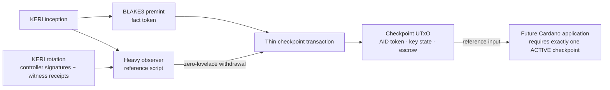

# cardano-keri

cardano-keri projects a rotating KERI identity into a stable Cardano
checkpoint.

!!! success "The transaction path does not require cardano-cli"
    The packaged `ckeri` can deploy the reference scripts, register an
    identity, advance a rotation, post/update/retire endpoint-board records,
    and close a checkpoint on a machine with no `cardano-cli` installed at
    all. Its runtime closure does not include `cardano-cli`; a closure check
    enforces that boundary and has been demonstrated to fail when the retired
    dependency is reintroduced.

**KERI** is Key Event Receipt Infrastructure, the identity protocol used by
the Global Legal Entity Identifier Foundation's verifiable LEI ecosystem. A
KERI **AID** (Autonomic Identifier) keeps its identity while its controller
keys rotate. Cardano applications can refer to the AID-derived checkpoint
token instead of permanently binding themselves to one key.

!!! success "Current evidence"
    A genuine two-key identity has registered, closed, rotated, and completed
    two Freeze/response rounds on a protocol-11 development network running
    production transaction limits. The detailed transaction IDs and limits
    are on the [story ladder](story-ladder.md). Separately, a witnessed
    2-of-5 KLI identity has registered and advanced its live V1 checkpoint on
    preprod; see [Rotate your identity](user/rotate-preprod-identity.md).

!!! warning "Not a production deployment"
    Settled development-network transactions prove the vertical path through
    the production validators and node boundary. They do not make this a
    mainnet service. Claim/thaw, conviction, real three-of-seven scale, full
    vLEI credentials, and wallet integration still have open stories.

## Start here

- [Why Cardano](why-cardano.md) — how this differs from anchoring or "rooting"
  a KEL on a ledger, and the two properties a validated checkpoint adds.
- [Story ladder](story-ladder.md) — what is settled, in flight, planned, and
  deliberately fail-closed.
- [KERI primer](keri-primer.md) — AIDs, key events, pre-rotation, witnesses,
  and Veridian.
- [Lifecycle and the two bonds](architecture/lifecycle-and-bonds.md) —
  ACTIVE, ARMED, FROZEN, TOMBSTONE, the delay bond, and the divergence bond.
- [Observer architecture](architecture/observer-architecture.md) — thin
  checkpoints, reference scripts, zero-lovelace withdrawals, and the BLAKE3
  premint fact token.
- [Rotate your preprod identity](user/rotate-preprod-identity.md) — export a
  witnessed KLI rotation, sign its binary Cardano package, and settle Advance.
- [ACDC primer](acdc-primer.md) — the separate credential layer.

For the financial and institutional concepts behind the later use cases, see
the [Finance primer](finance-primer.md).

## Implementation status

The settled small-identity ladder covers:

1. **Register.** Prove the BLAKE3 inception/AID binding in a premint
   transaction, then mint one AID-derived checkpoint token into an ACTIVE
   output holding `minimum ADA + D_reg + B`.
2. **Close.** Have the current controller threshold authorize the exact input
   and refund address, burn the token, and return the complete escrow.
3. **Advance.** Relay a genuine KERI rotation with the required controller
   signatures and witness receipts; consume the old checkpoint and create its
   unique sequence-plus-one ACTIVE successor.
4. **Freeze.** Let any hunter submit a witnessed conflicting event that is
   ahead of the checkpoint; preserve the escrow but move the token to ARMED,
   which consumers reject.
5. **Respond.** Before the deadline, use the same ordinary Advance path to
   return ARMED to ACTIVE and keep the delay bond.
6. **Reject stale replay.** After advancing, reject the exact old Freeze proof;
   a new round needs fresh evidence at the new sequence.

The current small-story wire does **not** expose `ClaimFreeze` or `Convict`.
Issue [#138](https://github.com/lambdasistemi/cardano-keri/issues/138)
must open timeout claim and thaw. Issue
[#151](https://github.com/lambdasistemi/cardano-keri/issues/151) must open
conviction and the terminal tombstone.

## The core architecture

Every identity has its own sovereign checkpoint **UTxO** (unspent transaction
output):


```mermaid
flowchart LR
    ICP["KERI inception"]
    HASH["BLAKE3 premint<br/>fact token"]
    ROT["KERI rotation<br/>controller signatures + witness receipts"]
    TX["Thin checkpoint transaction"]
    OBS["Heavy observer<br/>reference script"]
    CK["Checkpoint UTxO<br/>AID token · key state · escrow"]
    APP["Future Cardano application<br/>requires exactly one ACTIVE checkpoint"]

    ICP --> HASH --> TX
    ICP --> OBS
    ROT --> OBS
    OBS -->|"zero-lovelace withdrawal"| TX
    TX --> CK
    CK -->|"reference input"| APP
```

The checkpoint script protects the exact state input, token, role address,
value, and successor. Large KERI evidence runs in an operation-specific
observer reference script in the same transaction. The two scripts bind to
the same policy, action, input, and output.

There is no global identity-registry UTxO and no separate shared Freeze
registry in this story. Lifecycle state is carried by the sovereign
checkpoint's role address.

## Two bonds

The ACTIVE escrow has three parts:

```text
checkpoint minimum ADA + divergence bond D_reg + delay bond B
```

- `B` is about 5 ADA in the reference deployment. It rewards a hunter only
  when an ARMED challenge goes unanswered through its deadline. A response
  keeps it; a later thaw must re-post it.
- `D_reg` is about 1000 ADA in the reference deployment. It backs the much
  narrower claim that the identity published a fully witnessed
  irreconcilable fork.

The values are deployment parameters. Keeping them separate stops ordinary
lag from being treated as dishonesty.

## Measured engineering boundary

The latest settled Freeze story measured:

- thin checkpoint: 9,155 bytes;
- enforcement observer: 13,548 bytes; and
- Advance observer: 16,130 bytes against a 16,133-byte applied-script limit.

The Advance observer therefore has only 3 bytes of headroom.
[#149](https://github.com/lambdasistemi/cardano-keri/issues/149) must create
maintainable space before the real seven-key rotation.

Register used about 1.9 million memory units. The two-key Advance observer used
4,110,025 memory units. Full measurements and sources are in
[Observer architecture](architecture/observer-architecture.md#measured-sizes-and-costs).

## Real-world direction: vLEI

The longer-term goal is to let Cardano applications combine:

- a current ACTIVE AID checkpoint;
- an ACDC credential chain proving a legal or organizational role; and
- current TEL non-revocation evidence.

Registering an AID answers “which keys control this identifier?” It does not
answer “which legal entity is this?” The latter is a credential claim and
remains a later roadmap layer. See the [vLEI design](design/vlei.md) and the
[roadmap](roadmap.md).
