# cardano-keri M1 — user-story deck

Browser-native preview of the 13-slide deck. These images avoid GitHub's embedded PDF renderer entirely.

[Open the HTML deck source](index.html) · [Open the PDF](cardano-keri-m1-user-story.pdf) · [Read the reusable design prompt](PROMPT.md)

The slides are the approachable overview. For the engineering decisions, measurements, limitations, and implementation status, read the [deep technical companion article](blog/cf-blog-post-cardano-keri-v3.md). The branch also preserves the [notes for the future vLEI verification installment](blog/series-notes-vlei-post.md).

## 01 — Keep the identity you already trust

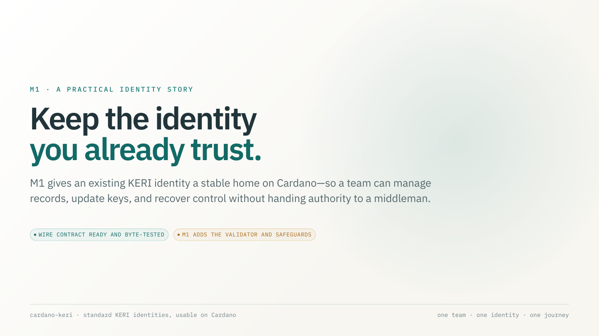

## 02 — Meet Northstar

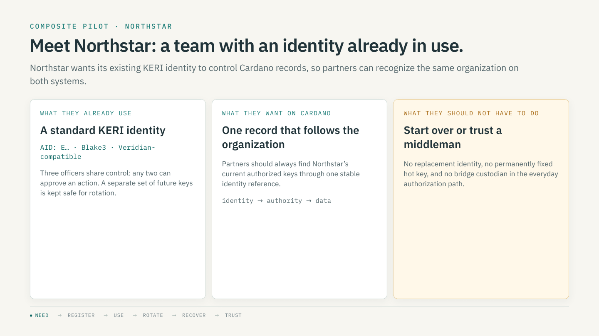

## 03 — Bring your existing identity — no conversion required

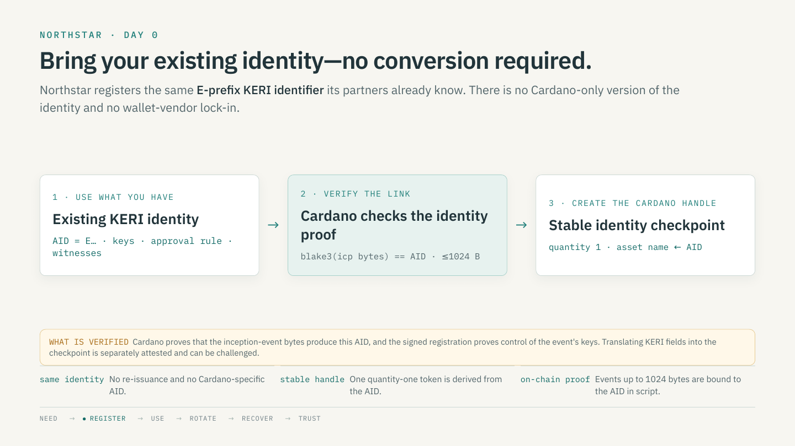

## 04 — Give apps one stable name for your organization

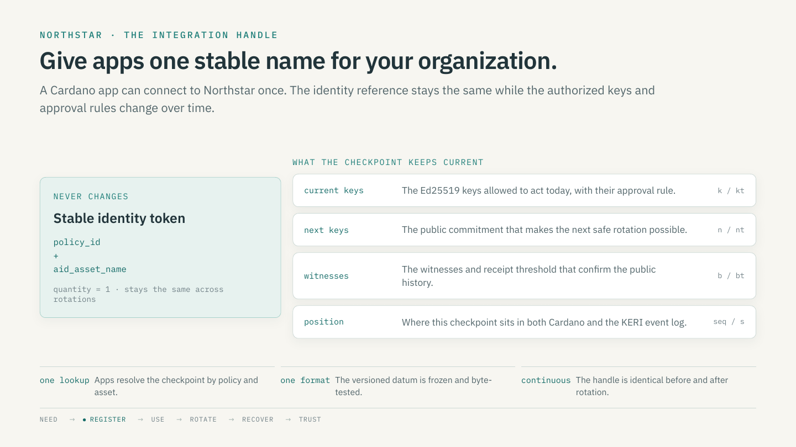

## 05 — Keep the approval rules your team already uses

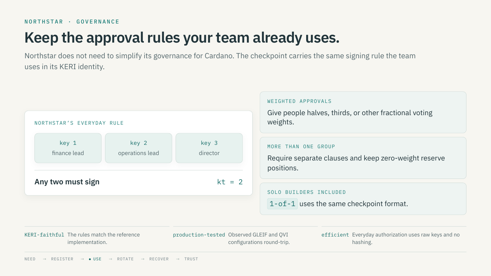

## 06 — Your records stay under the right control

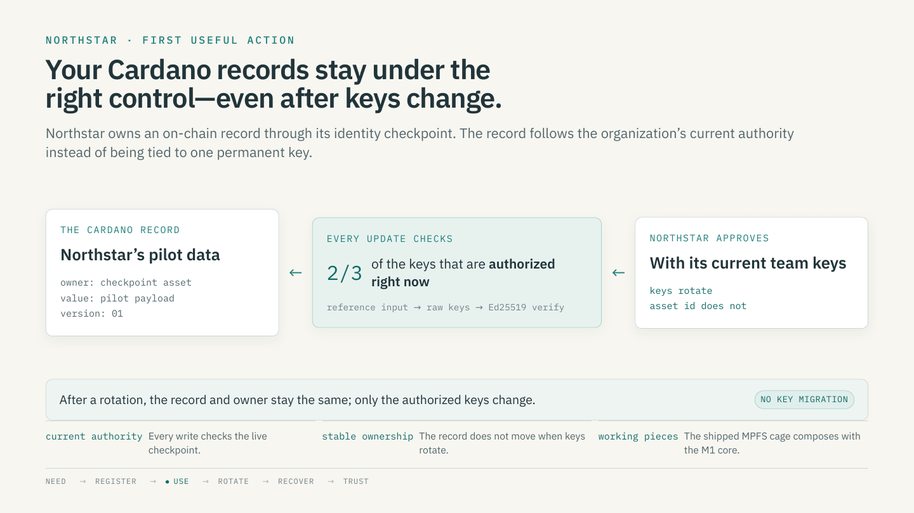

## 07 — Update keys directly, whenever your team needs to

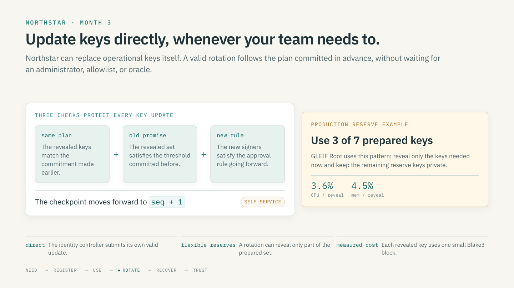

## 08 — Losing today's keys does not mean losing the identity

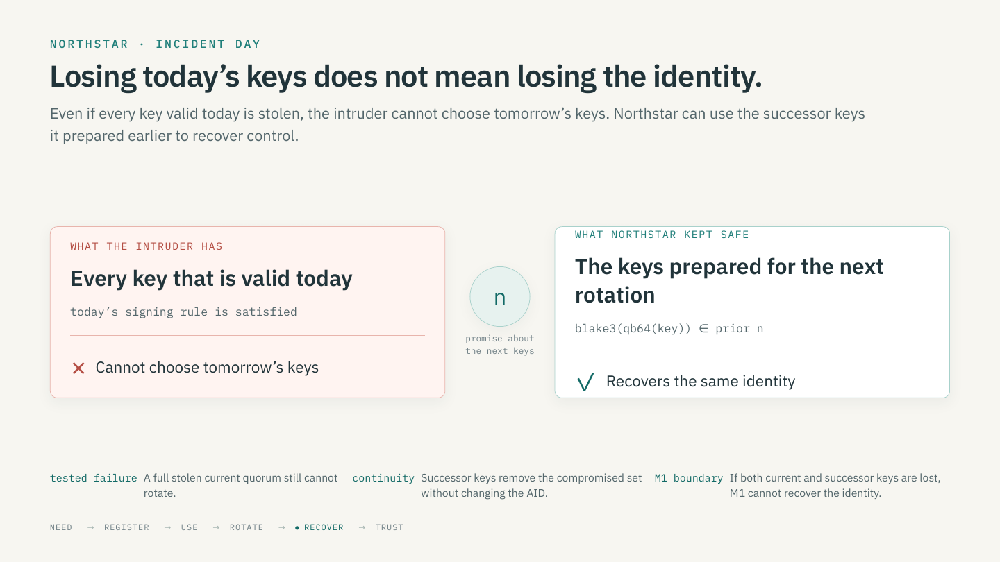

## 09 — Apps always read the keys that are valid now

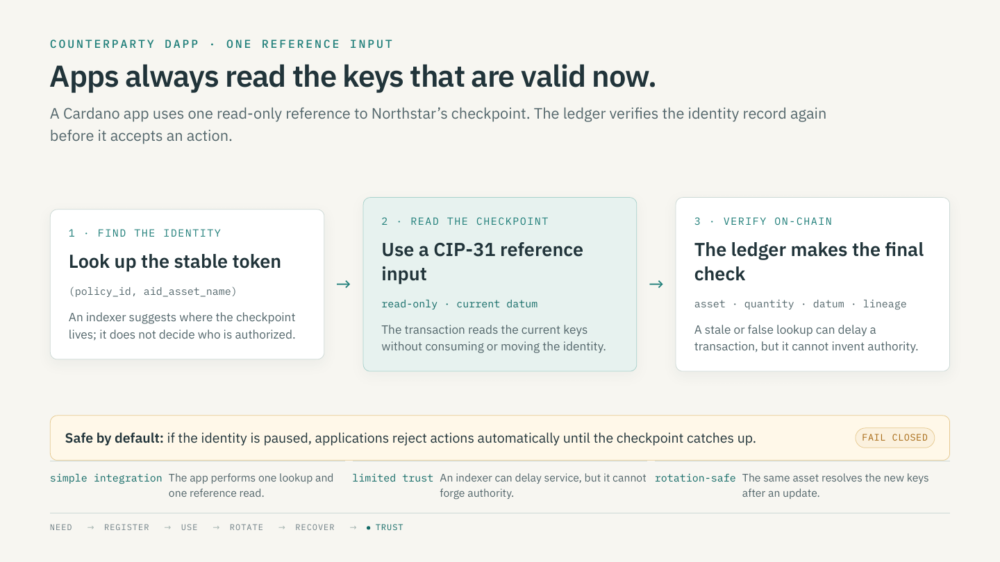

## 10 — Public checks keep Cardano and KERI in sync

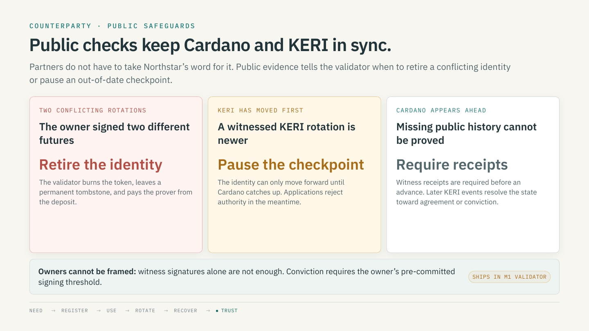

## 11 — The same public evidence supports useful services

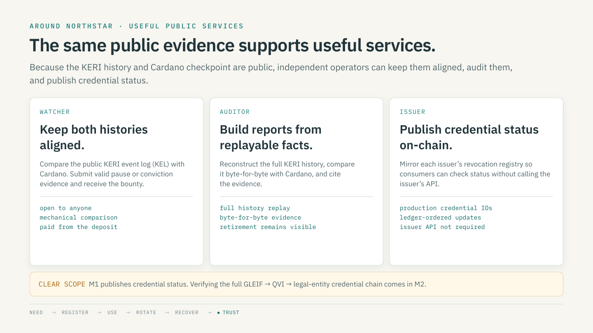

## 12 — The M1 demo shows the complete journey

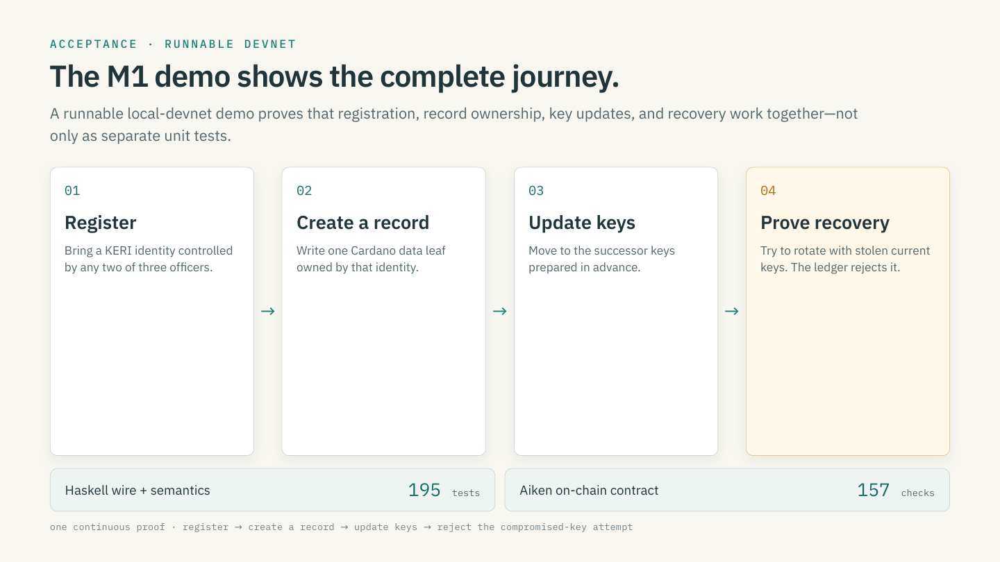

## 13 — What M1 is ready to prove — and what comes next

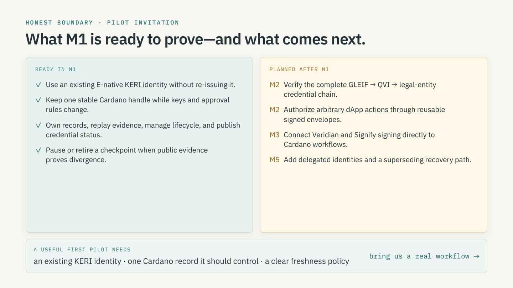
