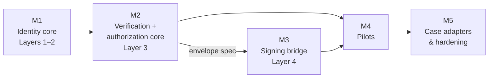

# Roadmap

The delivery plan, derived from the
[business-case comparison and factored core](design/business-cases/index.md).
Its headline result drives the whole layout: **most of the open work is
use-case-invariant** — every business case needs the same identity registry,
verifier, and authorization machinery, and the business pick only selects a
last-mile adapter. So the milestones build the common core first and defer the
app choice to the last responsible moment.

!!! tip "Slide deck"
    A [milestones deck](milestones-deck/index.html) covers the same layout
    for a technical-peer audience: pre-rotation, the layer stack, and each
    milestone's vertical demo.

!!! note "Issue links"
    Milestone and issue links on this page point to the project's
    [internal tracker](https://github.com/lambdasistemi/cardano-keri/issues)
    and are not publicly readable. The decisions themselves are stated inline.

## Milestone layout

Tracked as GitHub
[milestones](https://github.com/lambdasistemi/cardano-keri/milestones) M1–M5.

!!! tip "Every milestone ships a vertical demo"
    Each epic closes with an **end-to-end application slice — not useful, but
    usable and demoable**: a runnable walkthrough on a local devnet that
    exercises the milestone's deliverables top to bottom, recorded as a
    terminal cast in the docs. The demo is the acceptance test of the
    milestone: if it cannot be demoed E2E, the milestone is not done. M4's
    pilots and M5's adapters are vertical by nature; M1–M3 get explicit demo
    tickets.

### M1 — Identity core (Layers 1–2)

Everything every case needs to anchor identity, finishing the foundation of
the umbrella epic
[#21](https://github.com/lambdasistemi/cardano-keri/issues/21):

- Sovereign per-AID checkpoint schema
  ([#68](https://github.com/lambdasistemi/cardano-keri/issues/68),
  [#81](https://github.com/lambdasistemi/cardano-keri/issues/81)): a
  **list-shaped, threshold-capable `CheckpointDatumV1`** supporting integer and
  fractionally weighted KERI thresholds. V1 accepts **independent AIDs only**
  and has no passive `delegator` / `di` slot; cooperative KERI delegation is a
  separately versioned proof protocol, not unchecked metadata.
- Checkpoint mint/spend lineage and permissionless pre-rotation
  ([#24](https://github.com/lambdasistemi/cardano-keri/issues/24)), mechanically
  re-cut to each AID's quantity-one checkpoint-token UTxO. A single key remains
  the 1-of-1 degenerate threshold case.
- Dual-root reconstruction and KEL replay off-chain
  ([#25](https://github.com/lambdasistemi/cardano-keri/issues/25)).
- Migration and lifecycle: legacy-leaf policy, End/GC restriction
  ([#26](https://github.com/lambdasistemi/cardano-keri/issues/26)).
- TEL revocation registry — per-issuer MPF credential status
  ([#30](https://github.com/lambdasistemi/cardano-keri/issues/30)).
- Docs re-vet against the canonical permissionless model
  ([#15](https://github.com/lambdasistemi/cardano-keri/issues/15)) — vetting
  gates implementation.
- **Vertical demo
  ([#44](https://github.com/lambdasistemi/cardano-keri/issues/44))**: incept a
  2-of-3 threshold AID on a local devnet, write an owned leaf, self-rotate
  without the oracle, and show that a stolen current key cannot rotate.

### M2 — Verification + authorization core (Layer 3)

Epic [#34](https://github.com/lambdasistemi/cardano-keri/issues/34). The
use-case-invariant verifier and authorization machinery:

- ACDC chain verifier
  ([#31](https://github.com/lambdasistemi/cardano-keri/issues/31)), rescoped to
  **hop bound 4, parameterized** (OOR credentials chain through an LE-signed
  OOR-AUTH credential — four ACDCs, not three) with **all-TELs cascade
  non-revocation** and a stated minutes-grade freshness floor.
  The verifier MUST name its issuer trust root: V1 pins a QVI or GLEIF External
  AID and discloses the omitted upstream KERI-delegation proof. Full recursive
  GLEIF-Root-to-QVI cooperative-delegation verification is not implied by an
  ACDC edge chain and is deferred to the delegated-AID extension.
- ACDC proof builder — CESR decode + redeemer generation
  ([#32](https://github.com/lambdasistemi/cardano-keri/issues/32)).
- Admission-cage component
  ([#38](https://github.com/lambdasistemi/cardano-keri/issues/38)):
  `trie_key → {credential_saids, role_level, admitted_at, not_after}` —
  verify the full chain once, then gate on a cheap lookup. Mandatory for the
  cache-bound cases, reusable everywhere.
- Detached-signature authorization envelope, Option A
  ([#39](https://github.com/lambdasistemi/cardano-keri/issues/39)):
  domain-separated, nonce- and validity-bounded, verified against the Layer-1
  registry. Forced by the DeFi batcher model; generalizes to ceremonies and
  cage writes.
- Scoped-override policy knob per cage
  ([#40](https://github.com/lambdasistemi/cardano-keri/issues/40)):
  *forging is impossible everywhere; scoped, issuer-AID-signed intervention
  powers are per-cage policy — explicit, on-chain, auditable.*

- **Vertical demo
  ([#45](https://github.com/lambdasistemi/cardano-keri/issues/45))**: a
  synthetic 4-hop vLEI chain verified on-chain on a devnet; one gated action
  through full verification and one through the admission cache; a mid-chain
  revocation blocking both paths; a scoped freeze verb exercised and audited.
  Unless the delegated-AID extension has landed, the synthetic chain uses an
  explicitly pinned issuer root and does not claim recursive KERI delegation
  from the GLEIF Root.

Both verification modes ship here regardless of the business pick: the case
only decides which mode a given gate *uses* — the admission cache is mandatory
for regulated DeFi and security tokens, while SPO delegation and institutional
contracts afford full per-transaction verification.

### M3 — KERI-wallet ↔ Cardano signing bridge (Layer 4)

Epic [#35](https://github.com/lambdasistemi/cardano-keri/issues/35). Every
case's actors keep keys in KERI wallets, not CIP-30 wallets; producing
order/transition-bound detached signatures programmatically is on the critical
path of every design.

- Bridge core: detached-signature production from Signify/Veridian
  ([#41](https://github.com/lambdasistemi/cardano-keri/issues/41)),
  conforming to the Layer-3 envelope spec.
- Intent/proof SDK
  ([#7](https://github.com/lambdasistemi/cardano-keri/issues/7), absorbed and
  rescoped from the retired staking-validator design).
- ~~The former external gate ([#42](https://github.com/lambdasistemi/cardano-keri/issues/42)):
  Veridian F-prefix SAIDs~~ — **dissolved by the E-native checkpoint contract**
  (2026-07-16): standard Blake3 (E-prefix) AIDs register natively; genesis is
  verified by the hash-proof minter (spike #88 lane-packed blake3, ≤1024 B
  single chunk) and rotations pay one single-block blake3 per revealing key.
  No wallet-vendor dependency remains. The historical rationale is preserved in
  [Blake2b-256 AID Requirement](design/blake2b256-requirement.md).

- **Vertical demo
  ([#46](https://github.com/lambdasistemi/cardano-keri/issues/46))**: a gated
  action authorized entirely from a KERI wallet — no CIP-30 anywhere — with a
  batcher-style third party submitting the transaction, plus replay/expiry/
  rotated-key rejections.

M3 can start as soon as the envelope spec (#39) is drafted — it does not wait
for all of M2.

### M4 — Pilots (preprod, end-to-end)

The two cheapest pilots per the
[pilot ladder](design/business-cases/index.md#pilot-ladder-by-cost), both
reachable through counterparties already in the project's network (the
Amaru/Veridian channel; the Amaru treasury ceremony):

- Identified SPO delegation
  ([#36](https://github.com/lambdasistemi/cardano-keri/issues/36)): one
  QVI-credentialed SPO + one institutional delegator; delegator stake script
  enforcing at the `publish` handler; full per-certificate verification.
- Institutional contracts
  ([#37](https://github.com/lambdasistemi/cardano-keri/issues/37)): one
  treasury disbursement ceremony with vLEI-verified signers; state-machine
  spend validators, full per-transition verification.

Both pilots share a **runway ticket
([#48](https://github.com/lambdasistemi/cardano-keri/issues/48), milestoned
M2)**: counterparty confirmation, QVI credential issuance, credential
fixtures, and preprod environment — started
early because of the lead times below.

The actors exercised by both pilots are independent AIDs whose business
authority comes from ACDC credentials. Neither pilot depends on a passive
`di` field or on-chain KERI cooperative delegation.

### M5 — Case adapters & hardening

Demand-driven, after the pilots prove the core:

- KYC security tokens: CIP-113 substandard and/or register-as-cage.
- Regulated DeFi gate: order gate + admission cage. Its real buyer — the RWA
  issuer — converges with the security-token case.
- Super watcher — permissionless cross-plane relayer & evidence submitter
  ([#10](https://github.com/lambdasistemi/cardano-keri/issues/10)) —
  **reframed by the identity model (2026-07-09) and #92 / NOTE-022
  (2026-07-15)**: identity forks are structurally impossible under the
  KERI-sovereign checkpoint, so divergence-burn is retired. The live role is a
  **permissionless cross-plane relayer and evidence submitter** (KERI ↔ Cardano
  + the R-TEL mirror), **not** a live economic convergence enforcer: relay a
  fully witnessed anchoring transition, submit duplicity / correspondence fraud
  proofs (a defined duty, drilled via #90), request or trigger the applicable
  freeze path, and police stale / false R-TEL credential mirrors — anchoring
  freshness / liveness, R-TEL policing, and freeze relay, all bounty-compatible
  but never truth-choosing when evidence is absent
  (`specs/68-keystate-shape/identity-model.md` §7b / §11). The
  in-script blake3 core (spike #88, lane-packed) is now **shipped in the
  contract** (2026-07-16): rotations hash one single block per revealing key
  (3.6% cpu / 4.5% mem each) and the hash-proof minter covers single-chunk
  genesis (≤1024 B — the whole observed production population below
  GLEIF-Root scale). Remaining M5 work: the chunk-token extension for
  6+-key inception events, and the native `blake3` builtin CIP — now backed
  by shipped-workaround cost evidence — to reclaim the budget.
- **Delegated-AID and recovery extension**: a versioned checkpoint protocol for
  `dip` / `drt`, recursive parent-anchor proofs, resource bounds, and
  delegated/superseding recovery. This moves earlier only if a concrete
  controller-custody or production-QVI pilot requires it; it is not a hidden
  prerequisite of the M1 independent-AID checkpoint.
- Aiken package registry publication
  ([#18](https://github.com/lambdasistemi/cardano-keri/issues/18)), once M2
  freezes the validator API.

## Where the common code ends

Nothing in M1–M3 depends on the business pick. `verify_acdc_chain`, the
admission cage, and the signature envelope are libraries; the **last-mile
adapter** is the first code that imports them with an opinion — the one
validator at each case's enforcement point, plus its local tooling and its
local unsolved problem:

| Case | Adapter validator | Case-local problem |
|---|---|---|
| Regulated DeFi | order/pool gate (withdraw-zero, batcher) | attributed order-flow privacy |
| SPO delegation | delegator stake script + identified-pools registry | delegation stickiness after revocation |
| Security tokens | CIP-113 substandard or register-as-cage | position privacy |
| Institutional contracts | state-machine templates + ceremony tooling | OOR churn / re-designation |

## Dependency spine

## Timing caveats

1. **The app choice is a calendar decision before it is a code decision.**
   The pilots need credentialed counterparties, and getting a real legal
   entity through QVI issuance has weeks-to-months of lead time. For M4 to
   start when M3 ends, the pilot pick and the counterparty conversation
   should happen during M2. Tracked as
   [#48](https://github.com/lambdasistemi/cardano-keri/issues/48).
2. **One soft leak backwards:** the scoped-override verbs (#40) are motivated
   differently per case — freeze/seize vs signer re-designation vs admission
   expiry. The mechanism is common, but the spec is written with all four
   verb families in view so the knob does not hard-code one app's semantics.

## Superseded designs

The staking-withdrawal-validator registry and the oracle-controlled registry
(issues #2, #13, #3) were retired by the canonical permissionless model; their
surviving concerns live in #24 and #40. The historical analyses remain under
[Vetting](vetting/index.md).
