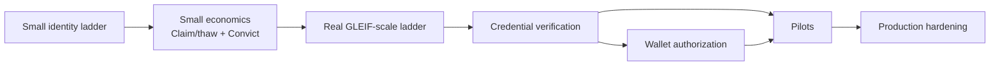

# Roadmap

The roadmap is evidence-led: prove a small identity vertically, complete its
economic lifecycle, repeat the ladder with a genuine GLEIF-scale identity,
then build credential and application layers on that stable identity core.

“Settled” means a transaction reached a protocol-11 development network. It
does not mean deployed on mainnet. The [story ladder](story-ladder.md) records
the exact transaction IDs.

## Current identity-core ladder

### Settled small stories

The small fixture has two controller keys and genuine `keripy` events and
witness receipts.

| Order | Story | Result |
|---:|---|---|
| 1 | [Register small — PR #146](https://github.com/lambdasistemi/cardano-keri/pull/146) | BLAKE3 premint and bonded ACTIVE checkpoint settled |
| 2 | [Close small — PR #147](https://github.com/lambdasistemi/cardano-keri/pull/147) | Controller-authorized burn and full refund settled |
| 3 | [Rotate small — PR #148](https://github.com/lambdasistemi/cardano-keri/pull/148) | Genuine witnessed Advance settled |
| 4 | [Freeze small — PR #150](https://github.com/lambdasistemi/cardano-keri/pull/150) | Freeze, response, stale replay rejection, and a fresh second round settled |

These stories prove the thin-checkpoint/reference-observer architecture under
production transaction limits. They also expose the current constraint:
`observer_advance` measures 16,130 bytes against a 16,133-byte limit.

### Complete the small economic lifecycle

1. [Seize the delay bond — #138](https://github.com/lambdasistemi/cardano-keri/issues/138)
   is in flight. It opens `ClaimFreeze` after an unanswered deadline, pays
   exactly `B` to the recorded hunter, retains `min + D_reg` in FROZEN, and
   proves thaw by an ordinary Advance that re-posts `B`.
2. [Convict a small identity — #151](https://github.com/lambdasistemi/cardano-keri/issues/151)
   is planned. It opens Convict from ACTIVE, ARMED, and FROZEN for a fully
   witnessed irreconcilable fork, proves protected payouts, and leaves the
   terminal TOMBSTONE.

Until those stories settle, Claim/thaw and Convict remain unavailable through
the small production-story checkpoint.

### Prove the real GLEIF-scale ladder

“Real” means the genuine Global Legal Entity Identifier Foundation shape:
weighted three-of-seven controller authority, the real witness set, and real
`keripy` lineage.

| Order | Story | Purpose |
|---:|---|---|
| 1 | [Register real — #139](https://github.com/lambdasistemi/cardano-keri/issues/139) | Add a production multi-transaction BLAKE3 proof for the 1083-byte-class inception and settle registration |
| 2 | [Close real — #145](https://github.com/lambdasistemi/cardano-keri/issues/145) | Prove the leanest real-scale spend and record cost |
| 3 | [Shrink Advance observer — #149](https://github.com/lambdasistemi/cardano-keri/issues/149) | Create at least 1 KB of maintainable reference-script headroom |
| 4 | [Rotate real — #144](https://github.com/lambdasistemi/cardano-keri/issues/144) | Settle the seven-key witnessed rotation and measure the mainnet gap |
| 5 | [Freeze real — #140](https://github.com/lambdasistemi/cardano-keri/issues/140) | Freeze and respond with full-scale evidence |
| 6 | [Seize real — #141](https://github.com/lambdasistemi/cardano-keri/issues/141) | Claim and thaw at full scale |
| 7 | [Convict real — #152](https://github.com/lambdasistemi/cardano-keri/issues/152) | Convict a fully witnessed real-scale fork |

Later real-scale steps are expected to use a development network with raised
execution limits while leaving production validators unchanged. This measures
the gap to mainnet. It does not hide it.

## Identity-core guarantees being assembled

When the two ladders are complete, the independent-AID identity core is
intended to provide:

- permissionless registration from genuine KERI inception evidence;
- BLAKE3 byte binding without a trusted registrar;
- weighted controller thresholds and pre-rotated successor commitments;
- witness-gated rotation, including incoming witness-set validation;
- sovereign per-AID checkpoint UTxOs with no global write contention;
- controller-authorized Close;
- immediate fail-closed Freeze on witnessed later-event evidence;
- a separately priced delay bond and divergence bond;
- timeout claim and permissionless thaw;
- conviction only for fully witnessed irreconcilable evidence; and
- fresh-evidence enforcement across repeated Freeze rounds.

The [trust model](design/trust-model.md) states which of these are settled and
which remain target behavior.

## Later milestones

### Credential verification and revocation

The next common layer verifies KERI credentials rather than just identity:

- bounded ACDC chain verification;
- explicit issuer trust roots;
- TEL issuance and revocation proofs for every credential in the chain;
- proof-building and canonical CESR decoding; and
- an optional admission cache for applications that cannot afford full
  verification on every action.

ACDC means Authentic Chained Data Container. TEL means Transaction Event Log.
This layer will answer “what role has an issuer granted to this AID?” The
checkpoint already answers the separate question “which keys currently
control this AID?”

### Application authorization

Applications then consume the ACTIVE checkpoint and credential evidence:

- a detached, domain-separated authorization envelope;
- replay protection and validity bounds;
- current checkpoint resolution through a CIP-31 reference input; and
- application-specific policy, such as scoped administrative actions.

The first vertical demo should perform one credential-gated Cardano action,
reject it after revocation, and show that an ARMED or FROZEN identity also
fails closed.

### KERI wallet bridge

The wallet bridge will let Veridian or Signify-controlled KERI keys authorize
Cardano actions without requiring the identity owner to manage an unrelated
CIP-30 wallet key.

Its vertical demo must include:

- intent display before signing;
- threshold signing through the KERI wallet;
- third-party transaction submission;
- replay and expiry rejection; and
- rejection after checkpoint rotation.

### Pilots

Two pilots remain the lowest-cost application candidates:

- identified stake-pool delegation; and
- institutional treasury contracts.

Both need real counterparties and vLEI credentials, so credential issuance
lead time may dominate implementation time.

### Hardening and extensions

Demand-driven work includes:

- delegated KERI AIDs and recovery events;
- a native Plutus BLAKE3 builtin to remove the workaround cost;
- privacy for attributed order flow and credential proofs;
- operational watcher and relayer services;
- package publication; and
- production deployment, monitoring, and incident procedures.

## Dependency spine

```mermaid
flowchart LR
    S["Small identity ladder"]
    E["Small economics<br/>Claim/thaw + Convict"]
    R["Real GLEIF-scale ladder"]
    C["Credential verification"]
    W["Wallet authorization"]
    P["Pilots"]
    H["Production hardening"]

    S --> E --> R
    R --> C
    C --> W
    C --> P
    W --> P
    P --> H
```

Observer size reduction sits between real Close and real Rotate. The
credential layer should not claim production identity authority until the
economic lifecycle and real-scale measurements are complete.

## Explicit non-claims

The roadmap does not claim that:

- development-network settlement is mainnet deployment;
- a two-key fixture proves the three-of-seven cost profile;
- registration alone proves a legal identity or credential;
- a private relayer guarantees prompt KERI-to-Cardano synchronization;
- conviction rolls back already-settled Cardano actions; or
- design models and predicate unit tests substitute for a settled vertical
  transaction.
