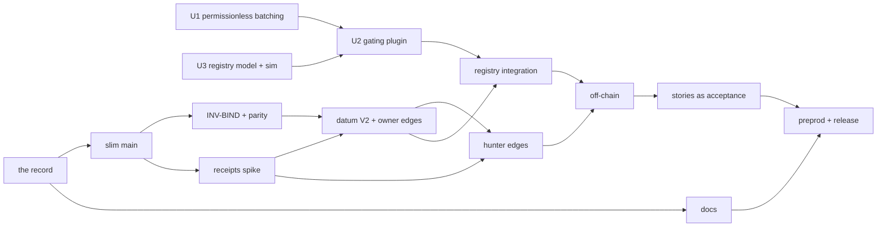

# Roadmap

The current plan is the **M1 return**: one milestone across two repositories,
fourteen epics, ordered so every epic shrinks the next one's risk. Preprod is
redeployed once, at the end.

!!! abstract "Where this page stands"
    Everything below is **planned**. What has settled is on the
    [story ladder](story-ladder.md); what is designed and proved is the Lean
    machine described on the [home page](index.md#the-accepted-design-the-m1-return).

## The milestone

**M1 — Identity core: witnessed checkpoints on Cardano, with poison, bonds and
a unique registry.**

Done means, on preprod: an identity registered once through the registry;
rotations landed by hunters for a premium; a freeze when the pool is short;
poison by the current quorum, cleared by rotation; close by the next keys and
reopen by a later rotation; conviction on a duplicity proof, terminal; a
consumer contract reading the checkpoint with the fail-closed verdict; `ckeri`
and a hunter daemon doing all of it; the fifteen stories replayed on preprod
as the acceptance suite; release 0.5.0.

The design itself is settled — 87 theorems in
`lean/CardanoKeri/CheckpointGoals.lean` over the checkpoint machine, 105
in `RegistryGoals.lean` over the registry, no `sorry` — and two
simulations the design is reviewed by playing. What follows is
engineering, plus the measurements that size the numbers still open.

## The epics

The registry is upstream work in the MPFS repositories that M1 implies; the
same milestone governs it.

| # | Epic | Repo | Depends on | Acceptance |
|---|---|---|---|---|
| U1 | [MPFS permissionless batching](https://github.com/lambdasistemi/cardano-keri/issues/329) — `Modify` without the owner signature; `End` and ownership transfer removed; objective rejection only; the tip paid to whoever applies; the cage's Lean proofs re-proved for the ownerless variant | cardano-mpfs | — | two independent appliers race on a devnet; a request one of them ignores lands through the other; retract still refunds; every cage proof green |
| U2 | [MPFS gating plugin](https://github.com/lambdasistemi/cardano-keri/issues/330) — a per-store validator the cage calls per request; the keri store's plugin parses the inception, checks the absence proof and mints the checkpoint in the same transaction; the leaf map is the interface `cardano-keri` consumes | cardano-mpfs | U1 | the registry simulator's scenarios replayed on a devnet against the plugin; a second registration of one AID refused; a reopen at or below the tombstone refused |
| U3 | **Registry model and simulator** — the Lean model of the leaf map and batching, its theorems, the registry simulation | cardano-mpfs | — | statements audited for completeness, proved, mutants; the page follows the Lean by replay |
| #318 | [The record](https://github.com/lambdasistemi/cardano-keri/issues/318) — the design note written from the plan; both Lean slices merged; the clarity record folded into the Lean's doc comments | cardano-keri | — | the note, the Lean and the simulator name the same rulings |
| #319 | [Slim `main`](https://github.com/lambdasistemi/cardano-keri/issues/319) — delete the enforcement economy and the M1.2 skeleton in one presented pull request; `convict_predicate` and its decoder lifted before the file goes; the docs survey executed; a size table of the surviving scripts | cardano-keri | #318 | `just ci`, `mkdocs --strict` and lychee green; the size table published |
| #320 | [INV-BIND on the slimmed tree](https://github.com/lambdasistemi/cardano-keri/issues/320) — rebase and merge the proven repair; add the advance-versus-`keripy` parity oracle for which witness set a rotation with cuts and adds tallies | cardano-keri | #319 | 16/16 adversarial cases green; the parity oracle red under a mutant that flips the set |
| #321 | [Receipts budget spike](https://github.com/lambdasistemi/cardano-keri/issues/321) — measure advance verification cost against witness count (3, 7, 11) and signer count on the slimmed scripts | cardano-keri | #319 | a measured table; a ruling on whether the premint proofs extend to Ed25519 signatures and receipts inside M1 |
| #322 | [Datum V2 and the owner's edges](https://github.com/lambdasistemi/cardano-keri/issues/322) — three value components; `poisoned`, `born_at`, `refund_to`, `alive_at`, `valid_until`; rotate with bond options and the signed intent; poison at the current threshold; close as a rotation with a burn; the consumer predicate in Aiken | cardano-keri | #320, #321 | each edge of the Lean has an Aiken vector generated from the Lean corpus, applied and refused cells alike; the Lean's mutant table reproduced as Aiken mutants, each red |
| #323 | [The hunter's edges](https://github.com/lambdasistemi/cardano-keri/issues/323) — advance paid `P` from the pool, unpaid advance, freeze when the pool is short, top-up, convict on a duplicity proof | cardano-keri | #322, #321 | the story steps for the hunter, the rival and the convictor replayed on a devnet; two hunters racing produce one winner and one refusal |
| #324 | [Registry integration](https://github.com/lambdasistemi/cardano-keri/issues/324) — registration as a request carrying the inception and the bonds, minted at application; reopen; the close and convict leaf updates; absence and presence proofs | cardano-keri | U2, #322 | one AID, one incarnation on a devnet; the stranger's stale registration plays out as the Lean says |
| #325 | [Off-chain](https://github.com/lambdasistemi/cardano-keri/issues/325) — `ckeri register-request`, `advance --bond keep\|deposit [--refund-to]`, `poison`, `close`, `reopen`, `top-up`, `freeze`, `convict`, `status`; the hunter daemon; the follower, indexer and query endpoint on V2 | cardano-keri | #322, #323, #324 | every story step has a `ckeri` command that produces it |
| #326 | [The stories as the acceptance suite](https://github.com/lambdasistemi/cardano-keri/issues/326) — the simulator's scenario files become end-to-end transaction sequences on a devnet, expected verdicts and refusals included | cardano-keri | #325 | all trunks and forks green; every refusal name reached by a refused transaction |
| #327 | [Docs](https://github.com/lambdasistemi/cardano-keri/issues/327) — the user guide rewritten from the stories; the design note as the design page; the simulations linked from every user page | cardano-keri | #318, alongside #322–#325 | `mkdocs --strict` and lychee green; a reader can play every page's story on the simulator |
| #328 | [Preprod cutover and release](https://github.com/lambdasistemi/cardano-keri/issues/328) — deploy the family and the registry store, reissue both manifests, migrate or re-register the operator's identities, parameters set, `ckeri` 0.5.0 released | cardano-keri | #326, #327 | the fifteen stories replayed on preprod; the release notes are the stories |

## Order and workstreams

```mermaid
flowchart LR
    U1[U1 permissionless batching] --> U2[U2 gating plugin]
    U3[U3 registry model + sim] --> U2
    U2 --> E324[registry integration]
    E318[the record] --> E319[slim main]
    E319 --> E320[INV-BIND + parity]
    E319 --> E321[receipts spike]
    E320 --> E322[datum V2 + owner edges]
    E321 --> E322
    E322 --> E323[hunter edges]
    E321 --> E323
    E322 --> E324
    E323 --> E325[off-chain]
    E324 --> E325
    E325 --> E326[stories as acceptance]
    E318 --> E327[docs]
    E326 --> E328[preprod + release]
    E327 --> E328
```

Three workstreams run at once: the upstream workstream (U1, U3, then U2),
the on-chain workstream (#319, #320, #321, then #322, #323), and the
record workstream (#318, #327). The critical path is
U1 → U2 → #324 → #325 → #326 → #328 on one side and
#319 → #322 → #323 → #325 on the other.
The registry is the long pole, which is why it starts now.

## Measurements that size the open numbers

Four deployment parameters are deliberately not guessed. Each waits on a
measurement:

| Measure | Taken in | Decides |
|---|---|---|
| script sizes after the deletion | #319 | whether the poison lives in the datum, and the budget for the signed intent |
| advance verification cost by witness and signer count | #321 | whether M1 serves GLEIF-scale receipt counts or is scoped to what the limit admits |
| requests per batch under the plugin | U2 | the onboarding burst the registry can absorb |
| relayer latency from receipt to landed rotation on a devnet | #325 | `W`, the juvenility window |
| transaction cost of an advance and of a freeze | #323 | floors for `P`, the premium, and `B`, the freeze bond |
| replay time of the fifteen stories on preprod | #328 | the release gate's duration |

`D_reg`, the conviction bond, is an economic call rather than a measurement: it
must exceed what duplicity buys, and it is refundable.

## Decisions still open

| Question | Blocks | Can wait until |
|---|---|---|
| The four numbers `P`, `B`, `W`, `D_reg` | #322's parameters | `P` and `B` after #323's cost measurement; `W` after #325's latency; `D_reg` before #328 |
| Validity and refresh: reserve the two fields, or ship the refresh edge | #322's scope | before #322 starts; reserving is two fields and no logic |
| Poison encoding: datum-resident, or a sibling UTxO | #322 | after #319's size table |
| Receipts at GLEIF scale | #323, #328's target population | after #321's measurement |

## Later milestones

### Credential verification and revocation

The next common layer verifies KERI credentials rather than just identity:
bounded ACDC chain verification; explicit issuer trust roots; TEL issuance and
revocation proofs for every credential in the chain; proof-building and
canonical CESR decoding; and an optional admission cache for applications that
cannot afford full verification on every action.

ACDC means Authentic Chained Data Container. TEL means Transaction Event Log.
This layer answers "what role has an issuer granted to this AID?" The
checkpoint already answers the separate question "which keys currently control
this AID?"

The design is
[Verifying credentials against the checkpoint](design/credential-verification.md):
the checkpoint keeps a history of past key states, an issuer's sealing
interaction event is presented as evidence and checked against that history
with the issuer's witness receipts, revocations are mirrored as a per-registry
set anyone may fill, and delegation is proven once per rotation rather than per
credential. No interaction event is ever ingested, and work per credential is
bounded by the issuer's key and witness counts.

### Application authorization

Applications then consume the checkpoint and credential evidence: a detached,
domain-separated authorization envelope; replay protection and validity bounds;
current checkpoint resolution through a CIP-31 reference input; and
application-specific policy.

The first vertical demo should perform one credential-gated Cardano action,
reject it after revocation, and show that a poisoned, frozen or
juvenile identity also fails closed.

### KERI wallet bridge

The wallet bridge lets Veridian or Signify-controlled KERI keys authorize
Cardano actions without requiring the identity owner to manage an unrelated
CIP-30 wallet key. Its vertical demo must include intent display before
signing, threshold signing through the KERI wallet, third-party transaction
submission, replay and expiry rejection, and rejection after a rotation.

This bridge is on the critical path of every application design and is
currently nobody's deliverable. See
[business cases](design/business-cases/index.md).

### Pilots

Two pilots remain the lowest-cost application candidates: identified stake-pool
delegation, and institutional treasury contracts. Both need real counterparties
and vLEI credentials, so credential issuance lead time may dominate
implementation time.

### Hardening and extensions

Demand-driven work includes delegated KERI AIDs and recovery events; a native
Plutus BLAKE3 builtin to remove the workaround cost; privacy for attributed
order flow and credential proofs; the maintenance escrow and premium beyond the
pool; package publication; and production deployment, monitoring and incident
procedures.

## Explicit non-claims

The roadmap does not claim that:

- development-network or preprod settlement is mainnet deployment;
- a two-key fixture proves the three-of-seven cost profile;
- registration alone proves a legal identity or credential;
- a private relayer guarantees prompt KERI-to-Cardano synchronization;
- conviction rolls back already-settled Cardano actions; or
- Lean theorems and simulations substitute for a settled vertical transaction.

The last one is the point of the ordering above: the design is proved, and the
epics are what make it true on chain.
