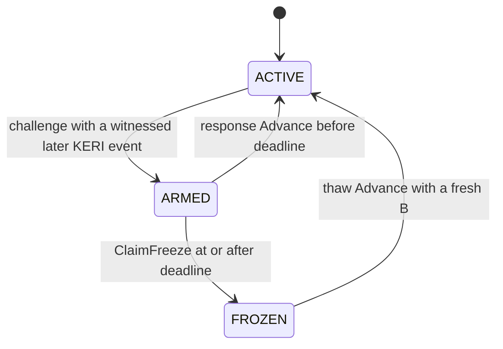

# Freeze lifecycle: challenge, response, claim, and thaw

A Cardano checkpoint is a public projection of a KERI identity's current key
state. Sometimes KERI has already moved while Cardano is still showing the
previous state. The freeze lifecycle handles that lag without treating an
ordinary delay as fraud.

The design separates two jobs:

- **Protect users immediately.** A valid challenge moves the checkpoint away
  from the ACTIVE address, so applications fail closed.
- **Pay only for real abandonment.** The hunter receives the delay bond only
  if the complete response window passes unanswered.

This page describes the deployed small-checkpoint path completed by
[issue #138](https://github.com/lambdasistemi/cardano-keri/issues/138).
For the protocol-level security argument, see the
[bonded lag lifecycle](../design/trust-model.md#bonded-lag-lifecycle).

## The four states and moves

Only the bare ACTIVE role is current authority. Applications that authorize
actions from a checkpoint must reject ARMED and FROZEN checkpoints by address.

The transition names describe what happened:

- **Challenge** is the `Freeze` transaction. It proves Cardano is behind and
  records a hunter and deadline.
- **Response** is an ordinary `Advance` before the deadline. It catches up and
  pays nobody.
- **Timeout claim** is `ClaimFreeze` at or after the deadline. It pays the
  recorded hunter.
- **Thaw** is an ordinary `Advance` from FROZEN. It applies the real next KERI
  event and restores the delay bond.

## The two deposits are different

`D_reg` and `B` have separate purposes:

| Component | Purpose | ACTIVE | ARMED | FROZEN |
|---|---|---:|---:|---:|
| `D_reg` | Registration and conviction deposit | retained | retained | retained |
| `B` | Delay bond | retained | retained | paid to hunter |
| min-ADA | Ledger output reserve | retained | retained | retained |

For the small deployed fixture, `B` is 5 ADA. The exact `D_reg`, `B`, and
freeze-window values are validator deployment parameters; clients must read
the parameters of the checkpoint program they are using.

Value above the protected reserve is ordinary transaction change. It is not
part of the hunter reward.

## 1. Challenge: ACTIVE to ARMED

Anyone holding a genuine witnessed KERI event that is later than the Cardano
checkpoint may submit a challenge.

The transaction must:

1. consume the ACTIVE checkpoint;
2. prove the later event through the enforcement observer;
3. choose a 28-byte Cardano verification-key hash for the hunter;
4. use a finite validity upper bound `u`; and
5. create one ARMED checkpoint with
   `deadline = u + W_freeze`.

The checkpoint keeps its complete value, including `D_reg + B`. The hunter is
not paid at challenge time.

Moving away from ACTIVE is the protection. A value-authorizing application
does not need to interpret the evidence or wait for the deadline; it simply
refuses the ARMED role.

## 2. Response: ARMED to ACTIVE

The identity can answer with the real next KERI rotation. The response is the
same permissionless `Advance` used for ordinary progress, with one additional
timing rule: its finite validity upper endpoint must be strictly before the
stored deadline.

A valid response:

- applies the unchanged KERI rotation checks;
- writes the exact next checkpoint datum;
- returns the checkpoint to ACTIVE;
- preserves the complete input value; and
- retains `B`, so the hunter receives nothing.

The submitter does not need a special "unfreeze" key. The KERI event and its
required controller signatures and witness receipts determine the successor.

## 3. Timeout claim: ARMED to FROZEN

If no response settles in time, `ClaimFreeze` becomes available. Its finite
validity lower endpoint must be at or after the stored deadline.

The claim has no evidence observer. It is a small state, timing, and value
transition:

1. the input must be the well-formed ARMED checkpoint;
2. the named payout output must use the hunter recorded in the ARMED datum;
3. that output must contain exactly `B` lovelace, no other assets, and no
   datum;
4. the FROZEN successor must retain the unchanged checkpoint datum and
   quantity-one AID token; and
5. its complete value must equal the ARMED input value minus exactly `B`.

The FROZEN checkpoint therefore retains `min-ADA + D_reg`. ClaimFreeze never
pays `D_reg`.

Two common races fail closed:

- **Early claim:** a lower validity endpoint before the deadline is rejected.
- **Wrong hunter:** redirecting the payout to another key is rejected, even
  after the deadline.

## 4. Thaw: FROZEN to ACTIVE

FROZEN is a recoverable state, not a tombstone. Anyone may submit the real next
KERI rotation through ordinary `Advance`.

The thaw transaction must add a fresh `B`. The ACTIVE successor's complete
value is exactly the FROZEN input value plus `B`; it carries the same
quantity-one AID token and the exact rotation-derived `V1` datum.

The party funding `B` gains no on-chain refund right. A bridge, relayer, or
other third-party thaw service may be compensated off chain, but the
checkpoint transition itself records no debt.

## What checkpoint consumers should enforce

A consumer should:

1. locate the current unspent quantity-one checkpoint token;
2. require the bare ACTIVE role address;
3. validate the checkpoint lineage and expected policy;
4. reject ARMED and FROZEN role addresses without trying to infer intent; and
5. apply its own KERI-to-Cardano freshness policy.

Cardano cannot react to a KERI event that nobody has submitted. The challenge
path shortens the observable lag window; it does not make unseen off-chain
events visible.

## Why the lifecycle cannot trap an identity

Every non-terminal freeze state has a public progress path:

- before the deadline, a real next event responds in one transaction;
- after the deadline, ClaimFreeze protects the hunter's earned payout; and
- after ClaimFreeze, the same real next event thaws in one transaction when
  `B` is re-posted.

No submitter owns exclusive response or thaw authority. A hostile transaction
can only present valid later KERI truth, open one bounded response window, or
pay the fee for progress that another party could also submit.
