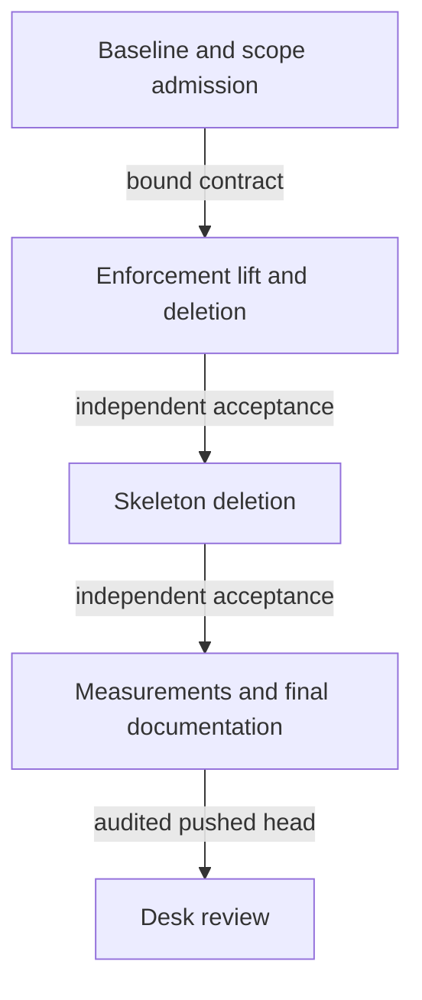

# Ordered implementation plan

The maintainer reviews one PR and three accepted slice boundaries. No later slice starts before its predecessor is accepted at an exact SHA.

Machine-facing plan register. Preservation is released by desk A-004 and epic A-003; gate admission is pending.

- SL-334: lift conviction/binding dependencies before deleting their current home; remove retired onchain/offchain operations, generators and wiring; update current candidate derivation/manifest handling; preserve historical release evidence; apply necessary independent documentation cleanup.
- SL-335: delete s0 validators, m12 skeleton, scripts/s0 and retired skeleton spec; preserve/relocate MPF proof tests and retain dependency v2.1.0; execute real positive and rejecting proofs.
- SL-336: commit the complete applied-script/transaction measurement command and controls; publish exact candidate table; integrate shared poison-encoding section after #332 handoff; complete final candidate readiness.

OWNER topology is required. Ticket owner authors the mandate/gates; an alternate-family visible commit owner implements; fresh visible auditors remain independent. No hidden agents. draft=NONE. One adjudicated gate repair; at most two audited submissions per admitted campaign; finite launch/execution budgets must be recorded before dispatch. Spend carries across recuts.

Initial baseline runs once through the brief's exact Nix-backed just ci command. Class map: handoffs/ci-classes.md in ticket runtime. Inherited failures are separate from regressions and cannot be silently waived or fixed outside scope. Gates must be falsifiable per class, observe executed behavior and guard complete nonempty extent. The widened preservation boundary must be included in the gate before admission.

No root flake exists. Use repository Nix recipes. Whole PR requires just ci, strict MkDocs, lychee with fragments, changed-page presentation/speech checks, and git diff --check on exact final tree. Remote CI and the served PR preview must be bound to the pushed head. Mandatory missing measurement paths are blockers.

Output ceilings: spec 8 KiB; each remaining model/plan/tasks artifact 6 KiB; compiled child brief 16 KiB plus hash-bound selected sources. Do not add another reporting layer or freeze placeholders as executable contracts.
