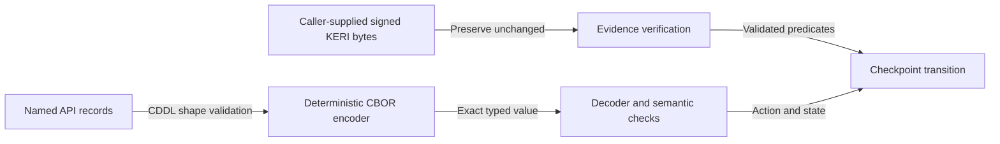

# Named maps and exact evidence bytes

As an SDK implementer, I want data to retain its meaning across languages and
encoders. Named fields remain maps. A signed KERI event remains the original
byte string, even when the API also exposes its parsed fields.



| Choice | Alternative | Reason |
| --- | --- | --- |
| Named maps | Tuples for every record | Field names preserve the operation contract without positional conventions. |
| CBOR unsigned integers and positive bignums | Machine-word truncation | Lean natural numbers are unbounded. |
| Preserve supplied signed bytes | Re-encode parsed KERI objects before verifying | Verification must cover the bytes that were actually signed. |

## Semantic conformance encoding

`checkpoint-model-v1` is the abstract model profile. Its natural numbers use
CDDL's `unsigned` prelude type, which includes both ordinary unsigned CBOR
integers and positive bignums. This is a shape for abstract addresses, epochs
and values; it does not turn numeric model addresses into Cardano addresses.
The prelude and bignum representation are defined by
[RFC 8610](https://www.rfc-editor.org/rfc/rfc8610.html#appendix-D).

Use the core deterministic CBOR rules: shortest representations,
definite-length containers and map keys ordered by their encoded bytes.
Integers through `2^64 - 1` use major type zero. Larger naturals use tag two
with a minimal unsigned big-endian byte string, without a leading zero byte.
Do not use a bignum representation for an integer that fits major type zero.
These requirements specialize
[RFC 8949's deterministic encoding and bignum rules](https://www.rfc-editor.org/rfc/rfc8949.html#section-4.2).

Reject duplicate map keys before constructing a host-language map, reject
unknown fields in this closed profile, and distinguish absent fields from
explicit null. Refund null means unchanged; refund zero names abstract
address zero. Negative numbers and floating-point numbers are not naturals.
The bonds `D` and `B` are strictly positive, including when decoded from a
bignum; `P`, `W`, pool amounts and top-ups may be zero.

The JSON conformance corpus is a readable representation of these typed
values. The committed grid uses small exact integers. Consumers handling
larger JSON integers must use an exact integer parser; passing them through
a binary floating-point number is not a portable codec. CBOR remains the
binary representation for bignum fixtures.

CDDL validates shapes. Deterministic encoding, duplicate-key rejection,
sorted unique refusal sets, index bounds and guard semantics are additional
checks. A schema validator alone cannot certify them.

The specification's executable check validates the whole model corpus,
requires a singleton-failure example for each transition refusal, and runs
positive/negative shape controls, including a CBOR natural larger than 64
bits. Supplying freshly emitted Lean trace JSON additionally checks every
accepted state/flow and refused cell against that output:

```sh
nix shell github:NixOS/nixpkgs/753cc8a3a87467296ddd1fa93f0cc3e81120ee46#cddl \
  --command node specs/400-offered-interface/check-conformance.mjs \
  /path/to/fresh-checkpoint-trace.json
```

The trace input is the output of the existing `CheckpointTraceDriver.lean`,
run against the source revision bound by `model-provenance.json`. Build the
declared toolchain with the following command, then use that toolchain for
the model build and trace driver. Build in an isolated copy if another
process is using the repository's Lean build directory.

```sh
nix build --impure --no-link --print-out-paths \
  --file specs/400-offered-interface/model-toolchain.nix
```

CDDL validation here uses the pinned Ruby `cddl` tool. It does not claim a
successful `cuddle` run or alter the repository's existing `cuddle` dependency.

## The KERI and Cardano boundary

This encoding is not a replacement for CESR, KERI event serialization or
Cardano transaction CBOR. Concrete profiles must name their supported event
types, digest/signature algorithms, exact preimages and Cardano script
identities. Preserve each supplied evidence object's bytes and its binding
to the claimed AID, establishment event and sequence. Parse views without
discarding the originals. Never hash an arbitrarily re-ordered API map as
though it were the original signed event.

An unsigned preparation identifies its concrete deployment profile and
returns the exact transaction body to be witnessed externally. If that
profile cannot encode the requested model transition, preparation refuses
with `deployment-operation-unsupported`. Model conformance does not imply
that a concrete evidence or transaction codec already exists.
