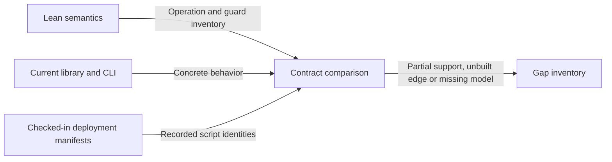

# What a caller can obtain today

## Stories and evidence boundary

As an SDK author, I want to know which Lean-derived operations have a concrete
implementation and which still need a model or an on-chain edge. As a CLI
maintainer, I want an explicit list of commands left outside that contract.

This is a source-based draft at
`88e930945d8b757913d653defe6f2ed3b2b06ffb`. The checked-in
[checkpoint manifest](../../deploy/preprod/m1-manifest.json) and
[board manifest](../../deploy/preprod/board-manifest.json) record published
deployments. They do not prove that their reference UTxOs remain unspent or
that a current preprod operation succeeds. No live-chain availability check
has been made for this inventory.

## Operation coverage

The checkpoint model's full state includes poison, freeze, birth slot, refund
address and pool. The current
[DatumV1](../../offchain/lib/Cardano/KERI/AID/Checkpoint/Datum.hs) representation and deployed
observer family must not be assumed to implement that state merely because
the CLI has commands named register, advance and close. Concrete source paths
and wire evidence must be reconciled before marking an operation expressible.

| Required operation | Lean source | Current implementation / remaining gap |
| --- | --- | --- |
| Register | Checkpoint register, SysStep; Registry processBody register | CLI register exists. Complete leaf-absence admission and new checkpoint state need reconciliation with the deployed generation. |
| Rotate, paid or unpaid; deposit/unfreeze | Checkpoint rotate | CLI advance exists; exact intent, pool payment, deposit and state mapping remain unbuilt or unbound in this draft. Paid/unpaid are model outcomes, not separate actions. |
| Poison | Checkpoint poison | No top-level CLI command; concrete new-state and declaration mapping unresolved. |
| Freeze | Checkpoint freeze | Current Checkpoint freeze is the offered semantics; historical freeze/seize code is not an implementation of it. |
| Top up | Checkpoint topUp | No top-level CLI command; model pool mapping unresolved. |
| Convict live/parked | Checkpoint convict | Deployed enforcement code is not evidence of the new terminal leaf and addressed flows; requires exact mapping. |
| Close/reap | Checkpoint close; distinct Registry reap | CLI close exists. Checkpoint immediate burn/parked commitment governs the API; older Registry reap is excluded, and concrete integration needs adaptation. |
| Reopen | Checkpoint reopen; Registry revive request | No top-level CLI command; parked commitment proof and fresh registration mechanics unresolved. |
| Registry contribute/fold/retract | Registry actions | Designed model; no corresponding top-level CLI commands or registry deployment identified in these manifests. |
| Registry pause/resume/convictCkpt | Registry actions | Excluded from the offered lifecycle; older coupling must be adapted to Checkpoint before reuse. |
| Read concrete key state | consumableStateB covers only state usability | CLI checkpoint exposes a concrete checkpoint view; abstract epochs cannot supply the required keys, thresholds, witnesses and toad. |
| Gate a consumer transaction | consumableStateB is only the state conjunct | Caller signatures, validity interval and concrete registry binding are outside this Lean predicate. |
| Follow from a chain point | No corresponding API model | Existing backend/indexer facilities need a language-neutral subscription and rollback contract. |
| Historical AID query | No corresponding API model | Chain-point identity, historical evidence completeness and verdict semantics are unspecified in Lean. |
| Delegated register/rotate/read | Statement branch Delegation and History | Exact approval seal and certificate consumption now modeled; concrete dip/drt evidence, token layout and Checkpoint revival composition remain unbound. |
| Verify credential / project TEL | Statement branch Mirror, Credential and History | vcp/iss/rev and historical issuer walks now modeled; bis/brv, concrete evidence, mirror freshness and deployed encoding remain gaps. |
| Verify credential chain | Statement branch Credential | Ordered edges, schemas, cache dependencies and revocation membership now modeled; issuee adjacency, actor binding and concrete policy enforcement remain gaps. |

The statement-branch rows use the [pinned refinement](statements.md) at
`4906cfaed34e43405b04d3cc8746bd6388fc8452`. These are executable models
with unproved statements, not evidence of a deployed credential or delegation
implementation. All other source and manifest observations retain the base
revision above.

These rows are findings and work items, not a count of independently verified
on-chain blockers. A final per-operation expressibility verdict still needs
the concrete codec/validator/library evidence and live deployment qualification
required by the ticket.

## Every command in the current CLI

The constructors and parser in
[CLI.hs](../../offchain/cli/Cardano/KERI/CLI.hs) enumerate fourteen leaf
commands. None is removed by this specification. The mapping below names all
remaining surface area, including infrastructure utilities that have no
checkpoint action.

| CLI command | Relationship to this draft | Work needed to rebuild the CLI as an API caller |
| --- | --- | --- |
| deploy | Outside Lean action catalogue | Deployment parameters, publication, signing, manifest result and refusals |
| manifest verify | Outside Lean action catalogue | Manifest decoding and script/reference verification contract |
| register | Partial correspondence to register | Concrete inception admission, transaction and registry mapping |
| advance | Partial correspondence to rotate | Evidence, intents, value flow and transaction mapping |
| close | Partial correspondence to close | Implement the selected Checkpoint lifecycle and transaction/refund mapping |
| status | Infrastructure observation | Backend status and failure contract |
| list | Infrastructure query | Enumeration, snapshot consistency and failures |
| checkpoint | Concrete checkpoint query | Datum decoding and model-to-key-state/verdict mapping |
| payer | Infrastructure funding utility | Funding inputs, output, signing and failures |
| board deploy | Outside Lean action catalogue | Endpoint-board reference deployment contract |
| board list | Outside Lean action catalogue | Verified endpoint catalogue read contract |
| board post | Outside Lean action catalogue | Witness-signed endpoint publication contract |
| board update | Outside Lean action catalogue | Owned endpoint replacement contract |
| board retire | Outside Lean action catalogue | Marker burn and deposit refund contract |

YAML/environment configuration, backend selection, manifest file I/O and CLI
formatting are also adapter responsibilities that need explicit boundaries.
They must not silently become KERI protocol operations. No endpoint-board,
backend or deployment API is defined by the current Lean files.
