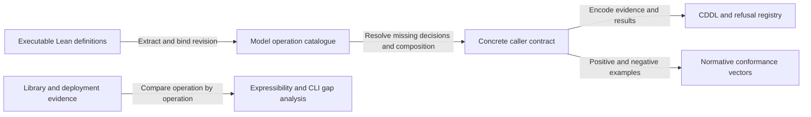

# From Lean semantics to a portable caller contract

As an implementer of either SDK, I want the same operation to admit the same
evidence, change the same state and produce the same value flow or refusal.
This planning draft starts with the executable Lean model and makes missing
contracts visible before concrete API implementation begins.

| Decision | Alternative | Reason |
| --- | --- | --- |
| Extract the existing models first | Add presumed behavior from the CLI | The operator selected Lean as the API source. |
| Pin the supplied statement branch in a separate profile | Merge different lifecycle assumptions silently | Its executable credential and delegation surface is available; its guarantees remain unproved and its Checkpoint composition incomplete. |
| Unsigned preparation with caller-supplied evidence | Invoke a signer or KERI resolver | The operator selected unsigned and no KERI networking. |

The current artifacts define the Checkpoint lifecycle with unsigned output
and caller-supplied evidence. Its model conformance corpus has stable guard
refusal sets and validated CDDL. Registry adaptation is separate implementation
work; its legacy lifecycle is excluded. The [statement refinement](statements.md)
adds historical walks, TEL mirrors, credential chains and approval certificates.
The next work is to bind each concrete operation to its KERI/Cardano encodings
and deployed scripts, and reconcile the models' distinct revival rules.

Validation must distinguish source discovery, compiled model observations,
CDDL parsing, concrete cryptographic vectors, deployed expressibility and
independent review. Passing one does not substitute for another. No interface
implementation or existing Lean/on-chain module changes belong to this ticket.
