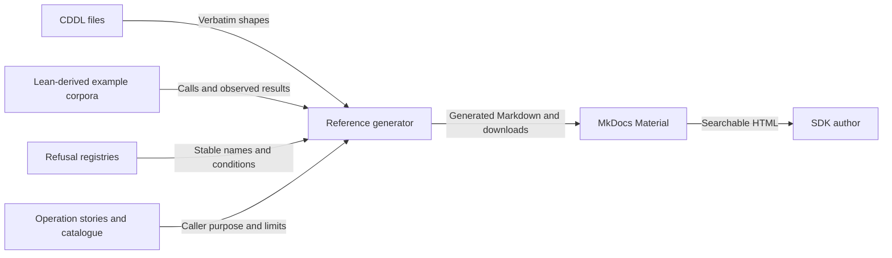

# Generate the API reference

As an SDK author, I want an HTML reference that stays aligned with the data
shapes and executable examples. As a maintainer, I want to change the source
contract once and regenerate the reference automatically.

The repository already uses MkDocs Material. A small presentation adapter
now generates its offered-API section from these specification artifacts.
MkDocs supplies navigation, search, copyable code blocks and a light/dark
palette. No transport is inferred from the documentation format.

## Tool choice

| Tool | What its documentation establishes | Fit here |
| --- | --- | --- |
| [anweiss CDDL](https://github.com/anweiss/cddl/blob/main/README.md) | Parsing, validation and a browser playground with schema outlines and sample generation | Useful for inspecting shapes; it does not supply our Lean results, refusal contract or caller stories. |
| [WebdriverIO CDDL](https://github.com/webdriverio/cddl/blob/main/packages/cddl/README.md) | A CDDL parser exposing an abstract syntax tree | A possible future basis for linked type views; unnecessary for verbatim schema rendering. |
| [MkDocs](https://www.mkdocs.org/user-guide/writing-your-docs/) | Markdown-to-HTML generation, navigation, relative links and downloadable assets | Already used here; retain it and generate the missing API pages. |

This is a bounded tool survey, not a claim that no other generator exists.
The adapter reads source artifacts; it does not parse CDDL semantics, execute
Lean in the browser or generate a client implementation. JSON display
examples retain the small exact fixture integers; this does not define a
large-integer JSON codec.

## Build and maintain

Run `just check-offered-interface` to validate both retained corpora, run the
shape and presentation controls, and generate the reference sources. A normal
`mkdocs build --strict` also runs the generator through its pre-build hook.
The existing docs workflow builds, previews and deploys the resulting HTML.

The generated directory is `docs/offered-api/`, ignored by Git. Edit the
CDDL, conformance corpus, refusal registry, catalogue or
[operation stories](operation-stories.json), then build again. Do not edit
generated Markdown. The generator rejects a missing or extra operation story
relative to the corpus. The generated provenance file records source hashes,
the generator hash and the specification commit.

Each operation page shows caller purpose, named refusals and representative
accepted/refused inputs and outputs. Boolean queries show both true and false.
Downloads retain every corpus case, source schema and provenance record.
The site includes the detailed catalogue, source limitations, encoding rules
and implementation gap inventory beside the reference.

The retained-corpus check is not fresh Lean execution. For that check, supply
fresh trace output to the corresponding conformance checker as described in
[the encoding contract](encoding.md). The statement profile remains an
executable specification with unproved theorem statements.
