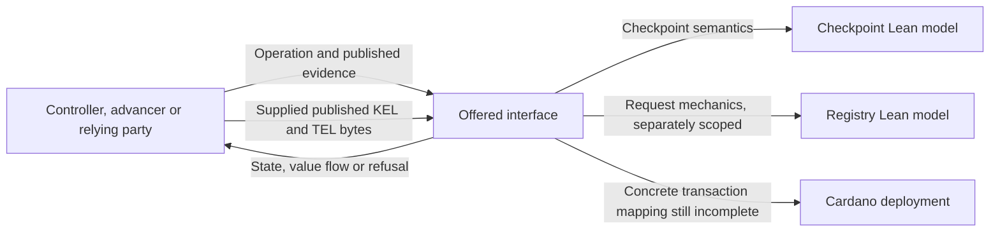
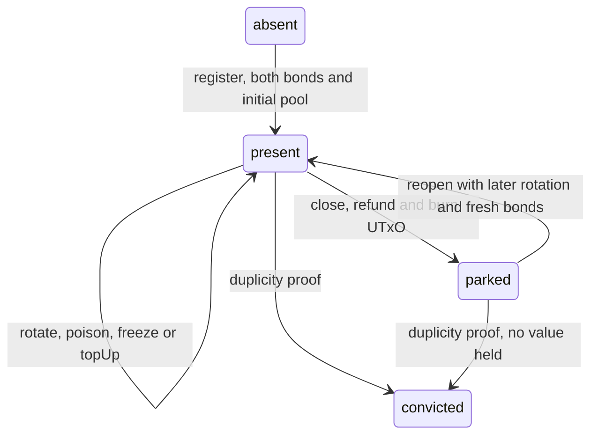
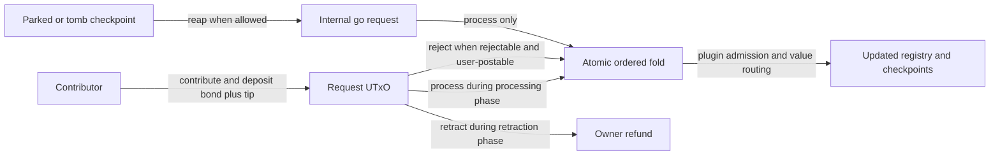
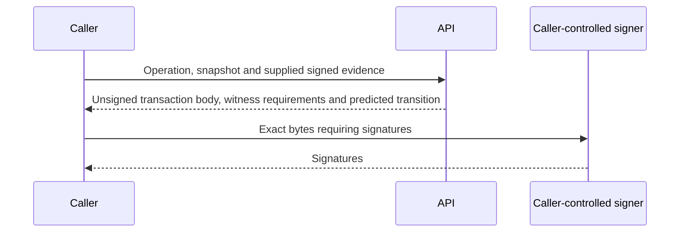

# An API derived from the Lean models

## Stories this specification serves

As an AID controller, I want to register, rotate, poison, close and reopen my
checkpoint with the authorization and refunds the model requires. As an
advancer, I want to land public evidence and know whether I receive a premium.
As a relying party, I want a verdict that distinguishes an unusable checkpoint
from evidence I could not obtain. As a registry operator, I want to contribute,
fold and retract requests under the model's admission and timing rules.

This is a **specification candidate**, following the operator's instruction to take
the API from the Lean specifications. It does not yet define a complete SDK
contract. The source revision is
`88e930945d8b757913d653defe6f2ed3b2b06ffb`. The issue supplies coverage
requirements; existing library code supplies implementation evidence. Neither
silently adds operations or guards to the Lean model.

## Model boundary

[Checkpoint.lean](../../lean/CardanoKeri/Checkpoint.lean) defines the lifecycle:
`Action`, `Env`, `Step`, `stepFn`, `SysStep` and `consumableStateB` are the
source of the extraction below. Its eight actions have thirteen transition
constructors because payment and state cases are outcomes of an action.
[Registry.lean](../../lean/CardanoKeri/Registry.lean) separately defines seven
actions and the request plugin's `processBody`.

The two models have an integration difference. Checkpoint close
burns the UTxO immediately and parks a key-state commitment in the leaf.
Registry pause parks a UTxO, which a later reap consumes to post a registry
request. **Checkpoint is the offered lifecycle profile**, as its source
explicitly declares. Registry's `pause`, `resume`, `reap` and `convictCkpt`
are excluded from the offered lifecycle. The Registry section below is a
compatibility inventory for a later implementation of request mechanics;
it does not offer a second meaning of close. Checkpoint's window is
juvenility; Registry's window is a reaping grace period. Adapting Registry
to this lifecycle is an on-chain/model implementation gap, not an unresolved
choice for callers of this API.

[Cage.lean](../../lean/CardanoKeri/Cage.lean) models the fold authorization
boundary and comparison modes. Its owner bypass and trivial plugin examples
are not offered product operations. [Samaritan.lean](../../lean/CardanoKeri/Samaritan.lean)
models conditional reap/fold economics, not another public operation.

| Choice | Alternative | Reason |
| --- | --- | --- |
| Derive operations from executable Lean definitions | Infer them from CLI names | The operator selected Lean as semantic authority. |
| Offer Checkpoint's lifecycle; retain Registry as a compatibility inventory | Offer both sets of lifecycle operations | Checkpoint declares itself the sole lifecycle specification. |
| CDDL maps for named fields | Require positional tuples throughout | The API has named records; native evidence encodings are a separate boundary. |
| Leave evidence representation open where Lean abstracts it | Accept caller-provided booleans as proof | Lean predicates stand for verification, not trusted caller assertions. |

## Checkpoint operations

Every operation is scoped to an AID, deployment parameters and observed state
at a chain slot. Lean's AIDs, addresses and key epochs are natural-number
abstractions. They are not a wire format for KERI prefixes, Cardano addresses
or public keys. `D` and `B` are positive bonds, `P` is the pool premium and
`W` the juvenility window. Neither `P` nor `W` is required to be positive.

An accepted model step returns **both the next state and addressed value
flow**. The caller API prepares unsigned artifacts from that transition;
it does not treat the model result as a submitted transaction or finality.
The operator selected **unsigned preparation and caller-supplied evidence**.
The API knows nothing about the KERI network: no KERI transport, discovery,
network client, resolver callback or evidence-fetching adapter belongs to it.

Present checkpoints carry independent poison and freeze flags. An action's
evidence obligations below describe what must be validated. Callers supply
the evidence and obtain signatures outside the API. Poison, bond, pool and reap are project
terms rather than KERI event types.

| Caller goal / action | Caller supplies beyond common context | What the caller obtains | Refusal conditions in the model |
| --- | --- | --- | --- |
| Sponsor an AID: `register` | Refund address, initial pool; funding for `D + B + pool0` | Present checkpoint at sequence and epoch zero, born now; funds locked | State is not absent; at `SysStep`, registry leaf is not absent |
| Land a rotation: `rotate` | Later establishment sequence, `keep` or `deposit`, premium payee, optional replacement refund address; witnessed rotation and required intent authorization | Next epoch/sequence; poison cleared; refund address updated if supplied. If pool covers `P`, pay `P`; otherwise accept without payment. `deposit` clears freeze and brings missing `B`; `keep` preserves freeze | No present checkpoint; invalid rotation evidence; sequence not later; required intent unauthorized |
| Declare current keys unsafe: `poison` | Current-key quorum declaration | Poison flag set, no value movement | No present checkpoint; quorum absent; already poisoned |
| Report stale keys: `freeze` | Later witnessed rotation, hunter payee | Existing `B` paid to hunter; freeze flag set; old epoch and sequence retained | No present checkpoint; invalid evidence; sequence not later; pool covers `P`; already frozen; poisoned |
| Fund future advances: `topUp` | Pool increment | Pool increased, including a permitted zero increment; no authorization guard | No present checkpoint |
| Prove duplicity: `convict` | Duplicity evidence against recorded epoch/sequence; convictor payee | Terminal conviction. Present: `D` to convictor, held `B` and pool to refund address. Parked: no value movement | State neither present nor parked; duplicity evidence invalid |
| Leave: `close` (the checkpoint model's reap) | Later witnessed rotation, payee, optional new refund address; new-key intent binds close payee and refund option | Parked commitment to the resulting epoch/sequence; UTxO burned. Pay `P` only when covered, refund all remaining held value | No present checkpoint; invalid rotation; sequence not later; close intent unauthorized |
| Return: `reopen` | Rotation from exactly the parked key state to a later sequence; fresh `D`, `B`, initial pool and sponsor-selected refund address | Clean, fully bonded present checkpoint, born now, next epoch | State not parked; invalid rotation path; sequence not later; at `SysStep`, leaf not parked |

`keep` with no replacement refund address requires no additional intent
signature. Every deposit, every close and every replacement refund address
requires the corresponding new-key intent. A close binds its premium payee;
a copied close with that payee changed must fail authorization. Insufficient
pool is **not** a refusal for rotate or close. Deposit preserves `bornAt`
and brings zero bond value when the freeze bond is already full. Close can
consume a poisoned or frozen checkpoint; top-up can fund either.

`register`, `reopen`, `close` and `convict` change the leaf. Rotate, poison,
freeze and top-up do not. System registration requires leaf absence in
addition to the per-AID state guard. The single-checkpoint function does not
validate inception cryptography; the Registry plugin's register admission
abstracts that check separately. Concrete proof encoding and atomic coupling
remain a gap, not a Boolean supplied by an untrusted caller.

## Registry compatibility inventory

As a request contributor or folder, I want the request's bond, tip and phase
to determine its disposition. A failed batch leaves no accepted intermediate
state. List order and repeated identifiers must be preserved until validation.
These source operations expose integration work. They are not an additional
offered lifecycle or a promise that today's Registry model implements
Checkpoint's leaf updates.

| Action | Caller supplies | Model result | Refusal conditions |
| --- | --- | --- | --- |
| `contribute` | AID, owner, submitted slot, operation | Request deposited with bond plus tip; request counter incremented | Operation is not user-postable (`register`, `revive`, `convict` are postable) |
| `fold` | Folder payee, generation, pinned plugin, ordered nonempty batch of request IDs and process/reject choices | One atomic state update, generation increment, per-request tip to folder, plugin-specific bonds/refunds | Generation or plugin mismatch; empty batch; request missing/repeated; phase violation; forbidden rejection; plugin admission fails |
| `retract` | Request ID | Request removed; bond plus tip refunded to its owner | Missing request or outside retraction phase |
| `reap` | AID and reaper payee | Checkpoint consumed; internal go request posted; premium to reaper | Missing checkpoint; live checkpoint; parked checkpoint before grace expiry without quorum |
| `pause` | AID and rotation evidence from recorded keys | Live checkpoint becomes parked now; key counter increments | Missing/non-live checkpoint or rotation invalid |
| `resume` | AID and rotation evidence from recorded keys | Parked checkpoint becomes live; key counter increments | Missing/non-parked checkpoint or rotation invalid |
| `convictCkpt` | AID and duplicity evidence | Checkpoint becomes tomb | Missing/already-tomb checkpoint or duplicity invalid |

Plugin admission requires absent leaf plus inception evidence for register;
dormant leaf, no remaining checkpoint and rotation evidence for revive;
active leaf for internal go-dormant/go-convicted; dormant leaf plus duplicity
for convict. Internal go requests cannot be contributed or rejected by the
user-postable path. The model's `Actor.owner` label on retract is not an
executable signer check: `stepFn` has no caller identity argument.

Processing requires `now < submittedAt + process`, with no lower bound in
that predicate. Retraction includes its lower endpoint and excludes its upper
endpoint. Rejection includes the final endpoint and also allows requests
dated in the future. This extraction preserves those exact conditions.
The `far` timestamp used for internal requests is finite; unbounded permanent
processing availability is not implied.

## Reads and missing models

As a relying party, I want to distinguish a negative verdict from incomplete
evidence. `consumableStateB` returns true exactly for a present checkpoint
that is neither frozen nor poisoned and satisfies `bornAt + W <= now`.
It does not check the consumer transaction's signatures, validity interval
or concrete registry proof. Returning that Boolean as complete transaction
authorization would overstate the model.

The Lean files do not specify complete key-state queries, chain-point
subscriptions, historical key lookup, delegated `dip`/`drt` validation, ACDC
verification, TEL projection or credential-chain traversal. Those remain
catalogue coverage with **missing-model** status. The operator confirmed that
delegation and credentials are coming in later work; they do not block this
checkpoint contract. In particular,
epoch counters cannot return concrete current keys, next-key digests,
thresholds, witnesses or toad.

The ticket requires credential verdicts to distinguish issued, revoked and
unknown. Missing TEL/KEL evidence must never imply validity. No operation may
require external KERI parties to publish, sign or maintain additional material
for this projection. These are requirements awaiting a Lean contract, not
implemented or proved behavior in the current models.

## Unsigned preparation and supplied evidence

As a controller or relayer, I supply an operation, a Cardano state snapshot,
deployment parameters and already-published KERI evidence. The API checks
the evidence and models the transition. When a concrete deployment supports
that transition, preparation returns the unsigned Cardano transaction body,
its required witness roles, and the expected state and value flow. If the
deployment cannot express the transition, it returns
`deployment-operation-unsupported`; it must not construct an older operation
with the same name but different semantics.

Existing KERI event signatures and witness receipts are evidence inputs,
not signatures generated by this API. Bridge intent authorization remains
separate from Cardano payment witnesses: a Cardano witness cannot stand in
for a missing new-key intent. The API accepts no secret keys or signer
callback. It does not acquire missing evidence. A concrete preparation may
identify missing evidence or authorization material, but must not advertise
a transaction as ready to witness when its transition evidence is incomplete.

Unsigned means an artifact the caller can inspect and sign externally; it
does not mean that the API may skip validation of signatures already present
in its evidence. The concrete transaction-body, intent-preimage and witness
encodings must be bound to a deployment profile before that operation can
be marked supported. Preparation alone does not establish transaction
acceptance, inclusion or an unchanged chain snapshot.

## Refusals, shapes and conformance

Lean returns `none` for refusal; it does not define stable refusal names or
diagnostic precedence. [The refusal registry](refusals.json) assigns stable
names to checkpoint guards as an explicit interface addition. When the
state has no constructor for the action, return only
`checkpoint-state-mismatch`. Otherwise return every failed applicable guard,
without duplicates, sorted by the ASCII spelling of its stable name. Do not
evaluate guards requiring a state variant that is absent. This avoids a
hidden implementation-specific choice of the first failed check. Refusal
leaves the input state unchanged. Guard names describe verified model
predicates; callers cannot supply trusted Boolean evidence to a production API.

[The CDDL draft](checkpoint-model.cddl) describes named maps for the abstract
checkpoint action and state profile. It is not an encoding of signed KERI
events. Original event bytes must be retained for cryptographic verification;
map membership does not prescribe their serialization order. Concrete KERI
and Cardano encodings still need their own profile. Model naturals use CDDL
`unsigned`, including positive CBOR bignums, so the abstract profile does not
truncate Lean values to a machine word. [The encoding contract](encoding.md)
defines deterministic maps, exact integers and preservation of signed bytes.

Existing Lean trace drivers supply accepted/refused transition observations.
Fresh runs produced 1,380 checkpoint grid cells and 3,000 registry grid cells,
plus their seeded traces and stories. [The model corpus](checkpoint-conformance.json)
retains the checkpoint grid in the named-map profile, including each accepted
transition outcome. [The provenance record](model-provenance.json)
binds the sources and complete trace output hashes. The conformance toolchain
reads this repository's `lean-toolchain` through
[model-toolchain.nix](model-toolchain.nix), rather than inheriting Blaster's
version. Fresh Lean 4.27.0 builds and runs produced byte-identical checkpoint
and registry trace outputs to the initial Lean 4.24.0 run. Only the executable
Checkpoint and Registry modules were built for this extraction; this is not
a fresh certification of every theorem.

The driver encoding and proposed CDDL profile are distinct. CDDL uses a
discriminator named `action`, renames the action's `sn'` to `sn`, `op` to
`bond`, `refund'` to `refund`, and top-up's `x` to `amount`. It flattens the
present-state wrapper and the parked key-state wrapper into named maps.
The [conformance generator](extract-checkpoint.mjs) applies this representation
mapping to the existing Lean trace output and annotates the failed guards.
It preserves accepted states and value flows from Lean, and checks that a
nonempty refusal set agrees with Lean's `none` for every grid cell.
[The model corpus](checkpoint-conformance.json) contains 119 accepted and
1,261 refused cells, covers all eight actions and all ten `stepFn` refusal
names, and passes CDDL validation. Its finite oracle tables are test inputs,
not cryptographic evidence accepted by the production API.
These are normative candidate vectors for the abstract transition profile.
System leaf-proof checks and concrete preparation refusals are separate
layers and are not claimed covered by this grid. Every concrete offered
operation still needs cryptographic positive/negative vectors, including
malformed evidence. A schema parser accepting this file alone cannot
establish that concrete contract.

## Scope of remaining implementation work

The operator resolved signing as unsigned and excluded all KERI networking
from the API. The instruction to derive the API from Lean selects Checkpoint's
current freeze semantics: take existing `B` under its guards, retain old
keys, and permit unpaid rotation. The historical alternative requiring a
new hunter bond is excluded.

Registry adaptation, concrete cryptographic evidence profiles and missing
query models remain implementation/model work recorded in
[the gap inventory](gaps.md). Delegation and credentials will arrive in a
later slice. This document specifies a caller boundary; it does not claim
that every modeled operation is already deployed.
