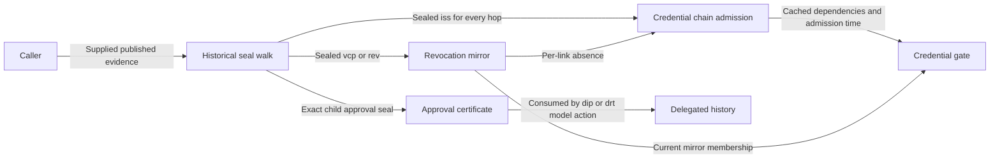
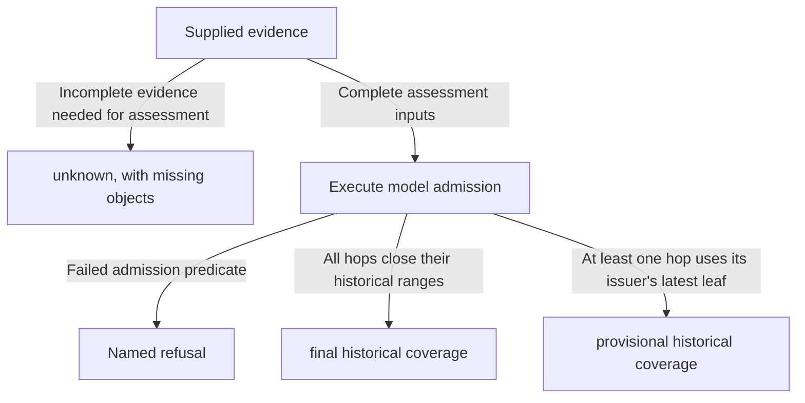

# Credentials, TEL mirrors and delegated identities

## Stories this refinement serves

As a credential holder, I supply my ACDC chain and its published evidence
and obtain an assessment against issuer history and supplied mirror state.
As a mirror contributor, I prepare an unsigned opening or revocation push
from the issuer's sealed TEL event. As a delegatee, I present a certificate
of the delegator's approval of my exact establishment event. The API never
fetches from the KERI network or signs on a caller's behalf.

The [CDDL profile](statements-model.cddl) refines the executable definitions
on `docs/lean-acdc-tel-delegation-statements`, pinned at
[`4906cfaed34e43405b04d3cc8746bd6388fc8452`](https://github.com/lambdasistemi/cardano-keri/tree/4906cfaed34e43405b04d3cc8746bd6388fc8452/lean/CardanoKeri/Statements).
This source adds the previously missing model surface. Its 52 theorem
statements intentionally use `sorry`; they are **stated, not proved**.
Compilation and the model examples below do not certify those guarantees.
The source branch remains separate from this specification PR.

## What maps to what

All records have named fields. Collections whose order matters remain
arrays: KEL seals, credential hops, schema positions, certificates and
admission dependencies. Function-valued model state is represented by
finite tables of named entries, not by a serialized function or an MPF proof.

| Lean definition | CDDL rule | Meaning preserved |
| --- | --- | --- |
| History Leaf / Checkpoint | `history-leaf`, `history-checkpoint` | Back-pointer, historical epoch, toad, latest sequence, current epoch and optional parent |
| Seal / KelEvent / WalkCore | `seal`, `kel-event`, `walk-core` | Exact identifier, sequence and digest; ordered seals and exact zero-based index; covering leaf and optional successor |
| TelEvent / Walk | `tel-event`, `tel-walk` | Distinct TEL `i`, `ri`, `s` and kind, plus the KEL seal walk |
| Mirror Registry / Sys | `mirror-registry`, `mirror-system` | Issuer-bound registry and revoked SAID set; issuances are not stored |
| Credential Body / Acdc / Hop | `acdc-body`, `acdc`, `credential-hop` | Issuer, schema, registry, issuee, optional parent edge, body SAID and issuance walk |
| Credential Policy | `credential-policy` | Root issuer, leaf-first schema sequence, depth and cached-admission age bound |
| Dep / Admission / Sys | `admission-dependency`, `admission`, `credential-system` | Per-hop history dependency, parallel SAID/registry lists, verdict, admission slot and actor-keyed cache |
| ChildEvent / Cert | `child-event`, `approval-certificate` | Child sequence and abstract event identity; all four certificate-name components plus parent seal position and verdict |
| Delegation Sys.known | `known-parent` table | Absent row means never registered; a plain row differs from delegation to parent zero |

The concrete AIDs, digests, keys and addresses remain abstract naturals here.
`nonce` stands for unmodelled child-event bytes, not a proposed KERI field.
Keep original signed bytes as described in [the encoding contract](encoding.md).

| Decision | Alternative | Reason |
| --- | --- | --- |
| A separate statement-model profile | Merge its records into Checkpoint datum shapes | These models omit lifecycle funding and have distinct history and revival assumptions. |
| Preserve `final` and `provisional` | Rename them valid and invalid | They describe historical range coverage, not overall credential validity. |
| A separate `unknown` assessment envelope | Add unknown to Lean's history verdict | Missing supplied evidence is an API completeness outcome; the model has only two history verdicts. |
| Preserve executable input shapes, with semantic refusal vectors | Add guards suggested only by comments | A schema must not silently strengthen the selected executable specification. |

## Calls and model results

The CDDL contains all sixteen action constructors across History, Mirror,
Credential and Delegation, plus eight executable queries. A call carries
the typed model state and action, and credential calls also carry policy.
The common model parameter is the historical toad floor. These model calls
are a conformance vocabulary. They are not permission to accept unverified
state tables from a production caller.

| Caller purpose | Calls / source actions | Successful result and refusal boundary |
| --- | --- | --- |
| Check the keys covering an event | `history.cover`, `history.walkOn`, `history.sealWalk` | Final or provisional; refusal on a failed range, seal, signature, receipt or registry check |
| Open a mirror or push a revocation | `mirror.open`, `mirror.push` | Updated mirror state; refuse duplicate/opened state, wrong event kind or failed issuer seal walk |
| Assess or cache a chain | `credential.admitChain`, `credential.admit` | Per-chain verdict or cached admission; every hop must pass integrity, edge, schema, issuer, issuance and mirror checks |
| Remove an invalidated cache entry | `credential.evict` | Entry removed when a dependency moved; missing or unmoved entry refuses |
| Evaluate cached admission | `credential.gate` | Boolean relative to the supplied cache and mirror state, including the inclusive age bound |
| Record a delegator's approval | `delegation.mint` | Certificate naming parent, child, child sequence and child event digest; refusal on absent parent, bad walk or an unconsumed duplicate name |
| Apply a child's approved event | `delegation.registerDelegated`, `delegation.advanceDelegated`, `delegation.supersedeDelegated` | Matching certificate consumed; child history created, advanced or replaced at the latest sequence |
| Check ancestry or an issuer's own TEL seal | `delegation.ancestorWithin`, `delegation.issuerWalk` | Bounded ancestry Boolean or history verdict, respectively |

History advance/supersede, Mirror register/history, Credential's lifted mirror
action, Delegation registerPlain/advancePlain and leave synchronize model
state. They do not introduce transaction recipes that bypass the Checkpoint
lifecycle, its evidence guards or its value flows. In particular,
`delegation.leave` is not an unsigned request to erase an arbitrary identity.

The new profile maps a source operation returning `none` to one stable
`<operation>-refused` name. Here the entire executable admission condition
is treated as a compound guard; no finer diagnostic ordering is implied by
the unproved inversion statements. Boolean false is an evaluated result,
not a refusal. This profile's refusal registry is separate from the
Checkpoint profile's finer-grained failed-guard sets.

## Interpret the verdicts at their actual boundary

Final historical coverage is not an assurance that an unpushed revocation
does not exist. `mirror.miss` is false for an unopened registry and for a
present revoked SAID. A true result means absence from that supplied mirror
only. The gate's `notAfter` bounds time since cached admission; it does not
bound KERI publication-to-mirror latency. Missing KEL/TEL, checkpoint or
mirror evidence yields the API's `unknown` assessment, never an assertion
of validity. No fetch is attempted. An authenticated observation that a
registry is unopened is different from failing to obtain its state.

`cover` requires the successor's back-pointer and the strict upper range
bound. No successor means provisional only at the latest leaf. An
establishment seal must use the establishment event's own leaf. The walk
uses that historical leaf's keys and receipts, not the checkpoint's `cur`.

## Source limits preserved by this refinement

- The TEL kind is exactly `vcp`, `iss` or `rev`. `bis`, `brv` and blinded
  TEL state have no definitions in this source. TEL sequence is a natural:
  the executable definitions do not enforce the conventional zero/one
  sequences mentioned in comments. Concrete KERI validation needs its own
  checks; the CDDL does not invent them.
- Parent edge and schema order are checked, but the issuer/issuee relation
  between adjacent hops is an explicit policy omission. Admission under an
  actor key is not a proof that the key equals the credential's issuee.
- Cached admission carries parallel `saids` and `registries` lists.
  `gate` zips them; it does not validate equal lengths on arbitrary forged
  model state. Production state needs authenticated provenance. The CDDL
  models the structure without asserting a theorem about arbitrary inputs.
- `Dep.moved` does not test its stored verdict. It checks historical epoch
  change or a leaf in the specified interval, and returns false if the
  issuer checkpoint is absent. The unproved final-admission stability
  statement is not a reason to add a different executable guard.
- Gate does not test moved dependencies itself: the cached admission must
  be evicted. The vectors include a gate evaluation before that eviction.
- Certificate identity is the exact four-field name, and its recorded
  verdict is not rechecked by `takeCert`. Duplicate mint checks only the
  unconsumed certificate list. The source permits re-minting a name after
  consumption; the profile does not claim lifetime uniqueness.
- A missing parent blocks a new mint, while its immediate child can still
  report that parent as its direct ancestor. Walking farther stops. A
  delegated issuer's TEL walk uses its own checkpoint.
- Overturned approvals do not evict child history in this model. Delegated
  revival is fresh registration with an inception certificate, unlike
  Checkpoint's rotation from parked state. Composition remains explicit
  follow-up work; no combined revival is invented here.

The [conformance corpus](statements-conformance.json) executes the pinned
functions directly through [the Lean fixture driver](StatementsTraceDriver.lean).
Its signature, receipt and digest oracles are deliberately synthetic;
these are semantic examples, not cryptographic test vectors or MPF proofs.
State observations cover the declared finite domains. Table identities and
set entries must be unique; seals and chain links retain their order.
