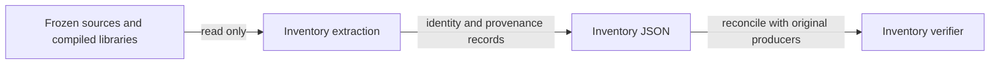

# Inventory responsibilities

A reviewer can follow each inventory record to the exact source or compiled producer responsible for it.

| Module | Responsibility | Owner and boundary |
|---|---|---|
| MOD-410-INVENTORY | Human-readable overview, declaration mappings, source/evidence pins, retained trace references and limitations. | Commit owner; `docs/design/lean-invariants-inventory/`. Data rows in data-model.md. |
| MOD-410-CHECK | Reproduce compiled extraction and reconcile records; expose damaged-record failure controls. | Commit owner; `scripts/check-lean-invariants-inventory.py`, with an inventory-only Lean helper inside the inventory directory if needed. Signatures in functions-model.md. |
| MOD-410-GATE | Independent compiled extent and failure-class checks, preserved existing checks, scoped path comparison. | Ticket owner; ignored runtime only, never imported by shipped checker. |

Existing Lean libraries remain upstream authorities; there is no abstraction promotion or new design library in this slice.
