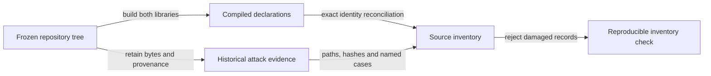

# Inventory the frozen Lean sources

An identity owner and reviewer can locate the declarations and retained attack evidence in one named repository tree, reproduce the inventory, and see a refusal when a mapping or required evidence is incomplete.

## Scope and authority

Part of #410 under #409. Subject: `5a35284be464a3706df4093ebc67ea64f33e65a4`. Only source pinning, existing declaration mapping and current attack preservation are released. Classification remains held pending explicit M1 desk release of DN003; #410 remains open. No lifecycle, simulator, CI, lockfile, runner, policy or proof changes.

## Observable contract

The following local identifiers are machine-facing acceptance rows; all are BLOCKING for this inventory submission.

| Row | Required result | Refusal |
|---|---|---|
| INV-410-SOURCE | Every included source has an immutable revision, exact path and byte hash; unavailable external content stays visibly unavailable. | Wrong subject, changed source identity or missing required evidence. |
| INV-410-EXTENT | Both libraries contribute their complete compiled declaration identities and original module/source mappings, including generated/private declarations. | Empty, shortened, missing, duplicated, orphaned or wrongly identified records, including non-default-library omission. |
| INV-410-KIND | Compiled declaration kind, proposition status and transitive axiom dependencies are recorded separately. | Misreported kind, proposition status, module or axiom dependency. |
| INV-410-TRACE | Retained attack outcomes, actual case identities and counts, provenance and limitations remain reconstructible without rewriting baseline artifacts. | Missing cases, altered payloads, missing provenance or historical execution presented as fresh. |
| INV-410-FENCE | The inventory-only hold and supplied annotations remain intact; changed paths are limited to the declared inventory/checker and ticket planning. | Policy classification, behavior changes, source replacement or unrelated path changes. |

The supplied annotations are retained verbatim in meaning: #408 is a known issue-backed registry divergence from ruling 12 / D-039 / D-040, while Checkpoint adopted the ruling through #359. Q-R3 remains an unresolved authorization question. Other issue-backed divergences remain named and are neither erased nor repaired. The five decisions in the dispatch stay open.

## Limits

A declaration's presence, proof dependencies or successful build does not establish a new semantic invariant or product coverage. Finite retained traces remain finite historical evidence. Aiken, signatures, transactions and production watcher acceptance are outside this submission.
